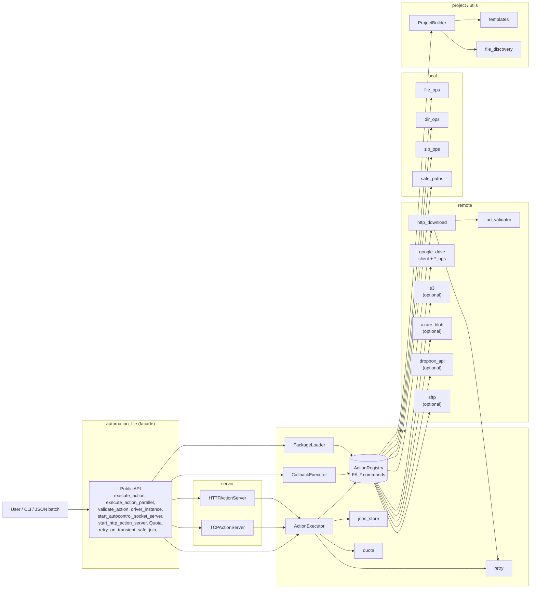

# FileAutomation

A modular automation framework for local file / directory / ZIP operations,
SSRF-validated HTTP downloads, remote storage (Google Drive, S3, Azure Blob,
Dropbox, SFTP), and JSON-driven action execution over embedded TCP / HTTP
servers. All public functionality is re-exported from the top-level
`automation_file` facade.

- Local file / directory / ZIP operations with path traversal guard (`safe_join`)
- Validated HTTP downloads with SSRF protections, retry, and size / time caps
- Google Drive CRUD (upload, download, search, delete, share, folders)
- Optional S3, Azure Blob, Dropbox, and SFTP backends behind extras
- JSON action lists executed by a shared `ActionExecutor` — validate, dry-run, parallel
- Loopback-first TCP **and** HTTP servers that accept JSON command batches with optional shared-secret auth
- Reliability primitives: `retry_on_transient` decorator, `Quota` size / time budgets
- Rich CLI with one-shot subcommands plus legacy JSON-batch flags
- Project scaffolding (`ProjectBuilder`) for executor-based automations

## Architecture



The `ActionRegistry` built by `build_default_registry()` is the single source
of truth for every `FA_*` command. `ActionExecutor`, `CallbackExecutor`,
`PackageLoader`, `TCPActionServer`, and `HTTPActionServer` all resolve commands
through the same shared registry instance exposed as `executor.registry`.

## Installation

```bash
pip install automation_file
```

Optional cloud backends (lazy-imported — install only what you need):

```bash
pip install "automation_file[s3]"        # boto3
pip install "automation_file[azure]"     # azure-storage-blob
pip install "automation_file[dropbox]"   # dropbox
pip install "automation_file[sftp]"      # paramiko
pip install "automation_file[dev]"       # ruff, mypy, pre-commit, pytest-cov
```

Requirements:
- Python 3.10+
- `google-api-python-client`, `google-auth-oauthlib` (for Drive)
- `requests`, `tqdm` (for HTTP download with progress)

## Usage

### Execute a JSON action list
```python
from automation_file import execute_action

execute_action([
    ["FA_create_file", {"file_path": "test.txt"}],
    ["FA_copy_file", {"source": "test.txt", "target": "copy.txt"}],
])
```

### Validate, dry-run, parallel
```python
from automation_file import execute_action, execute_action_parallel, validate_action

# Fail-fast: aborts before any action runs if any name is unknown.
execute_action(actions, validate_first=True)

# Dry-run: log what would be called without invoking commands.
execute_action(actions, dry_run=True)

# Parallel: run independent actions through a thread pool.
execute_action_parallel(actions, max_workers=4)

# Manual validation — returns the list of resolved names.
names = validate_action(actions)
```

### Initialize Google Drive and upload
```python
from automation_file import driver_instance, drive_upload_to_drive

driver_instance.later_init("token.json", "credentials.json")
drive_upload_to_drive("example.txt")
```

### Validated HTTP download (with retry)
```python
from automation_file import download_file

download_file("https://example.com/file.zip", "file.zip")
```

### Start the loopback TCP server (optional shared-secret auth)
```python
from automation_file import start_autocontrol_socket_server

server = start_autocontrol_socket_server(
    host="127.0.0.1", port=9943, shared_secret="optional-secret",
)
```

Clients must prefix each payload with `AUTH <secret>\n` when `shared_secret`
is set. Non-loopback binds require `allow_non_loopback=True` explicitly.

### Start the HTTP action server
```python
from automation_file import start_http_action_server

server = start_http_action_server(
    host="127.0.0.1", port=9944, shared_secret="optional-secret",
)

# curl -H 'Authorization: Bearer optional-secret' \
#      -d '[["FA_create_dir",{"dir_path":"x"}]]' \
#      http://127.0.0.1:9944/actions
```

### Retry and quota primitives
```python
from automation_file import retry_on_transient, Quota

@retry_on_transient(max_attempts=5, backoff_base=0.5)
def flaky_network_call(): ...

quota = Quota(max_bytes=50 * 1024 * 1024, max_seconds=30.0)
with quota.time_budget("bulk-upload"):
    bulk_upload_work()
```

### Path traversal guard
```python
from automation_file import safe_join

target = safe_join("/data/jobs", user_supplied_path)
# raises PathTraversalException if the resolved path escapes /data/jobs.
```

### Optional cloud backends
```python
from automation_file import executor
from automation_file.remote.s3 import register_s3_ops, s3_instance

register_s3_ops(executor.registry)
s3_instance.later_init(region_name="us-east-1")

execute_action([
    ["FA_s3_upload_file", {"local_path": "report.csv", "bucket": "reports", "key": "report.csv"}],
])
```

All backends (`s3`, `azure_blob`, `dropbox_api`, `sftp`) expose the same five
operations: `upload_file`, `upload_dir`, `download_file`, `delete_*`, `list_*`.
SFTP uses `paramiko.RejectPolicy` — unknown hosts are rejected, not auto-added.

### Scaffold an executor-based project
```python
from automation_file import create_project_dir

create_project_dir("my_workflow")
```

## CLI

```bash
# Subcommands (one-shot operations)
python -m automation_file zip ./src out.zip --dir
python -m automation_file unzip out.zip ./restored
python -m automation_file download https://example.com/file.bin file.bin
python -m automation_file create-file hello.txt --content "hi"
python -m automation_file server --host 127.0.0.1 --port 9943
python -m automation_file http-server --host 127.0.0.1 --port 9944
python -m automation_file drive-upload my.txt --token token.json --credentials creds.json

# Legacy flags (JSON action lists)
python -m automation_file --execute_file actions.json
python -m automation_file --execute_dir ./actions/
python -m automation_file --execute_str '[["FA_create_dir",{"dir_path":"x"}]]'
python -m automation_file --create_project ./my_project
```

## JSON action format

Each entry is either a bare command name, a `[name, kwargs]` pair, or a
`[name, args]` list:

```json
[
  ["FA_create_file", {"file_path": "test.txt"}],
  ["FA_drive_upload_to_drive", {"file_path": "test.txt"}],
  ["FA_drive_search_all_file"]
]
```

## Documentation

Full API documentation lives under `docs/` and can be built with Sphinx:

```bash
pip install -r docs/requirements.txt
sphinx-build -b html docs/source docs/_build/html
```

See [`CLAUDE.md`](CLAUDE.md) for architecture notes, conventions, and security
considerations.
