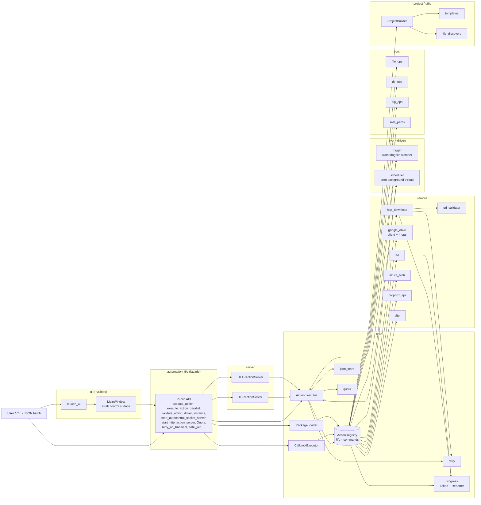

# FileAutomation

**English** | [繁體中文](README.zh-TW.md) | [简体中文](README.zh-CN.md)

A modular automation framework for local file / directory / ZIP operations,
SSRF-validated HTTP downloads, remote storage (Google Drive, S3, Azure Blob,
Dropbox, SFTP), and JSON-driven action execution over embedded TCP / HTTP
servers. Ships with a PySide6 GUI that exposes every feature through tabs.
All public functionality is re-exported from the top-level `automation_file`
facade.

- Local file / directory / ZIP operations with path traversal guard (`safe_join`)
- Validated HTTP downloads with SSRF protections, retry, and size / time caps
- Google Drive CRUD (upload, download, search, delete, share, folders)
- First-class S3, Azure Blob, Dropbox, and SFTP backends — installed by default
- JSON action lists executed by a shared `ActionExecutor` — validate, dry-run, parallel
- Loopback-first TCP **and** HTTP servers that accept JSON command batches with optional shared-secret auth
- Reliability primitives: `retry_on_transient` decorator, `Quota` size / time budgets
- **File-watcher triggers** — run an action list whenever a path changes (`FA_watch_*`)
- **Cron scheduler** — recurring action lists on a stdlib-only 5-field parser (`FA_schedule_*`)
- **Transfer progress + cancellation** — opt-in `progress_name` hook on HTTP and S3 transfers (`FA_progress_*`)
- **Fast file search** — OS index fast path (`mdfind` / `locate` / `es.exe`) with a streaming `scandir` fallback (`FA_fast_find`)
- **Checksums + integrity verification** — streaming `file_checksum` / `verify_checksum` with any `hashlib` algorithm; `download_file(expected_sha256=...)` verifies after transfer (`FA_file_checksum`, `FA_verify_checksum`)
- **Resumable HTTP downloads** — `download_file(resume=True)` writes to `<target>.part` and sends `Range: bytes=<n>-` so interrupted transfers continue
- **Duplicate-file finder** — three-stage size → partial-hash → full-hash pipeline; unique-size files are never hashed (`FA_find_duplicates`)
- **DAG action executor** — topological scheduling with parallel fan-out and per-branch skip-on-failure (`FA_execute_action_dag`)
- **Entry-point plugins** — third-party packages register their own `FA_*` actions via `[project.entry-points."automation_file.actions"]`; `build_default_registry()` picks them up automatically
- PySide6 GUI (`python -m automation_file ui`) with a tab per backend, the JSON-action runner, and dedicated tabs for Triggers, Scheduler, and live Progress
- Rich CLI with one-shot subcommands plus legacy JSON-batch flags
- Project scaffolding (`ProjectBuilder`) for executor-based automations

## Architecture



The `ActionRegistry` built by `build_default_registry()` is the single source
of truth for every `FA_*` command. `ActionExecutor`, `CallbackExecutor`,
`PackageLoader`, `TCPActionServer`, and `HTTPActionServer` all resolve commands
through the same shared registry instance exposed as `executor.registry`.

## Installation

```bash
pip install automation_file
```

A single install pulls in every backend (Google Drive, S3, Azure Blob, Dropbox,
SFTP) and the PySide6 GUI — no extras required for day-to-day use.

```bash
pip install "automation_file[dev]"       # ruff, mypy, pre-commit, pytest-cov, build, twine
```

Requirements:
- Python 3.10+
- Bundled dependencies: `google-api-python-client`, `google-auth-oauthlib`,
  `requests`, `tqdm`, `boto3`, `azure-storage-blob`, `dropbox`, `paramiko`,
  `PySide6`, `watchdog`

## Usage

### Execute a JSON action list
```python
from automation_file import execute_action

execute_action([
    ["FA_create_file", {"file_path": "test.txt"}],
    ["FA_copy_file", {"source": "test.txt", "target": "copy.txt"}],
])
```

### Validate, dry-run, parallel
```python
from automation_file import execute_action, execute_action_parallel, validate_action

# Fail-fast: aborts before any action runs if any name is unknown.
execute_action(actions, validate_first=True)

# Dry-run: log what would be called without invoking commands.
execute_action(actions, dry_run=True)

# Parallel: run independent actions through a thread pool.
execute_action_parallel(actions, max_workers=4)

# Manual validation — returns the list of resolved names.
names = validate_action(actions)
```

### Initialize Google Drive and upload
```python
from automation_file import driver_instance, drive_upload_to_drive

driver_instance.later_init("token.json", "credentials.json")
drive_upload_to_drive("example.txt")
```

### Validated HTTP download (with retry)
```python
from automation_file import download_file

download_file("https://example.com/file.zip", "file.zip")
```

### Start the loopback TCP server (optional shared-secret auth)
```python
from automation_file import start_autocontrol_socket_server

server = start_autocontrol_socket_server(
    host="127.0.0.1", port=9943, shared_secret="optional-secret",
)
```

Clients must prefix each payload with `AUTH <secret>\n` when `shared_secret`
is set. Non-loopback binds require `allow_non_loopback=True` explicitly.

### Start the HTTP action server
```python
from automation_file import start_http_action_server

server = start_http_action_server(
    host="127.0.0.1", port=9944, shared_secret="optional-secret",
)

# curl -H 'Authorization: Bearer optional-secret' \
#      -d '[["FA_create_dir",{"dir_path":"x"}]]' \
#      http://127.0.0.1:9944/actions
```

### Retry and quota primitives
```python
from automation_file import retry_on_transient, Quota

@retry_on_transient(max_attempts=5, backoff_base=0.5)
def flaky_network_call(): ...

quota = Quota(max_bytes=50 * 1024 * 1024, max_seconds=30.0)
with quota.time_budget("bulk-upload"):
    bulk_upload_work()
```

### Path traversal guard
```python
from automation_file import safe_join

target = safe_join("/data/jobs", user_supplied_path)
# raises PathTraversalException if the resolved path escapes /data/jobs.
```

### Cloud / SFTP backends
Every backend is auto-registered by `build_default_registry()`, so `FA_s3_*`,
`FA_azure_blob_*`, `FA_dropbox_*`, and `FA_sftp_*` actions are available out
of the box — no separate `register_*_ops` call needed.

```python
from automation_file import execute_action, s3_instance

s3_instance.later_init(region_name="us-east-1")

execute_action([
    ["FA_s3_upload_file", {"local_path": "report.csv", "bucket": "reports", "key": "report.csv"}],
])
```

All backends (`s3`, `azure_blob`, `dropbox_api`, `sftp`) expose the same five
operations: `upload_file`, `upload_dir`, `download_file`, `delete_*`, `list_*`.
SFTP uses `paramiko.RejectPolicy` — unknown hosts are rejected, not auto-added.

### File-watcher triggers
Run an action list whenever a filesystem event fires on a watched path:

```python
from automation_file import watch_start, watch_stop

watch_start(
    name="inbox-sweeper",
    path="/data/inbox",
    action_list=[["FA_copy_all_file_to_dir", {"source_dir": "/data/inbox",
                                              "target_dir": "/data/processed"}]],
    events=["created", "modified"],
    recursive=False,
)
# later:
watch_stop("inbox-sweeper")
```

`FA_watch_start` / `FA_watch_stop` / `FA_watch_stop_all` / `FA_watch_list`
surface the same lifecycle to JSON action lists.

### Cron scheduler
Recurring action lists on a stdlib-only 5-field cron parser:

```python
from automation_file import schedule_add

schedule_add(
    name="nightly-snapshot",
    cron_expression="0 2 * * *",        # every day at 02:00 local time
    action_list=[["FA_zip_dir", {"dir_we_want_to_zip": "/data",
                                 "zip_name": "/backup/data_nightly"}]],
)
```

Supports `*`, exact values, `a-b` ranges, comma lists, and `*/n` step
syntax with `jan..dec` / `sun..sat` aliases. JSON actions:
`FA_schedule_add`, `FA_schedule_remove`, `FA_schedule_remove_all`,
`FA_schedule_list`.

### Transfer progress + cancellation
HTTP and S3 transfers accept an opt-in `progress_name` kwarg:

```python
from automation_file import download_file, progress_cancel

download_file("https://example.com/big.bin", "big.bin",
              progress_name="big-download")

# From another thread or the GUI:
progress_cancel("big-download")
```

The shared `progress_registry` exposes live snapshots via `progress_list()`
and the `FA_progress_list` / `FA_progress_cancel` / `FA_progress_clear` JSON
actions. The GUI's **Progress** tab polls the registry every half second.

### Fast file search
Query an OS index when available (`mdfind` on macOS, `locate` / `plocate` on
Linux, Everything's `es.exe` on Windows) and fall back to a streaming
`os.scandir` walk otherwise. No extra dependencies.

```python
from automation_file import fast_find, scandir_find, has_os_index

# Uses the OS indexer when available, scandir fallback otherwise.
results = fast_find("/var/log", "*.log", limit=100)

# Force the portable path (skip the OS indexer).
results = fast_find("/data", "report_*.csv", use_index=False)

# Streaming — stop early without scanning the whole tree.
for path in scandir_find("/data", "*.csv"):
    if "2026" in path:
        break
```

`FA_fast_find` exposes the same function to JSON action lists:

```json
[["FA_fast_find", {"root": "/var/log", "pattern": "*.log", "limit": 50}]]
```

### Checksums + integrity verification
Stream any `hashlib` algorithm; `verify_checksum` compares with
`hmac.compare_digest` (constant-time):

```python
from automation_file import file_checksum, verify_checksum

digest = file_checksum("bundle.tar.gz")                # sha256 by default
verify_checksum("bundle.tar.gz", digest)               # -> True
verify_checksum("bundle.tar.gz", "deadbeef...", algorithm="blake2b")
```

Also available as `FA_file_checksum` / `FA_verify_checksum` JSON actions.

### Resumable HTTP downloads
`download_file(resume=True)` writes to `<target>.part` and sends
`Range: bytes=<n>-` on the next attempt. Pair with `expected_sha256=` for
integrity verification once the transfer completes:

```python
from automation_file import download_file

download_file(
    "https://example.com/big.bin",
    "big.bin",
    resume=True,
    expected_sha256="3b0c44298fc1...",
)
```

### Duplicate-file finder
Three-stage pipeline: size bucket → 64 KiB partial hash → full hash.
Unique-size files are never hashed:

```python
from automation_file import find_duplicates

groups = find_duplicates("/data", min_size=1024)
# list[list[str]] — each inner list is a set of identical files, sorted
# by size descending.
```

`FA_find_duplicates` runs the same search from JSON.

### DAG action executor
Run actions in dependency order; independent branches fan out across a
thread pool. Each node is `{"id": ..., "action": [...], "depends_on":
[...]}`:

```python
from automation_file import execute_action_dag

execute_action_dag([
    {"id": "fetch",  "action": ["FA_download_file",
                                ["https://example.com/src.tar.gz", "src.tar.gz"]]},
    {"id": "verify", "action": ["FA_verify_checksum",
                                ["src.tar.gz", "3b0c44298fc1..."]],
                     "depends_on": ["fetch"]},
    {"id": "unpack", "action": ["FA_unzip_file", ["src.tar.gz", "src"]],
                     "depends_on": ["verify"]},
])
```

If `verify` raises, `unpack` is marked `skipped` by default. Pass
`fail_fast=False` to run dependents regardless. JSON action:
`FA_execute_action_dag`.

### Entry-point plugins
Third-party packages advertise actions via `pyproject.toml`:

```toml
[project.entry-points."automation_file.actions"]
my_plugin = "my_plugin:register"
```

where `register` is a zero-argument callable returning a
`dict[str, Callable]`. Once installed in the same environment, the
commands show up in every freshly-built registry:

```python
# my_plugin/__init__.py
def greet(name: str) -> str:
    return f"hello {name}"

def register() -> dict:
    return {"FA_greet": greet}
```

```python
# after `pip install my_plugin`
from automation_file import execute_action
execute_action([["FA_greet", {"name": "world"}]])
```

Plugin failures are logged and swallowed — one broken plugin cannot
break the library.

### GUI
```bash
python -m automation_file ui        # or: python main_ui.py
```

```python
from automation_file import launch_ui
launch_ui()
```

Tabs: Home, Local, Transfer, Progress, JSON actions, Triggers, Scheduler,
Servers. A persistent log panel at the bottom streams every result and error.

### Scaffold an executor-based project
```python
from automation_file import create_project_dir

create_project_dir("my_workflow")
```

## CLI

```bash
# Subcommands (one-shot operations)
python -m automation_file ui
python -m automation_file zip ./src out.zip --dir
python -m automation_file unzip out.zip ./restored
python -m automation_file download https://example.com/file.bin file.bin
python -m automation_file create-file hello.txt --content "hi"
python -m automation_file server --host 127.0.0.1 --port 9943
python -m automation_file http-server --host 127.0.0.1 --port 9944
python -m automation_file drive-upload my.txt --token token.json --credentials creds.json

# Legacy flags (JSON action lists)
python -m automation_file --execute_file actions.json
python -m automation_file --execute_dir ./actions/
python -m automation_file --execute_str '[["FA_create_dir",{"dir_path":"x"}]]'
python -m automation_file --create_project ./my_project
```

## JSON action format

Each entry is either a bare command name, a `[name, kwargs]` pair, or a
`[name, args]` list:

```json
[
  ["FA_create_file", {"file_path": "test.txt"}],
  ["FA_drive_upload_to_drive", {"file_path": "test.txt"}],
  ["FA_drive_search_all_file"]
]
```

## Documentation

Full API documentation lives under `docs/` and can be built with Sphinx:

```bash
pip install -r docs/requirements.txt
sphinx-build -b html docs/source docs/_build/html
```

See [`CLAUDE.md`](CLAUDE.md) for architecture notes, conventions, and security
considerations.
