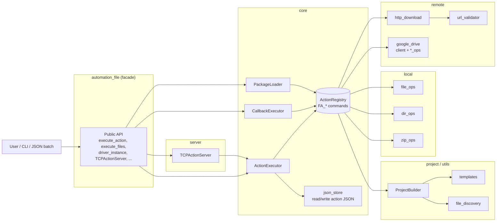

# FileAutomation

A modular framework for local file automation, remote Google Drive operations,
and JSON-driven action execution over an embedded TCP server. All public
functionality is re-exported from the top-level `automation_file` facade.

- Local file / directory / ZIP operations
- Validated HTTP downloads with SSRF protections
- Google Drive CRUD (upload, download, search, delete, share, folders)
- JSON action lists executed by a shared `ActionExecutor`
- Loopback-first TCP server that accepts JSON command batches
- Project scaffolding (`ProjectBuilder`) for executor-based automations

## Architecture



The `ActionRegistry` built by `build_default_registry()` is the single source
of truth for every `FA_*` command. `ActionExecutor`, `CallbackExecutor`,
`PackageLoader`, and `TCPActionServer` all resolve commands through the same
shared registry instance exposed as `executor.registry`.

## Installation

```bash
pip install automation_file
```

Requirements:
- Python 3.10+
- `google-api-python-client`, `google-auth-oauthlib` (for Drive)
- `requests`, `tqdm` (for HTTP download with progress)

## Usage

### Execute a JSON action list
```python
from automation_file import execute_action

execute_action([
    ["FA_create_file", {"file_path": "test.txt"}],
    ["FA_copy_file", {"source": "test.txt", "target": "copy.txt"}],
])
```

### Initialize Google Drive and upload
```python
from automation_file import driver_instance, drive_upload_to_drive

driver_instance.later_init("token.json", "credentials.json")
drive_upload_to_drive("example.txt")
```

### Validated HTTP download
```python
from automation_file import download_file

download_file("https://example.com/file.zip", "file.zip")
```

### Start the loopback TCP server
```python
from automation_file import start_autocontrol_socket_server

server = start_autocontrol_socket_server("127.0.0.1", 9943)
```

Send a newline-terminated JSON payload and read until the `Return_Data_Over_JE\n`
marker. Non-loopback binds require `allow_non_loopback=True` and are opt-in.

### Scaffold an executor-based project
```python
from automation_file import create_project_dir

create_project_dir("my_workflow")
```

## JSON action format

Each entry is either a bare command name, a `[name, kwargs]` pair, or a
`[name, args]` list:

```json
[
  ["FA_create_file", {"file_path": "test.txt"}],
  ["FA_drive_upload_to_drive", {"file_path": "test.txt"}],
  ["FA_drive_search_all_file"]
]
```

## Documentation

Full API documentation lives under `docs/` and can be built with Sphinx:

```bash
pip install -r docs/requirements.txt
sphinx-build -b html docs/source docs/_build/html
```

See [`CLAUDE.md`](CLAUDE.md) for architecture notes, conventions, and security
considerations.
