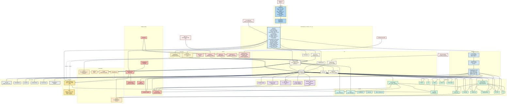

# FileAutomation

**English** | [繁體中文](README.zh-TW.md) | [简体中文](README.zh-CN.md)

A modular automation framework for local file / directory / ZIP operations,
SSRF-validated HTTP downloads, remote storage (Google Drive, S3, Azure Blob,
Dropbox, SFTP), and JSON-driven action execution over embedded TCP / HTTP
servers. Ships with a PySide6 GUI that exposes every feature through tabs.
All public functionality is re-exported from the top-level `automation_file`
facade.

- Local file / directory / ZIP operations with path traversal guard (`safe_join`)
- Validated HTTP downloads with SSRF protections, retry, and size / time caps
- Google Drive CRUD (upload, download, search, delete, share, folders)
- S3, Azure Blob, Dropbox, SFTP and seven more remote backends, each installed with its own extra (`pip install "automation_file[s3]"`, or `[all]` for every one)
- JSON action lists executed by a shared `ActionExecutor` — validate, dry-run, parallel
- Loopback-first TCP **and** HTTP servers that accept JSON command batches with optional shared-secret auth
- Reliability primitives: `retry_on_transient` decorator, `Quota` size / time budgets
- **File-watcher triggers** — run an action list whenever a path changes (`FA_watch_*`)
- **Cron scheduler** — recurring action lists on a stdlib-only 5-field parser (`FA_schedule_*`)
- **Transfer progress + cancellation** — opt-in `progress_name` hook on HTTP and S3 transfers (`FA_progress_*`)
- **Fast file search** — OS index fast path (`mdfind` / `locate` / `es.exe`) with a streaming `scandir` fallback (`FA_fast_find`)
- **Checksums + integrity verification** — streaming `file_checksum` / `verify_checksum` with any `hashlib` algorithm; `download_file(expected_sha256=...)` verifies after transfer (`FA_file_checksum`, `FA_verify_checksum`)
- **Resumable HTTP downloads** — `download_file(resume=True)` writes to `<target>.part` and sends `Range: bytes=<n>-` so interrupted transfers continue
- **Duplicate-file finder** — three-stage size → partial-hash → full-hash pipeline; unique-size files are never hashed (`FA_find_duplicates`)
- **DAG action executor** — topological scheduling with parallel fan-out and per-branch skip-on-failure (`FA_execute_action_dag`)
- **Entry-point plugins** — third-party packages register their own `FA_*` actions via `[project.entry-points."automation_file.actions"]`; `build_default_registry()` picks them up automatically
- **Incremental directory sync** — rsync-style mirror with size+mtime or checksum change detection, optional delete of extras, dry-run (`FA_sync_dir`)
- **Directory manifests** — JSON snapshot of every file's checksum under a root, with separate missing/modified/extra reporting on verify (`FA_write_manifest`, `FA_verify_manifest`)
- **Notification sinks** — webhook / Slack / SMTP / Telegram / Discord / Teams / PagerDuty with a fanout manager that does per-sink error isolation and sliding-window dedup; auto-notify on trigger + scheduler failures (`FA_notify_send`, `FA_notify_list`)
- **Config file + secret providers** — declare notification sinks / defaults in `automation_file.toml`; `${env:…}` and `${file:…}` references resolve through an Env/File/Chained provider abstraction so secrets stay out of the file itself
- **Config hot reload** — `ConfigWatcher` polls `automation_file.toml` and re-applies sinks / defaults on change without restart
- **Shell / grep / JSON edit / tar / backup rotation** — `FA_run_shell` (argument-list subprocess with timeout), `FA_grep` (streaming text search), `FA_json_get` / `FA_json_set` / `FA_json_delete` (in-place JSON editing), `FA_create_tar` / `FA_extract_tar`, `FA_rotate_backups`
- **FTP / FTPS backend** — plain FTP or explicit FTPS via `FTP_TLS.auth()`; auto-registered as `FA_ftp_*`
- **Cross-backend copy** — `FA_copy_between` copies a file between any two storage locations (`local://`, `s3://`, `azure://`, `gdrive://`, `dropbox://`, `sftp://`, `ftp://`, a mount, or an `http(s)://` source) on the storage layer; the older `s3:bucket/key` and `sftp:/path` spellings still work
- **Scheduler overlap guard** — running jobs are skipped on the next fire unless `allow_overlap=True`
- **Server action ACL** — `allowed_actions=(...)` restricts which commands TCP / HTTP servers will dispatch
- **Variable substitution** — opt-in `${env:VAR}` / `${date:%Y-%m-%d}` / `${uuid}` / `${cwd}` expansion in action arguments via `execute_action(..., substitute=True)`
- **Conditional execution** — `FA_if_exists` / `FA_if_newer` / `FA_if_size_gt` run a nested action list only when a guard passes
- **SQLite audit log** — `AuditLog(db_path)` records every action execution with actor / status / duration; query via `recent` / `count` / `purge`
- **File integrity monitoring** — `IntegrityMonitor` keeps a versioned baseline of a tree in any storage backend, detects created / modified / deleted / renamed files and metadata or permission changes, publishes drift as an event, and quarantines or restores only when a policy asks for it
- **HTTPActionClient SDK** — typed Python client for the HTTP action server with shared-secret auth, loopback guard, and OPTIONS-based ping
- **AES-256-GCM file encryption** — `encrypt_file` / `decrypt_file` with `generate_key()` / `key_from_password()` (PBKDF2-HMAC-SHA256); JSON actions `FA_encrypt_file` / `FA_decrypt_file`
- **Prometheus metrics exporter** — `start_metrics_server()` exposes `automation_file_actions_total{action,status}` counters and `automation_file_action_duration_seconds{action}` histograms
- **WebDAV backend** — `WebDAVClient` with `exists` / `upload` / `download` / `delete` / `mkcol` / `list_dir` on any RFC 4918 server; rejects private / loopback targets unless `allow_private_hosts=True`
- **SMB / CIFS backend** — `SMBClient` over `smbprotocol`'s high-level `smbclient` API; UNC-based, encrypted sessions by default
- **fsspec bridge** — drive any `fsspec`-backed filesystem (memory, local, s3, gcs, abfs, …) through the action registry with `get_fs` / `fsspec_upload` / `fsspec_download` / `fsspec_list_dir` etc.
- **HTTP server observability** — `GET /healthz` / `GET /readyz` probes, `GET /openapi.json` spec, and `GET /progress` WebSocket stream of live transfer snapshots
- **HTMX Web UI** — `start_web_ui()` serves a read-only dashboard (health, progress, registry) that polls HTML fragments; stdlib-only HTTP plus one CDN script with SRI
- **MCP (Model Context Protocol) server** — `MCPServer` bridges the registry to any MCP host (Claude Desktop, MCP CLIs) over newline-delimited JSON-RPC 2.0 on stdio; every `FA_*` action becomes an MCP tool with an auto-generated input schema
- **Universal storage layer** — `File` / `Storage` address local and remote storage with one URI syntax (`local:///…`, `s3://…`, `azure://…`, `gdrive://…`, `sftp://…`, …), one `StorageBackend` contract and one error hierarchy; twelve backends are built in (local, in-memory, S3, Azure Blob, Google Drive, Dropbox, OneDrive, SFTP, FTP / FTPS, WebDAV, SMB, fsspec), and an 88-case contract suite checks any backend
- **Event bus** — one `Event` model with ten core events (`pipeline.*`, `task.*`, `integrity.violation`, `storage.error`, `scheduler.error`, `system.error`), severities, correlation IDs and actors; subscribe on `event_bus` by class, type or prefix
- **Notification router** — routes decide which sinks hear about which events (by type, source and minimum severity), with deduplication and rate limiting per route; declare them in code, in `automation_file.toml` or with `FA_notify_route_*`
- **Audit trail** — `configure_audit(path)` records one row per event and per storage operation (actor, source, pipeline, task, action, resource, backend, status, duration, correlation ID), searchable with `audit_search` / `FA_audit_search`
- **Pipelines** — `Pipeline` runs tasks (callables or `FA_*` actions) in dependency order, independent ones in parallel, with retry, timeout, cancellation, conditions, idempotency keys, checkpoint and resume, a dry run and an execution history; definitions in Python, YAML or JSON
- **Semantic MCP tools** — fourteen tools with stable names (`file_read`, `file_copy`, `storage_list`, `pipeline_run`, `integrity_status`, `audit_search`, …) for AI hosts, confined to the roots you name, read-only until you allow writing, with a dry run for everything that changes something; the `FA_*` bridge stays available
- PySide6 GUI (`python -m automation_file ui`) with a tab per backend, the JSON-action runner, and dedicated tabs for Triggers, Scheduler, and live Progress
- Rich CLI with one-shot subcommands plus legacy JSON-batch flags
- Project scaffolding (`ProjectBuilder`) for executor-based automations

## Architecture


```mermaid
flowchart TD
    CLI["<b>CLI / JSON batch</b><br/>python -m automation_file"]
    GUIUser["<b>PySide6 GUI</b><br/>launch_ui"]
    ClientSDK["<b>HTTPActionClient SDK</b>"]
    MCPHost["<b>MCP hosts</b><br/>Claude Desktop · MCP CLIs"]
    Plugins["<b>Entry-point plugins</b><br/>automation_file.actions"]

    subgraph Facade["<b>automation_file &mdash; facade (__init__.py)</b>"]
        PublicAPI["<b>Public API</b><br/>execute_action · execute_action_parallel · execute_action_dag<br/>validate_action · driver_instance · s3_instance · azure_blob_instance<br/>dropbox_instance · sftp_instance · ftp_instance · onedrive_instance · box_instance<br/>start_autocontrol_socket_server · start_http_action_server<br/>start_metrics_server · start_web_ui · MCPServer<br/>notification_manager · scheduler · trigger_manager<br/>AutomationConfig · progress_registry · Quota · retry_on_transient"]
    end

    subgraph Core["<b>core</b>"]
        Registry[("<b>ActionRegistry</b><br/>FA_* commands")]
        Executor["<b>ActionExecutor</b><br/>serial · parallel · dry-run · validate-first"]
        DAG["<b>dag_executor</b><br/>topological fan-out"]
        Callback["<b>CallbackExecutor</b>"]
        Loader["<b>PackageLoader</b><br/>+ entry-point plugins"]
        Queue["<b>ActionQueue</b>"]
        Json["<b>json_store</b>"]
        Sub["<b>substitution</b><br/>${env:} ${date:} ${uuid}"]
    end

    subgraph Reliability["<b>reliability</b>"]
        Retry["<b>retry</b><br/>@retry_on_transient"]
        QuotaMod["<b>Quota</b><br/>bytes + time budget"]
        Breaker["<b>CircuitBreaker</b>"]
        RL["<b>RateLimiter</b>"]
        Locks["<b>FileLock</b> · <b>SQLiteLock</b>"]
    end

    subgraph Observability["<b>observability</b>"]
        Progress["<b>progress</b><br/>CancellationToken · Reporter"]
        Metrics["<b>metrics</b><br/>Prometheus counters + histograms"]
        Audit["<b>AuditLog</b><br/>SQLite"]
        Tracing["<b>tracing</b><br/>OpenTelemetry spans"]
        FIM["<b>IntegrityMonitor</b>"]
    end

    subgraph Security["<b>security &amp; config</b>"]
        Secrets["<b>Secret providers</b><br/>Env · File · Chained"]
        Config["<b>AutomationConfig</b><br/>TOML loader"]
        ConfW["<b>ConfigWatcher</b><br/>hot reload"]
        Crypto["<b>crypto</b><br/>AES-256-GCM"]
        Check["<b>checksum</b> / <b>manifest</b>"]
        SafeP["<b>safe_paths</b><br/>safe_join · is_within"]
        ACL["<b>ActionACL</b>"]
    end

    subgraph Events["<b>event-driven</b>"]
        Trigger["<b>TriggerManager</b><br/>watchdog file watcher"]
        Sched["<b>Scheduler</b><br/>5-field cron + overlap guard"]
    end

    subgraph Servers["<b>servers</b>"]
        TCP["<b>TCPActionServer</b><br/>loopback · AUTH secret"]
        HTTPS["<b>HTTPActionServer</b><br/>POST /actions · Bearer<br/>/healthz /readyz /progress /openapi.json"]
        MCP["<b>MCPServer</b><br/>JSON-RPC 2.0 (stdio)"]
        MetSrv["<b>MetricsServer</b><br/>/metrics"]
        WebUI["<b>WebUIServer</b><br/>HTMX dashboard"]
    end

    subgraph UI["<b>ui (PySide6)</b>"]
        MainWin["<b>MainWindow</b><br/>Home · Local · HTTP · Drive · S3 · Azure · Dropbox<br/>SFTP · OneDrive · Box · JSON · Triggers · Scheduler<br/>Progress · Transfer · Servers"]
        Worker["<b>ActionWorker</b><br/>QRunnable on QThreadPool"]
    end

    subgraph Local["<b>local ops</b>"]
        FileOps["<b>file_ops</b> · <b>dir_ops</b>"]
        Archives["<b>zip_ops</b> · <b>tar_ops</b> · <b>archive_ops</b>"]
        DataOps["<b>data_ops</b><br/>csv · jsonl · parquet · yaml"]
        TextOps["<b>text_ops</b> · <b>diff_ops</b><br/><b>json_edit</b> · <b>templates</b>"]
        Misc["<b>shell_ops</b> · <b>sync_ops</b> · <b>trash</b><br/><b>versioning</b> · <b>conditional</b> · <b>mime</b>"]
    end

    subgraph Remote["<b>remote backends</b>"]
        UrlVal["<b>url_validator</b><br/>SSRF guard"]
        Http["<b>http_download</b><br/>retry · resume · SHA-256"]
        Drive["<b>google_drive</b>"]
        S3M["<b>s3</b>"]
        Azure["<b>azure_blob</b>"]
        Dropbox["<b>dropbox_api</b>"]
        SFTP["<b>sftp</b> (RejectPolicy)"]
        FTP["<b>ftp / FTPS</b>"]
        OneD["<b>onedrive</b>"]
        Box["<b>box</b>"]
        WebDAV["<b>webdav</b>"]
        SMB["<b>smb / cifs</b>"]
        Fsspec["<b>fsspec_bridge</b>"]
        Cross["<b>cross_backend</b><br/>local:// s3:// azure://<br/>dropbox:// sftp:// ftp://"]
    end

    subgraph StorageLayer["<b>storage (universal layer)</b>"]
        FileAPI["<b>File</b> · <b>Storage</b><br/>local:// s3:// azure:// gdrive:// sftp:// …"]
        Resolver["<b>StorageResolver</b><br/>mounts · scheme factories"]
        Backends["<b>StorageBackend</b> contract<br/>Local · Memory · S3 · Azure · Drive · Dropbox<br/>OneDrive · SFTP · FTP · WebDAV · SMB · fsspec"]
    end

    subgraph Notify["<b>notifications</b>"]
        NM["<b>NotificationManager</b><br/>fanout · dedup · SSRF guard"]
        Sinks["<b>Sinks</b><br/>Webhook · Slack · Email<br/>Telegram · Discord · Teams · PagerDuty"]
    end

    subgraph Utils["<b>utils / project</b>"]
        Fast["<b>fast_find</b><br/>mdfind / locate / es.exe"]
        Dedup["<b>find_duplicates</b>"]
        Grep["<b>grep_files</b>"]
        Rotate["<b>rotate_backups</b>"]
        Discovery["<b>file_discovery</b>"]
        Builder["<b>ProjectBuilder</b> + templates"]
    end

    CLI ==> PublicAPI
    GUIUser ==> MainWin
    ClientSDK ==> HTTPS
    MCPHost ==> MCP
    Plugins ==> Loader

    MainWin ==> Worker
    Worker ==> PublicAPI

    PublicAPI ==> Executor
    PublicAPI ==> DAG
    PublicAPI ==> Callback
    PublicAPI ==> Queue
    PublicAPI ==> Config
    PublicAPI ==> NM
    PublicAPI ==> Trigger
    PublicAPI ==> Sched
    PublicAPI ==> FileAPI
    FileAPI ==> Resolver
    Resolver ==> Backends
    Backends ==> SafeP
    Backends ==> Check
    Backends ==> S3M
    Backends ==> Azure
    Backends ==> Drive
    Backends ==> Dropbox
    Backends ==> OneD
    Backends ==> SFTP
    Backends ==> FTP
    Backends ==> WebDAV
    Backends ==> SMB
    Backends ==> Fsspec

    TCP ==> Executor
    HTTPS ==> Executor
    MCP ==> Registry
    MetSrv ==> Metrics
    WebUI ==> Registry
    ACL ==> TCP
    ACL ==> HTTPS

    Executor ==> Registry
    Executor ==> Sub
    Executor ==> Retry
    Executor ==> QuotaMod
    Executor ==> Metrics
    Executor ==> Audit
    Executor ==> Tracing
    Executor ==> Json
    DAG ==> Executor
    Callback ==> Registry
    Loader ==> Registry

    Trigger ==> Executor
    Sched ==> Executor
    Trigger -. on failure .-> NM
    Sched -. on failure .-> NM
    FIM -. on drift .-> NM
    ConfW ==> Config
    Config ==> Secrets
    Config ==> NM

    Registry ==> FileOps
    Registry ==> Archives
    Registry ==> DataOps
    Registry ==> TextOps
    Registry ==> Misc
    Registry ==> Http
    Registry ==> Drive
    Registry ==> S3M
    Registry ==> Azure
    Registry ==> Dropbox
    Registry ==> SFTP
    Registry ==> FTP
    Registry ==> OneD
    Registry ==> Box
    Registry ==> WebDAV
    Registry ==> SMB
    Registry ==> Fsspec
    Registry ==> Cross
    Registry ==> Crypto
    Registry ==> Check
    Registry ==> Fast
    Registry ==> Dedup
    Registry ==> Grep
    Registry ==> Rotate
    Registry ==> Discovery
    Registry ==> Builder
    Registry ==> Progress

    FileOps ==> SafeP
    Archives ==> SafeP
    Misc ==> SafeP

    Http ==> UrlVal
    Http ==> Retry
    Http ==> Progress
    Http ==> Check
    S3M ==> Progress
    WebDAV ==> UrlVal
    NM ==> UrlVal
    NM ==> Sinks

    Cross ==> Drive
    Cross ==> S3M
    Cross ==> Azure
    Cross ==> Dropbox
    Cross ==> SFTP
    Cross ==> FTP

    classDef entry fill:#FDEDEC,stroke:#641E16,stroke-width:3px,color:#000,font-weight:bold;
    classDef facade fill:#D6EAF8,stroke:#154360,stroke-width:4px,color:#000,font-weight:bold;
    classDef core fill:#FEF9E7,stroke:#1F3A93,stroke-width:3px,color:#000,font-weight:bold;
    classDef rel fill:#D1F2EB,stroke:#0B5345,stroke-width:3px,color:#000,font-weight:bold;
    classDef obs fill:#FDEBD0,stroke:#9C640C,stroke-width:3px,color:#000,font-weight:bold;
    classDef sec fill:#F5B7B1,stroke:#78281F,stroke-width:3px,color:#000,font-weight:bold;
    classDef event fill:#FCF3CF,stroke:#7D6608,stroke-width:3px,color:#000,font-weight:bold;
    classDef server fill:#FADBD8,stroke:#922B21,stroke-width:3px,color:#000,font-weight:bold;
    classDef ui fill:#AED6F1,stroke:#1B4F72,stroke-width:3px,color:#000,font-weight:bold;
    classDef localOps fill:#E8DAEF,stroke:#512E5F,stroke-width:3px,color:#000,font-weight:bold;
    classDef remote fill:#D5F5E3,stroke:#196F3D,stroke-width:3px,color:#000,font-weight:bold;
    classDef notify fill:#F9E79F,stroke:#7D6608,stroke-width:3px,color:#000,font-weight:bold;
    classDef utils fill:#EAEDED,stroke:#212F3C,stroke-width:3px,color:#000,font-weight:bold;
    classDef storage fill:#D4E6F1,stroke:#1A5276,stroke-width:3px,color:#000,font-weight:bold;

    class CLI,GUIUser,ClientSDK,MCPHost,Plugins entry;
    class PublicAPI facade;
    class Registry,Executor,DAG,Callback,Loader,Queue,Json,Sub core;
    class Retry,QuotaMod,Breaker,RL,Locks rel;
    class Progress,Metrics,Audit,Tracing,FIM obs;
    class Secrets,Config,ConfW,Crypto,Check,SafeP,ACL sec;
    class Trigger,Sched event;
    class TCP,HTTPS,MCP,MetSrv,WebUI server;
    class MainWin,Worker ui;
    class FileOps,Archives,DataOps,TextOps,Misc localOps;
    class UrlVal,Http,Drive,S3M,Azure,Dropbox,SFTP,FTP,OneD,Box,WebDAV,SMB,Fsspec,Cross remote;
    class NM,Sinks notify;
    class Fast,Dedup,Grep,Rotate,Discovery,Builder utils;
    class FileAPI,Resolver,Backends storage;

    linkStyle default stroke:#1F2A44,stroke-width:2.5px;
```

The `ActionRegistry` built by `build_default_registry()` is the single source
of truth for every `FA_*` command. `ActionExecutor`, `CallbackExecutor`,
`PackageLoader`, `TCPActionServer`, and `HTTPActionServer` all resolve commands
through the same shared registry instance exposed as `executor.registry`.

## Installation

```bash
pip install automation_file                 # the base: no cloud SDK, no GUI toolkit
pip install "automation_file[s3,sftp]"      # add the backends you use
pip install "automation_file[all]"          # every backend and the GUI
```

The base install runs JSON actions, local file operations, HTTP downloads, the storage
layer's local and in-memory backends, pipelines, events, triggers, the scheduler and the
servers. Each backend's SDK and the GUI toolkit live in an extra, imported only when the
feature is used. Calling a feature whose extra is missing raises
`OptionalDependencyException` with the command to run.

| Extra | Installs | Gives you |
|---|---|---|
| `s3` | `boto3` | S3 (`FA_s3_*`, `s3://`) |
| `azure` | `azure-storage-blob` | Azure Blob (`FA_azure_blob_*`, `azure://`) |
| `gdrive` | `google-api-python-client`, `google-auth-httplib2`, `google-auth-oauthlib` | Google Drive (`FA_drive_*`) |
| `dropbox` | `dropbox` | Dropbox (`FA_dropbox_*`) |
| `sftp` | `paramiko` | SFTP (`FA_sftp_*`) |
| `ftp` | — | FTP / FTPS (`FA_ftp_*`); standard library only |
| `webdav` | — | WebDAV (`WebDAVClient`); the base dependencies suffice |
| `smb` | `smbprotocol` | SMB / CIFS (`SMBClient`) |
| `fsspec` | `fsspec` | The fsspec bridge |
| `onedrive` | `msal` | OneDrive (`FA_onedrive_*`) |
| `box` | `boxsdk` | Box (`FA_box_*`) |
| `parquet` | `pyarrow` | Parquet data operations (`FA_parquet_*`, `FA_csv_to_parquet`) |
| `gui` | `PySide6` | The desktop GUI (`python -m automation_file ui`) |
| `all` | everything above | Every backend and the GUI, as before the split |

```bash
pip install "automation_file[all,dev]"   # plus ruff, mypy, pre-commit, pytest-cov, build, twine
```

Upgrading from a release that bundled everything: install `automation_file[all]` to keep
what you had.

Requirements:
- Python 3.10+
- Base dependencies: `requests`, `tqdm`, `watchdog`, `cryptography`, `prometheus_client`, `defusedxml`,
  `PyYAML`, `opentelemetry-api`, `opentelemetry-sdk`, `je_action_core` (the action executor
  shared with APITestka, LoadDensity and MailThunder)

## Usage

### Execute a JSON action list
```python
from automation_file import execute_action

execute_action([
    ["FA_create_file", {"file_path": "test.txt"}],
    ["FA_copy_file", {"source": "test.txt", "target": "copy.txt"}],
])
```

### Validate, dry-run, parallel
```python
from automation_file import execute_action, execute_action_parallel, validate_action

# Fail-fast: aborts before any action runs if any name is unknown.
execute_action(actions, validate_first=True)

# Dry-run: log what would be called without invoking commands.
execute_action(actions, dry_run=True)

# Parallel: run independent actions through a thread pool.
execute_action_parallel(actions, max_workers=4)

# Manual validation — returns the list of resolved names.
names = validate_action(actions)
```

### Initialize Google Drive and upload
```python
from automation_file import driver_instance, drive_upload_to_drive

driver_instance.later_init("token.json", "credentials.json")
drive_upload_to_drive("example.txt")
```

### Validated HTTP download (with retry)
```python
from automation_file import download_file

download_file("https://example.com/file.zip", "file.zip")
```

### Start the loopback TCP server (optional shared-secret auth)
```python
from automation_file import start_autocontrol_socket_server

server = start_autocontrol_socket_server(
    host="127.0.0.1", port=9943, shared_secret="optional-secret",
)
```

Clients must prefix each payload with `AUTH <secret>\n` when `shared_secret`
is set. Non-loopback binds require `allow_non_loopback=True` explicitly.

### Start the HTTP action server
```python
from automation_file import start_http_action_server

server = start_http_action_server(
    host="127.0.0.1", port=9944, shared_secret="optional-secret",
)

# curl -H 'Authorization: Bearer optional-secret' \
#      -d '[["FA_create_dir",{"dir_path":"x"}]]' \
#      http://127.0.0.1:9944/actions
```

### Retry and quota primitives
```python
from automation_file import retry_on_transient, Quota

@retry_on_transient(max_attempts=5, backoff_base=0.5)
def flaky_network_call(): ...

quota = Quota(max_bytes=50 * 1024 * 1024, max_seconds=30.0)
with quota.time_budget("bulk-upload"):
    bulk_upload_work()
```

### Path traversal guard
```python
from automation_file import safe_join

target = safe_join("/data/jobs", user_supplied_path)
# raises PathTraversalException if the resolved path escapes /data/jobs.
```

### Cloud / SFTP backends
Every backend is auto-registered by `build_default_registry()`, so `FA_s3_*`,
`FA_azure_blob_*`, `FA_dropbox_*`, and `FA_sftp_*` actions are available out
of the box — no separate `register_*_ops` call needed.

```python
from automation_file import execute_action, s3_instance

s3_instance.later_init(region_name="us-east-1")

execute_action([
    ["FA_s3_upload_file", {"local_path": "report.csv", "bucket": "reports", "key": "report.csv"}],
])
```

All backends (`s3`, `azure_blob`, `dropbox_api`, `sftp`) expose the same five
operations: `upload_file`, `upload_dir`, `download_file`, `delete_*`, `list_*`.
SFTP uses `paramiko.RejectPolicy` — unknown hosts are rejected, not auto-added.

### Universal storage layer (File / Storage)
One URI syntax, one set of operations and one set of errors for every storage.
`File` is a single file, `Storage` a directory, and `StorageBackend` the contract a
backend implements. The `FA_*` actions and the per-backend functions keep working
unchanged next to it.

```python
from automation_file import File, LocalStorage, Storage

report = File("local:///data/reports/q1.csv")      # a plain path works too
report.write("region,total\nEMEA,42\n")
report.size, report.modified_at, report.content_type
report.checksum()                                   # Checksum("sha256", "…")
report.copy_to("memory://scratch/archive/q1.csv")   # any backend to any backend
report.move_to("local:///data/done/q1.csv")

reports = Storage("local:///data/reports")
for info in reports.list_dir(recursive=True):
    print(info.path, info.size)

# Confine untrusted paths: nothing under sandbox://jobs/ can leave /srv/jobs.
Storage.mount("sandbox://jobs", LocalStorage("/srv/jobs"))
File("sandbox://jobs/42/out.csv").write(b"done")
```

- **URIs** — `<scheme>://<authority>/<path>`: `local:///data/a.csv`, `s3://bucket/a.csv`,
  `sftp://server/data/a.csv`. The path is literal (nothing is percent-decoded), `..` segments
  are rejected, and credentials in the authority are refused. Text without `://` is a local path.
- **Operations** — `exists`, `stat`, `list_dir`, `mkdir`, `upload`, `download`, `delete`,
  `checksum`, `read_bytes`, `write_bytes`, `copy_from`, `move_from`, identical on every backend.
  Downloads and local writes are atomic, deleting a directory with entries needs
  `recursive=True`, and the storage root is never deleted.
- **Streams and trees** — `File.open_read()` / `open_write()` / `iter_chunks()` for content too
  large for memory; `Storage.copy_to(target)` copies a directory tree to any backend and
  `Storage.sync_to(target, delete=False, checksum=False, dry_run=False)` copies only what changed.
- **Errors** — `StorageException` and its subclasses: `StorageNotFoundException`,
  `StorageAlreadyExistsException`, `StoragePathTypeException`, `StorageNotEmptyException`,
  `StoragePermissionException`, `StorageTransientException`, `StorageUnavailableException`,
  `StorageUnsupportedException`, `StorageURIException`.
- **Backends** — twelve are built in. Addressed by URI through the shared clients you already
  initialise: `local://`, `memory://`, `s3://bucket/key`, `azure://container/blob`, `gdrive://<root>/path`,
  `dropbox:///path`, `onedrive:///path`, `sftp://host/path`, `ftp://host/path` and `ftps://host/path`.
  Mounted, because they need a client or a filesystem of their own: `WebDAVStorage`, `SMBStorage` and
  `FsspecStorage` (`Storage.mount("webdav://files.example.com", WebDAVStorage(client))`). Each remote
  backend needs its extra (`pip install "automation_file[sftp]"`). An `sftp://` or `ftp://` URI must
  name the host the session is connected to, so a typo cannot write to another server. Box has no
  adapter and stays on its `FA_box_*` actions. Write your own by subclassing `StorageBackend`
  (`ObjectStorage` for an object store, `SessionStorage` for a login session) and check it with the
  88-case contract suite in `tests/storage_contract.py`.

- **Actions** — `FA_storage_exists`, `FA_storage_stat`, `FA_storage_list`, `FA_storage_mkdir`,
  `FA_storage_upload`, `FA_storage_download`, `FA_storage_delete`, `FA_storage_checksum`,
  `FA_storage_verify`, `FA_storage_copy`, `FA_storage_move`, `FA_storage_read_text`,
  `FA_storage_write_text`, `FA_storage_copy_tree`, `FA_storage_sync`, `FA_storage_schemes`. They take URIs
  as strings and return JSON-friendly values, so the layer works from action files, the CLI, the
  TCP and HTTP servers and as MCP tools. Restrict them on a server with `ActionACL`, as for any
  file action.

```json
[
  ["FA_storage_copy", {"source": "s3://reports/q1.csv", "target": "local:///backup/q1.csv"}],
  ["FA_storage_verify", {"uri": "local:///backup/q1.csv", "expected": "sha256:9f86d081884c7d65…"}],
  ["FA_storage_list", {"uri": "s3://reports", "recursive": true}]
]
```

The API is new and may still change before 1.0. Full reference: the *Universal Storage Layer*
chapter of the documentation.

### Events
Every component reports through one event model instead of calling a sink or the audit log itself.

```python
from automation_file import Severity, actor_scope, correlation_scope, event_bus

event_bus.subscribe(print, types=["pipeline.*", "integrity.violation"])
event_bus.subscribe(alert, min_severity=Severity.ERROR)

with actor_scope("scheduler"), correlation_scope() as run_id:
    ...   # every event and storage operation in here carries run_id and the actor
event_bus.recent(limit=20, correlation_id=run_id)
```

- **Core events** — `PipelineStarted`, `PipelineCompleted`, `PipelineFailed`, `TaskStarted`,
  `TaskCompleted`, `TaskFailed`, `IntegrityViolation`, `StorageError`, `SchedulerError`,
  `SystemErrorEvent`. Each has a `type` (`pipeline.failed`), a `severity`, a `source`, a `subject`,
  a structured `payload`, a `correlation_id` and an `actor`, and turns into JSON with `to_dict()`.
- **Bus** — `event_bus.subscribe(handler, types=..., min_severity=...)` by class, type name or
  prefix; a handler that raises is logged and skipped; `event_bus.recent()` returns the latest events.
- **Storage operations** — uploads, downloads, reads, deletes, copies and moves are reported to
  `automation_file.storage.observe` listeners, and a failing backend becomes a `StorageError` event.

### Notification router
Notifications are driven by events: a module publishes an event, and routes decide which
sinks hear about it.

```python
from automation_file import Route, Severity, notification_router

notification_router.add_route(Route(
    "pipeline-failures",
    sinks=("team-alerts",),                  # empty = every registered sink
    types=("pipeline.*", "task.failed"),     # event class, type name or prefix
    min_severity=Severity.ERROR,
    dedup_seconds=600, rate_limit=10, rate_period=60,
))
notification_router.start()                  # subscribe on the event bus
```

- **Routes** — by event type, source and minimum severity, to named sinks. Declare them in
  code, as `[[notify.routes]]` tables in `automation_file.toml` (hot-reloaded with the sinks),
  or with `FA_notify_route_add` / `FA_notify_route_remove` / `FA_notify_route_list`.
- **Deduplication and rate limiting** — per route and sink: a repeat of the same type, source
  and subject within `dedup_seconds` is dropped, and at most `rate_limit` messages go out per
  `rate_period`.
- **Structured messages** — the subject and the body are built from the event: severity,
  source, correlation ID, actor and the JSON of `event.to_dict()`. `critical` is sent at the
  sinks' `error` level.
- **Failure isolation** — one failing sink never affects another. The failure is published as
  a `system.error` event from the source `notify`, which the router never routes, so a broken
  sink cannot feed a loop.
- **`notify_on_failure`** — always publishes an event. With the router active the routes
  deliver it; otherwise the direct notification is sent as before, so nobody is notified twice
  and nobody stops being notified.

### Audit trail (schema v2)
The audit trail records who did what, when, against which resource, using which backend and
with what result: one record per event and per storage operation.

```python
from automation_file import audit_search, configure_audit, correlation_scope

configure_audit("audit.sqlite")              # SQLite store; starts recording

with correlation_scope() as run_id:
    ...                                      # events and storage operations are recorded
audit_search(correlation_id=run_id)          # the whole run, newest first
audit_search(status="error", resource_prefix="s3://reports/", limit=20)
```

- **Record** — `id`, `timestamp` (UTC), `actor`, `source`, `pipeline`, `task`, `action`,
  `resource`, `backend`, `status`, `duration_ms`, `error`, `metadata`, `correlation_id`.
- **Search** — by `since` / `until`, `actor`, `source`, `pipeline`, `task`, `action`,
  `resource_prefix`, `backend`, `status`, `correlation_id` and free `text`; newest first, with
  `limit` / `offset`.
- **Stores** — `SQLiteAuditStore` (parameterised SQL, a schema-version table, WAL) and
  `MemoryAuditStore` for tests; `AuditStore` is the interface a PostgreSQL or remote store
  implements. `SQLiteAuditStore.import_v1()` copies the rows of a v1 `AuditLog`.
- **Never in the way** — a record that cannot be written is logged and dropped, never raised
  into the code being audited. A failed storage operation is recorded once, not twice.
- **Actions and metrics** — `FA_audit_configure` / `FA_audit_search` / `FA_audit_count` /
  `FA_audit_purge`; `install_operational_metrics()` adds Prometheus counters for events,
  notifications and storage operations.

### Pipelines

`automation_file.pipeline` runs tasks in dependency order, with independent tasks
in parallel, and records every step. A task is a Python callable or an `FA_*`
action; a pipeline is built in Python or loaded from a YAML / JSON definition. A
run reports only through `pipeline.*` and `task.*` events on the event bus.

```python
from automation_file import Pipeline, RetryPolicy, SQLiteRunStore

def check(ctx):
    if ctx.results["download"]["size"] == 0:
        raise ValueError("the report is empty")

pipeline = Pipeline("daily-report", max_workers=4)
pipeline.task(
    "download",
    ["FA_storage_copy", {"source": "s3://input/${params.date}.csv",
                         "target": "local:///tmp/report.csv"}],
    retry=RetryPolicy(max_attempts=3, backoff_base=1.0, backoff_cap=30.0),
    timeout=300.0,
)
pipeline.task("check", check, depends_on=["download"])
pipeline.task(
    "publish",
    ["FA_storage_copy", {"source": "local:///tmp/report.csv",
                         "target": "azure://reports/${params.date}.csv"}],
    depends_on=["check"],
    idempotency_key="publish-${params.date}",        # at most once per date
)
pipeline.task(
    "withdraw",                                      # clean-up when publish failed
    ["FA_storage_delete", {"uri": "azure://reports/${params.date}.csv",
                           "missing_ok": True}],
    depends_on=["publish"],
    when="on_failure",
)

store = SQLiteRunStore("pipelines.db")
run = pipeline.run(params={"date": "2026-10-08"}, store=store)
if run.status != "succeeded":
    run = pipeline.resume(run.run_id, store=store)   # keeps what succeeded
```

- **Retry, timeout, cancellation.** `RetryPolicy` retries transient errors with
  capped exponential back-off; a task past its `timeout` is marked `timeout` and
  the run goes on; `pipeline.start()` runs in the background and `run.cancel()`
  stops it.
- **Conditions and idempotency.** `when` is `on_success`, `on_failure`, `always`
  or a callable; an `idempotency_key` skips a task that already succeeded under
  the same key and reuses its result.
- **Checkpoint, resume, history.** Every task transition is written to a
  `RunStore` (`MemoryRunStore`, `SQLiteRunStore`); `resume(run_id)` runs only what
  did not succeed, and `store.list_runs()` is the execution history.
- **Definitions.** `Pipeline.from_file("daily-report.yaml")`, `from_dict` /
  `to_dict`, `validate_definition()` with the path of every problem, and
  `PIPELINE_SCHEMA` (JSON Schema). `run(dry_run=True)` plans without executing.
- **Actions.** `FA_pipeline_run`, `FA_pipeline_validate`, `FA_pipeline_status`,
  `FA_pipeline_history` and `FA_pipeline_resume` for JSON action lists, the CLI,
  the action servers and MCP.

### File-watcher triggers
Run an action list whenever a filesystem event fires on a watched path:

```python
from automation_file import watch_start, watch_stop

watch_start(
    name="inbox-sweeper",
    path="/data/inbox",
    action_list=[["FA_copy_all_file_to_dir", {"source_dir": "/data/inbox",
                                              "target_dir": "/data/processed"}]],
    events=["created", "modified"],
    recursive=False,
)
# later:
watch_stop("inbox-sweeper")
```

`FA_watch_start` / `FA_watch_stop` / `FA_watch_stop_all` / `FA_watch_list`
surface the same lifecycle to JSON action lists.

### Cron scheduler
Recurring action lists on a stdlib-only 5-field cron parser:

```python
from automation_file import schedule_add

schedule_add(
    name="nightly-snapshot",
    cron_expression="0 2 * * *",        # every day at 02:00 local time
    action_list=[["FA_zip_dir", {"dir_we_want_to_zip": "/data",
                                 "zip_name": "/backup/data_nightly"}]],
)
```

Supports `*`, exact values, `a-b` ranges, comma lists, and `*/n` step
syntax with `jan..dec` / `sun..sat` aliases. JSON actions:
`FA_schedule_add`, `FA_schedule_remove`, `FA_schedule_remove_all`,
`FA_schedule_list`.

### Transfer progress + cancellation
HTTP and S3 transfers accept an opt-in `progress_name` kwarg:

```python
from automation_file import download_file, progress_cancel

download_file("https://example.com/big.bin", "big.bin",
              progress_name="big-download")

# From another thread or the GUI:
progress_cancel("big-download")
```

The shared `progress_registry` exposes live snapshots via `progress_list()`
and the `FA_progress_list` / `FA_progress_cancel` / `FA_progress_clear` JSON
actions. The GUI's **Progress** tab polls the registry every half second.

### Fast file search
Query an OS index when available (`mdfind` on macOS, `locate` / `plocate` on
Linux, Everything's `es.exe` on Windows) and fall back to a streaming
`os.scandir` walk otherwise. No extra dependencies.

```python
from automation_file import fast_find, scandir_find, has_os_index

# Uses the OS indexer when available, scandir fallback otherwise.
results = fast_find("/var/log", "*.log", limit=100)

# Force the portable path (skip the OS indexer).
results = fast_find("/data", "report_*.csv", use_index=False)

# Streaming — stop early without scanning the whole tree.
for path in scandir_find("/data", "*.csv"):
    if "2026" in path:
        break
```

`FA_fast_find` exposes the same function to JSON action lists:

```json
[["FA_fast_find", {"root": "/var/log", "pattern": "*.log", "limit": 50}]]
```

### Checksums + integrity verification
Stream any `hashlib` algorithm; `verify_checksum` compares with
`hmac.compare_digest` (constant-time):

```python
from automation_file import file_checksum, verify_checksum

digest = file_checksum("bundle.tar.gz")                # sha256 by default
verify_checksum("bundle.tar.gz", digest)               # -> True
verify_checksum("bundle.tar.gz", "deadbeef...", algorithm="blake2b")
```

Also available as `FA_file_checksum` / `FA_verify_checksum` JSON actions.

### Resumable HTTP downloads
`download_file(resume=True)` writes to `<target>.part` and sends
`Range: bytes=<n>-` on the next attempt. Pair with `expected_sha256=` for
integrity verification once the transfer completes:

```python
from automation_file import download_file

download_file(
    "https://example.com/big.bin",
    "big.bin",
    resume=True,
    expected_sha256="3b0c44298fc1...",
)
```

### Duplicate-file finder
Three-stage pipeline: size bucket → 64 KiB partial hash → full hash.
Unique-size files are never hashed:

```python
from automation_file import find_duplicates

groups = find_duplicates("/data", min_size=1024)
# list[list[str]] — each inner list is a set of identical files, sorted
# by size descending.
```

`FA_find_duplicates` runs the same search from JSON.

### Incremental directory sync
`sync_dir` mirrors `src` into `dst` by copying only files that are new or
changed. Change detection is `(size, mtime)` by default; pass
`compare="checksum"` when mtime is unreliable. Extras under `dst` are left
alone by default — pass `delete=True` to prune them (and `dry_run=True` to
preview):

```python
from automation_file import sync_dir

summary = sync_dir("/data/src", "/data/dst", delete=True)
# summary: {"copied": [...], "skipped": [...], "deleted": [...],
#           "errors": [...], "dry_run": False}
```

Symlinks are re-created as symlinks rather than followed, so a link
pointing outside the tree can't blow up the mirror. JSON action:
`FA_sync_dir`.

### Directory manifests
Write a JSON manifest of every file's checksum under a tree and verify the
tree hasn't changed later:

```python
from automation_file import write_manifest, verify_manifest

write_manifest("/release/payload", "/release/MANIFEST.json")

# Later…
result = verify_manifest("/release/payload", "/release/MANIFEST.json")
if not result["ok"]:
    raise SystemExit(f"manifest mismatch: {result}")
```

`result` reports `matched`, `missing`, `modified`, and `extra` lists
separately. Extras don't fail verification (mirrors `sync_dir`'s
non-deleting default); `missing` or `modified` do. JSON actions:
`FA_write_manifest`, `FA_verify_manifest`.

### Notifications
Push one-off messages or auto-notify on trigger/scheduler failures via
webhook, Slack, or SMTP:

```python
from automation_file import (
    SlackSink, WebhookSink, EmailSink,
    notification_manager, notify_send,
)

notification_manager.register(SlackSink("https://hooks.slack.com/services/T/B/X"))
notify_send("deploy complete", body="rev abc123", level="info")
```

Every sink implements the same `send(subject, body, level)` contract. The
fanout `NotificationManager` does per-sink error isolation (one broken
sink doesn't starve the others), sliding-window dedup so a stuck trigger
can't flood a channel, and SSRF validation on every webhook/Slack URL.
Scheduler and trigger dispatchers auto-notify on failure at
`level="error"` — registering a sink is all that's needed. JSON actions:
`FA_notify_send`, `FA_notify_list`.

### Config file and secret providers
Declare sinks and defaults once in `automation_file.toml`. Secret
references resolve at load time from environment variables or a file root
(Docker / K8s style):

```toml
# automation_file.toml

[secrets]
file_root = "/run/secrets"

[defaults]
dedup_seconds = 120

[[notify.sinks]]
type = "slack"
name = "team-alerts"
webhook_url = "${env:SLACK_WEBHOOK}"

[[notify.sinks]]
type = "email"
name = "ops-email"
host = "smtp.example.com"
port = 587
sender = "alerts@example.com"
recipients = ["ops@example.com"]
username = "${env:SMTP_USER}"
password = "${file:smtp_password}"
```

```python
from automation_file import AutomationConfig, notification_manager, notification_router

config = AutomationConfig.load("automation_file.toml")
config.apply_to(notification_manager, notification_router)   # sinks, and [[notify.routes]]
```

Unresolved `${…}` references raise `SecretNotFoundException` rather than
silently becoming empty strings. Custom provider chains can be built from
`ChainedSecretProvider` / `EnvSecretProvider` / `FileSecretProvider` and
passed as `AutomationConfig.load(path, provider=…)`.

### Variable substitution in action lists
Opt in with `substitute=True` and `${…}` references expand at dispatch time:

```python
from automation_file import execute_action

execute_action(
    [["FA_create_file", {"file_path": "reports/${date:%Y-%m-%d}/${uuid}.txt"}]],
    substitute=True,
)
```

Supports `${env:VAR}`, `${date:FMT}` (strftime), `${uuid}`, `${cwd}`. Unknown
names raise `SubstitutionException` — no silent empty strings.

### Conditional execution
Run a nested action list only when a path-based guard passes:

```json
[
  ["FA_if_exists", {"path": "/data/in/job.json",
                    "then": [["FA_copy_file", {"source": "/data/in/job.json",
                                               "target": "/data/processed/job.json"}]]}],
  ["FA_if_newer",  {"source": "/src", "target": "/dst",
                    "then": [["FA_sync_dir", {"src": "/src", "dst": "/dst"}]]}],
  ["FA_if_size_gt", {"path": "/logs/app.log", "size": 10485760,
                     "then": [["FA_run_shell", {"command": ["logrotate", "/logs/app.log"]}]]}]
]
```

### SQLite audit log
`AuditLog` writes one row per action with short-lived connections and a
module-level lock:

```python
from automation_file import AuditLog

audit = AuditLog("audit.sqlite3")
audit.record(action="FA_copy_file", actor="ops",
             status="ok", duration_ms=12, detail={"src": "a", "dst": "b"})

for row in audit.recent(limit=50):
    print(row["timestamp"], row["action"], row["status"])
```

### File integrity monitoring
`IntegrityMonitor` checks that a directory tree, in any storage backend, is still what was
approved: it stores a baseline, compares the tree with it, and publishes every drift as an event.

```python
from automation_file import IntegrityMonitor

monitor = IntegrityMonitor("s3://reports/2026",
                           baseline="local:///var/lib/fa/reports-2026.json")
monitor.create_baseline()        # approve what is there now
report = monitor.verify()        # hashes every file; verify(deep=False) is the quick pass
if not report.ok:
    print(report.counts)         # {'created': 0, 'modified': 1, 'deleted': 0, ...}
    monitor.accept(report)       # after review: approve what the report saw
monitor.start()                  # continuous mode: verify every `interval` seconds
handle = monitor.watch()         # or react to changes as they happen; handle.stop() ends it
```

- **Four modes** — `snapshot()`, `verify()`, `watch()` (filesystem events for a local target,
  polling for any other backend) and continuous `start()` / `stop()`.
- **Six kinds of change** — `created`, `modified`, `deleted`, `renamed`, `metadata_changed` and
  `permission_changed`, in a `DriftReport` with counts per kind and `to_dict()`.
- **Baseline anywhere** — a versioned JSON manifest at any storage URI, written atomically; the
  `write_manifest` format is still read. SHA-256 by default, `sha512` and `blake2b` on request,
  `md5` and `sha1` only with `allow_weak=True`.
- **Events and opt-in remediation** — one `IntegrityViolation` per verification that finds drift
  (`error` when something was modified or deleted, `warning` for additions and metadata). The
  monitor only reads unless a `RemediationPolicy` tells it to quarantine or to restore from a
  mirror, which it verifies by checksum.
- **Actions** — `FA_integrity_snapshot`, `FA_integrity_baseline`, `FA_integrity_verify`,
  `FA_integrity_accept`, `FA_integrity_watch_start`, `FA_integrity_watch_stop`,
  `FA_integrity_status`.

Code written for the first monitor keeps working: `IntegrityMonitor(root=..., manifest_path=...,
interval=..., manager=..., on_drift=...)` reads a manifest written by `write_manifest`, `check_once()`
returns the same summary, and the notification still goes through `manager` or, when none is passed,
the process-wide `notification_manager`. While the notification router is active its routes deliver the
`IntegrityViolation` event in place of that direct notification, so one drift is not announced twice;
`notify=False` turns the direct notification off altogether.

### AES-256-GCM file encryption
Authenticated encryption with a self-describing envelope. Derive a key from
a password or generate one directly:

```python
from automation_file import encrypt_file, decrypt_file, key_from_password

key = key_from_password("correct horse battery staple", salt=b"app-salt-v1")
encrypt_file("secret.pdf", "secret.pdf.enc", key, associated_data=b"v1")
decrypt_file("secret.pdf.enc", "secret.pdf", key, associated_data=b"v1")
```

Tamper is detected via GCM's authentication tag and reported as
`CryptoException("authentication failed")`. JSON actions:
`FA_encrypt_file`, `FA_decrypt_file`.

### HTTPActionClient Python SDK
Typed client for the HTTP action server; enforces loopback by default and
carries the shared secret for you:

```python
from automation_file import HTTPActionClient

with HTTPActionClient("http://127.0.0.1:9944", shared_secret="s3cr3t") as client:
    client.ping()                                       # OPTIONS /actions
    result = client.execute([["FA_create_dir", {"dir_path": "x"}]])
```

Auth failures map to `HTTPActionClientException` with `kind="unauthorized"`;
404 responses report the server exists but does not expose `/actions`.

### Prometheus metrics exporter
`ActionExecutor` records one counter row and one histogram sample per
action. Serve them on a loopback `/metrics` endpoint:

```python
from automation_file import start_metrics_server

server = start_metrics_server(host="127.0.0.1", port=9945)
# curl http://127.0.0.1:9945/metrics
```

Exports `automation_file_actions_total{action,status}` and
`automation_file_action_duration_seconds{action}`. Non-loopback binds
require `allow_non_loopback=True` explicitly.

### WebDAV, SMB/CIFS, fsspec
Extra remote backends alongside the first-class S3 / Azure / Dropbox / SFTP:

```python
from automation_file import WebDAVClient, SMBClient, fsspec_upload

# RFC 4918 WebDAV — loopback/private targets require opt-in.
dav = WebDAVClient("https://files.example.com/remote.php/dav",
                   username="alice", password="s3cr3t")
dav.upload("/local/report.csv", "team/reports/report.csv")

# SMB / CIFS via smbprotocol's high-level smbclient API.
with SMBClient("fileserver", "share", "alice", "s3cr3t") as smb:
    smb.upload("/local/report.csv", "reports/report.csv")

# Anything fsspec can address — memory, gcs, abfs, local, …
fsspec_upload("/local/report.csv", "memory://reports/report.csv")
```

### HTTP server observability
`start_http_action_server()` additionally exposes liveness / readiness probes,
an OpenAPI 3.0 spec, and a WebSocket stream of progress snapshots:

```bash
curl http://127.0.0.1:9944/healthz          # {"status": "ok"}
curl http://127.0.0.1:9944/readyz           # 200 when registry non-empty, 503 otherwise
curl http://127.0.0.1:9944/openapi.json     # OpenAPI 3.0 spec
# Connect a WebSocket to ws://127.0.0.1:9944/progress for live progress frames.
```

### HTMX Web UI
A read-only observability dashboard built on stdlib HTTP + HTMX (loaded from
a pinned CDN URL with SRI). Loopback-only by default; optional shared secret:

```python
from automation_file import start_web_ui

server = start_web_ui(host="127.0.0.1", port=9955, shared_secret="s3cr3t")
# Browse http://127.0.0.1:9955/ — health, progress, and registry fragments
# auto-poll every few seconds. Write operations stay on the action servers.
```

### MCP (Model Context Protocol) server

`MCPServer` speaks MCP over stdio (JSON-RPC 2.0), so an AI client such as Claude
Desktop or Claude Code can work with files through this library. It offers
fourteen **semantic tools** bound to a permission policy, and, for compatibility,
the **bridge** that exposes every registered `FA_*` action as a tool.

```bash
# Read-only access to one directory, semantic tools only
python -m automation_file mcp --root /srv/reports --no-bridge

# Two locations, writing allowed, pipeline definitions kept on disk
python -m automation_file mcp --root s3://reports-export/daily --root /srv/outbox \
    --allow-write --pipeline-dir /var/lib/automation_file/pipelines --no-bridge
```

```python
from automation_file import MCPServer
from automation_file.server.mcp_policy import MCPPolicy
from automation_file.server.mcp_tools import SemanticToolkit

policy = MCPPolicy(roots=["s3://reports-export/daily", "sftp://sftp.example.com/inbound"],
                   allow_write=True, allow_delete=True)
MCPServer(policy=policy, bridge=False).serve_stdio()      # blocks until stdin closes

# The same tools without JSON-RPC, for tests and embedding
toolkit = SemanticToolkit(MCPPolicy(roots=["/srv/reports"], allow_write=True))
outcome = toolkit.call(
    "file_copy",
    {"source": "/srv/reports/in/a.csv", "target": "/srv/reports/out/a.csv", "dry_run": True},
)
outcome.is_error, outcome.payload["overwrites"], outcome.correlation_id
```

- **Fourteen stable tools.** `file_read`, `file_write`, `file_copy`, `file_move`,
  `file_search`, `file_checksum`, `file_verify`, `storage_list`, `storage_copy`,
  `pipeline_create`, `pipeline_run`, `pipeline_status`, `integrity_status` and
  `audit_search`. They take storage URIs, have hand-written input schemas, and
  answer with one JSON document.
- **Safe defaults.** No location is allowed until `--root` names one; the server is
  read-only until `--allow-write`; replacing a file and deleting (a move deletes
  its source) need `--allow-overwrite` and `--allow-delete`. Reads, listings,
  searches and written content are capped (`--max-read-bytes`, `--max-results`,
  `--max-search-bytes`, `--max-write-bytes`).
- **Roots that hold.** A local root is served by a `LocalStorage` confined to it,
  so a symbolic link or an absolute path that leaves it is refused by `safe_join`.
  Other backends are compared by scheme, authority and whole path segments:
  `s3://bucket/team` does not allow `s3://bucket/team-b`.
- **Dry run.** Every tool that changes something takes `dry_run` and returns what it
  would do: source, target, sizes, whether something would be replaced.
- **Pipelines under the policy.** A pipeline created or run through MCP may call
  only the `FA_storage_*` actions the permissions cover, in guarded versions that
  check the roots when each task runs. `--pipeline-actions` lists other actions
  explicitly; `FA_run_shell` is never available unless it is listed.
- **Traceable.** Each call runs under a correlation ID and an `mcp` actor and is
  published as `mcp.tool.completed` or `mcp.tool.failed`, so `audit_search` returns
  what a call did and a notification route can alert on refusals and failures.
- **The `FA_*` bridge.** On by default, as before, with `--allowed-actions` to
  narrow it. The policy does not bind it: use `--no-bridge` for an AI client.

`pip install` provides the `automation_file_mcp` console script, which takes the
same flags as `python -m automation_file mcp`. See the
[MCP manual](docs/source/Eng/usage/mcp.rst) for the permission model, the example
workflow (S3 to SFTP, verified, audited, alert on failure) and the security
guidance, and [`examples/mcp/`](examples/mcp) for host configurations.

Suggested feature bullet:

- **MCP (Model Context Protocol) server** — `MCPServer` serves fourteen semantic tools (`file_read`, `file_copy`, `pipeline_run`, `audit_search`, ...) bound to a permission policy with allowed roots, read-only defaults and dry run, next to the bridge that exposes every `FA_*` action, over newline-delimited JSON-RPC 2.0 on stdio

### DAG action executor
Run actions in dependency order; independent branches fan out across a
thread pool. Each node is `{"id": ..., "action": [...], "depends_on":
[...]}`:

```python
from automation_file import execute_action_dag

execute_action_dag([
    {"id": "fetch",  "action": ["FA_download_file",
                                ["https://example.com/src.tar.gz", "src.tar.gz"]]},
    {"id": "verify", "action": ["FA_verify_checksum",
                                ["src.tar.gz", "3b0c44298fc1..."]],
                     "depends_on": ["fetch"]},
    {"id": "unpack", "action": ["FA_unzip_file", ["src.tar.gz", "src"]],
                     "depends_on": ["verify"]},
])
```

If `verify` raises, `unpack` is marked `skipped` by default. Pass
`fail_fast=False` to run dependents regardless. JSON action:
`FA_execute_action_dag`.

### Entry-point plugins
Third-party packages advertise actions via `pyproject.toml`:

```toml
[project.entry-points."automation_file.actions"]
my_plugin = "my_plugin:register"
```

where `register` is a zero-argument callable returning a
`dict[str, Callable]`. Once installed in the same environment, the
commands show up in every freshly-built registry:

```python
# my_plugin/__init__.py
def greet(name: str) -> str:
    return f"hello {name}"

def register() -> dict:
    return {"FA_greet": greet}
```

```python
# after `pip install my_plugin`
from automation_file import execute_action
execute_action([["FA_greet", {"name": "world"}]])
```

Plugin failures are logged and swallowed — one broken plugin cannot
break the library.

### GUI
```bash
python -m automation_file ui        # or: python main_ui.py
```

```python
from automation_file import launch_ui
launch_ui()
```

Tabs: Home, Local, Transfer, Progress, JSON actions, Triggers, Scheduler,
Servers. A persistent log panel at the bottom streams every result and error.

### Scaffold an executor-based project
```python
from automation_file import create_project_dir

create_project_dir("my_workflow")
```

## CLI

```bash
# Subcommands (one-shot operations)
python -m automation_file ui
python -m automation_file zip ./src out.zip --dir
python -m automation_file unzip out.zip ./restored
python -m automation_file download https://example.com/file.bin file.bin
python -m automation_file create-file hello.txt --content "hi"
python -m automation_file server --host 127.0.0.1 --port 9943
python -m automation_file http-server --host 127.0.0.1 --port 9944
python -m automation_file drive-upload my.txt --token token.json --credentials creds.json
python -m automation_file mcp --allowed-actions FA_file_checksum,FA_fast_find
automation_file_mcp --allowed-actions FA_file_checksum,FA_fast_find  # installed console script

# Storage layer: ls, stat, cat, cp, mv, rm, mkdir, sync, checksum, verify, schemes (JSON output)
python -m automation_file storage ls s3://reports/2026 --recursive
python -m automation_file storage cp report.csv s3://reports/2026/report.csv
python -m automation_file storage sync ./site s3://www --delete --dry-run
python -m automation_file storage checksum s3://reports/2026/q1.csv

# Integrity, pipelines and the audit trail (JSON output; exit code 1 on drift or a failed run)
python -m automation_file integrity baseline s3://reports/2026 reports.baseline.json
python -m automation_file integrity verify s3://reports/2026 reports.baseline.json
python -m automation_file pipeline run daily.yaml --param date=2026-10-08 --store runs.db
python -m automation_file pipeline history --store runs.db
python -m automation_file pipeline --audit audit.sqlite run daily.yaml --store runs.db
python -m automation_file audit search --db audit.sqlite --status error --limit 20

# Legacy flags (JSON action lists)
python -m automation_file --execute_file actions.json
python -m automation_file --execute_dir ./actions/
python -m automation_file --execute_str '[["FA_create_dir",{"dir_path":"x"}]]'
python -m automation_file --create_project ./my_project
```

## JSON action format

Each entry is either a bare command name, a `[name, kwargs]` pair, or a
`[name, args]` list:

```json
[
  ["FA_create_file", {"file_path": "test.txt"}],
  ["FA_drive_upload_to_drive", {"file_path": "test.txt"}],
  ["FA_drive_search_all_file"]
]
```

## Deployment

The scheduler, the integrity monitors, the notification router, the audit trail and the servers are
threads of the process that starts them, so a production deployment is one script under your service
manager: load the configuration, point the audit trail and the pipeline run store at SQLite files,
initialise the backends, start what should run, and keep every server on the loopback interface behind
a shared secret and an action allow list. The manual chapter *Deploying to production*
(`docs/source/Eng/usage/deployment.rst`) has the script, a systemd unit, what to back up, what to
watch and how to upgrade.

## Tests

```bash
pip install -e ".[all,test]"
python -m pytest tests/                 # unit tests; a backend whose extra is missing is skipped

# The storage contract against a real service in a container (needs Docker)
eval "$(bash tests/integration/start_service.sh s3)"   # or azure, sftp, ftp, webdav, smb
python -m pytest tests/integration/test_s3_minio.py
```

The integration tests are skipped unless their `FA_IT_*` variables are set; see the manual chapter
*Integration tests*.

## Compatibility

Releases follow semantic versioning. The public surface is everything in `automation_file.__all__`
and in the `__all__` of the documented packages, the `FA_*` actions, the command line, the storage
URI syntax, the data formats (each carries a schema version) and the event types. Until 1.0 the
storage layer, the event bus, pipelines, the integrity monitor, the audit trail, the notification
router and the semantic MCP tools are provisional: they may still change in a minor release, and
the release notes say how. A deprecated name keeps working for at least two minor releases, warns
with its replacement, and is removed only in a major release. The full policy is in the manual:
*Public API and compatibility* (`docs/source/Eng/usage/api_policy.rst`).

## Documentation

Full API documentation lives under `docs/` and can be built with Sphinx:

```bash
pip install -r docs/requirements.txt
sphinx-build -b html docs/source docs/_build/html
```

See [`CLAUDE.md`](CLAUDE.md) for architecture notes, conventions, and security
considerations.
