# FileAutomation

[English](README.md) | [繁體中文](README.zh-TW.md) | **简体中文**

一套模块化的自动化框架，涵盖本地文件 / 目录 / ZIP 操作、经 SSRF 验证的 HTTP
下载、远程存储（Google Drive、S3、Azure Blob、Dropbox、SFTP），以及通过内嵌
TCP / HTTP 服务器执行的 JSON 驱动动作。内附 PySide6 GUI，每个功能都有对应
页签。所有公开 API 均由顶层 `automation_file` facade 统一导出。

- 本地文件 / 目录 / ZIP 操作，内置路径穿越防护（`safe_join`）
- 经 SSRF 验证的 HTTP 下载，支持重试与大小 / 时间上限
- Google Drive CRUD（上传、下载、搜索、删除、分享、文件夹）
- 一等公民的 S3、Azure Blob、Dropbox、SFTP 后端 — 默认安装
- JSON 动作清单由共享的 `ActionExecutor` 执行 — 支持验证、干跑、并行
- Loopback 优先的 TCP **与** HTTP 服务器，接受 JSON 指令批量并可选 shared-secret 验证
- 可靠性原语：`retry_on_transient` 装饰器、`Quota` 大小 / 时间预算
- **文件监听触发** — 当路径变动时执行动作清单（`FA_watch_*`）
- **Cron 调度器** — 仅用标准库的 5 字段解析器执行周期性动作清单（`FA_schedule_*`）
- **传输进度 + 取消** — HTTP 与 S3 传输可选的 `progress_name` 钩子（`FA_progress_*`）
- **快速文件搜索** — OS 索引快速路径（`mdfind` / `locate` / `es.exe`）搭配流式 `scandir` 回退（`FA_fast_find`）
- **校验和 + 完整性验证** — 流式 `file_checksum` / `verify_checksum`，支持任何 `hashlib` 算法；`download_file(expected_sha256=...)` 在下载完成后立即验证（`FA_file_checksum`、`FA_verify_checksum`）
- **可续传 HTTP 下载** — `download_file(resume=True)` 写入 `<target>.part` 并发送 `Range: bytes=<n>-`，让中断的传输继续而非从头开始
- **重复文件查找器** — 三阶段 size → 部分哈希 → 完整哈希管线；大小唯一的文件完全不会被哈希（`FA_find_duplicates`）
- **DAG 动作执行器** — 按依赖顺序拓扑调度，独立分支并行展开，失败时其后代默认标记为跳过（`FA_execute_action_dag`）
- **Entry-point 插件** — 第三方包通过 `[project.entry-points."automation_file.actions"]` 注册自定义 `FA_*` 动作；`build_default_registry()` 会自动加载
- **增量目录同步** — rsync 风格镜像，支持 size+mtime 或 checksum 变更检测，可选删除多余文件，支持干跑（`FA_sync_dir`）
- **目录 manifest** — 以 JSON 快照记录树下每个文件的校验和，验证时分开报告 missing / modified / extra（`FA_write_manifest`、`FA_verify_manifest`）
- **通知 sink** — webhook / Slack / SMTP / Telegram / Discord / Teams / PagerDuty，fanout 管理器做单 sink 错误隔离与滑动窗口去重；trigger + scheduler 失败时自动通知（`FA_notify_send`、`FA_notify_list`）
- **配置文件 + 密钥提供者** — 在 `automation_file.toml` 声明通知 sink / 默认值；`${env:…}` 与 `${file:…}` 引用通过 Env / File / Chained 提供者抽象解析，让密钥不留在配置文件中
- **配置热加载** — `ConfigWatcher` 轮询 `automation_file.toml`，变更时即时应用 sink / 默认值,无需重启
- **Shell / grep / JSON 编辑 / tar / 备份轮转** — `FA_run_shell`(参数列表式 subprocess,含超时)、`FA_grep`(流式文本搜索)、`FA_json_get` / `FA_json_set` / `FA_json_delete`(原地 JSON 编辑)、`FA_create_tar` / `FA_extract_tar`、`FA_rotate_backups`
- **FTP / FTPS 后端** — 纯 FTP 或通过 `FTP_TLS.auth()` 的显式 FTPS;自动注册为 `FA_ftp_*`
- **跨后端复制** — `FA_copy_between` 通过 `local://`、`s3://`、`drive://`、`azure://`、`dropbox://`、`sftp://`、`ftp://` URI 在任意两个后端之间搬运数据
- **调度器重叠防护** — 正在执行的作业在下次触发时会被跳过,除非显式传入 `allow_overlap=True`
- **服务器动作 ACL** — `allowed_actions=(...)` 限制 TCP / HTTP 服务器可派发的命令
- **变量替换** — 动作参数中可选使用 `${env:VAR}` / `${date:%Y-%m-%d}` / `${uuid}` / `${cwd}`,通过 `execute_action(..., substitute=True)` 展开
- **条件执行** — `FA_if_exists` / `FA_if_newer` / `FA_if_size_gt` 仅在路径守卫通过时执行嵌套动作清单
- **SQLite 审计日志** — `AuditLog(db_path)` 为每个动作记录 actor / status / duration;通过 `recent` / `count` / `purge` 查询
- **文件完整性监控** — `IntegrityMonitor` 按 manifest 轮询整棵树,检测到 drift 时触发 callback + 通知
- **HTTPActionClient SDK** — HTTP 动作服务器的类型化 Python 客户端,具 shared-secret 认证、loopback 守护与 OPTIONS ping
- **AES-256-GCM 文件加密** — `encrypt_file` / `decrypt_file` 搭配 `generate_key()` / `key_from_password()`(PBKDF2-HMAC-SHA256);JSON 动作 `FA_encrypt_file` / `FA_decrypt_file`
- **Prometheus metrics 导出器** — `start_metrics_server()` 提供 `automation_file_actions_total{action,status}` 计数器与 `automation_file_action_duration_seconds{action}` 直方图
- **WebDAV 后端** — `WebDAVClient` 提供 `exists` / `upload` / `download` / `delete` / `mkcol` / `list_dir`，适用于任何 RFC 4918 服务器；除非显式传入 `allow_private_hosts=True`，否则拒绝私有 / loopback 目标
- **SMB / CIFS 后端** — `SMBClient` 基于 `smbprotocol` 的高阶 `smbclient` API；采用 UNC 路径，默认启用加密会话
- **fsspec 桥接** — 通过 `get_fs` / `fsspec_upload` / `fsspec_download` / `fsspec_list_dir` 等函数，驱动任何 `fsspec` 支持的文件系统（memory、local、s3、gcs、abfs、…）
- **HTTP 服务器观测端点** — `GET /healthz` / `GET /readyz` 探针、`GET /openapi.json` 规格，以及 `GET /progress`（通过 WebSocket 推送实时传输快照）
- **HTMX Web UI** — `start_web_ui()` 启动只读观测仪表板（health、progress、registry），通过 HTML 片段轮询；仅用标准库 HTTP，搭配一个带 SRI 的 CDN 脚本
- **MCP（Model Context Protocol）服务器** — `MCPServer` 通过 stdio 上的 JSON-RPC 2.0（换行分隔 JSON）将注册表桥接到任意 MCP 主机（Claude Desktop、MCP CLI）；每个 `FA_*` 动作都会自动生成输入 schema 并成为 MCP 工具
- PySide6 GUI（`python -m automation_file ui`）每个后端一个页签，含 JSON 动作执行器，另有 Triggers、Scheduler、实时 Progress 专属页签
- 功能丰富的 CLI，包含一次性子命令与旧式 JSON 批量标志
- 项目脚手架（`ProjectBuilder`）协助构建以 executor 为核心的自动化项目

## 架构

```mermaid
flowchart TD
    CLI["<b>CLI / JSON 批次</b><br/>python -m automation_file"]
    GUIUser["<b>PySide6 GUI</b><br/>launch_ui"]
    ClientSDK["<b>HTTPActionClient SDK</b>"]
    MCPHost["<b>MCP 主机</b><br/>Claude Desktop · MCP CLIs"]
    Plugins["<b>入口点插件</b><br/>automation_file.actions"]

    subgraph Facade["<b>automation_file &mdash; 门面 (__init__.py)</b>"]
        PublicAPI["<b>Public API</b><br/>execute_action · execute_action_parallel · execute_action_dag<br/>validate_action · driver_instance · s3_instance · azure_blob_instance<br/>dropbox_instance · sftp_instance · ftp_instance · onedrive_instance · box_instance<br/>start_autocontrol_socket_server · start_http_action_server<br/>start_metrics_server · start_web_ui · MCPServer<br/>notification_manager · scheduler · trigger_manager<br/>AutomationConfig · progress_registry · Quota · retry_on_transient"]
    end

    subgraph Core["<b>core 核心</b>"]
        Registry[("<b>ActionRegistry</b><br/>FA_* 命令")]
        Executor["<b>ActionExecutor</b><br/>串行 · 并行 · dry-run · validate-first"]
        DAG["<b>dag_executor</b><br/>拓扑调度 fan-out"]
        Callback["<b>CallbackExecutor</b>"]
        Loader["<b>PackageLoader</b><br/>+ 入口点插件"]
        Queue["<b>ActionQueue</b>"]
        Json["<b>json_store</b>"]
        Sub["<b>substitution</b><br/>${env:} ${date:} ${uuid}"]
    end

    subgraph Reliability["<b>可靠性</b>"]
        Retry["<b>retry</b><br/>@retry_on_transient"]
        QuotaMod["<b>Quota</b><br/>字节 + 时间配额"]
        Breaker["<b>CircuitBreaker</b>"]
        RL["<b>RateLimiter</b>"]
        Locks["<b>FileLock</b> · <b>SQLiteLock</b>"]
    end

    subgraph Observability["<b>可观测性</b>"]
        Progress["<b>progress</b><br/>CancellationToken · Reporter"]
        Metrics["<b>metrics</b><br/>Prometheus counters + histograms"]
        Audit["<b>AuditLog</b><br/>SQLite 审计日志"]
        Tracing["<b>tracing</b><br/>OpenTelemetry spans"]
        FIM["<b>IntegrityMonitor</b>"]
    end

    subgraph Security["<b>安全 &amp; 配置</b>"]
        Secrets["<b>Secret providers</b><br/>Env · File · Chained"]
        Config["<b>AutomationConfig</b><br/>TOML 加载器"]
        ConfW["<b>ConfigWatcher</b><br/>热重载"]
        Crypto["<b>crypto</b><br/>AES-256-GCM"]
        Check["<b>checksum</b> / <b>manifest</b>"]
        SafeP["<b>safe_paths</b><br/>safe_join · is_within"]
        ACL["<b>ActionACL</b>"]
    end

    subgraph Events["<b>事件驱动</b>"]
        Trigger["<b>TriggerManager</b><br/>watchdog 文件监听"]
        Sched["<b>Scheduler</b><br/>5-field cron + overlap guard"]
    end

    subgraph Servers["<b>服务器</b>"]
        TCP["<b>TCPActionServer</b><br/>loopback · AUTH secret"]
        HTTPS["<b>HTTPActionServer</b><br/>POST /actions · Bearer<br/>/healthz /readyz /progress /openapi.json"]
        MCP["<b>MCPServer</b><br/>JSON-RPC 2.0 (stdio)"]
        MetSrv["<b>MetricsServer</b><br/>/metrics"]
        WebUI["<b>WebUIServer</b><br/>HTMX dashboard"]
    end

    subgraph UI["<b>ui (PySide6)</b>"]
        MainWin["<b>MainWindow</b><br/>Home · Local · HTTP · Drive · S3 · Azure · Dropbox<br/>SFTP · OneDrive · Box · JSON · Triggers · Scheduler<br/>Progress · Transfer · Servers"]
        Worker["<b>ActionWorker</b><br/>QRunnable on QThreadPool"]
    end

    subgraph Local["<b>本地 ops</b>"]
        FileOps["<b>file_ops</b> · <b>dir_ops</b>"]
        Archives["<b>zip_ops</b> · <b>tar_ops</b> · <b>archive_ops</b>"]
        DataOps["<b>data_ops</b><br/>csv · jsonl · parquet · yaml"]
        TextOps["<b>text_ops</b> · <b>diff_ops</b><br/><b>json_edit</b> · <b>templates</b>"]
        Misc["<b>shell_ops</b> · <b>sync_ops</b> · <b>trash</b><br/><b>versioning</b> · <b>conditional</b> · <b>mime</b>"]
    end

    subgraph Remote["<b>远程后端</b>"]
        UrlVal["<b>url_validator</b><br/>SSRF 保护"]
        Http["<b>http_download</b><br/>retry · resume · SHA-256"]
        Drive["<b>google_drive</b>"]
        S3M["<b>s3</b>"]
        Azure["<b>azure_blob</b>"]
        Dropbox["<b>dropbox_api</b>"]
        SFTP["<b>sftp</b> (RejectPolicy)"]
        FTP["<b>ftp / FTPS</b>"]
        OneD["<b>onedrive</b>"]
        Box["<b>box</b>"]
        WebDAV["<b>webdav</b>"]
        SMB["<b>smb / cifs</b>"]
        Fsspec["<b>fsspec_bridge</b>"]
        Cross["<b>cross_backend</b><br/>local:// s3:// drive:// azure://<br/>dropbox:// sftp:// ftp://"]
    end

    subgraph Notify["<b>通知</b>"]
        NM["<b>NotificationManager</b><br/>fanout · dedup · SSRF guard"]
        Sinks["<b>Sinks</b><br/>Webhook · Slack · Email<br/>Telegram · Discord · Teams · PagerDuty"]
    end

    subgraph Utils["<b>工具 / 项目</b>"]
        Fast["<b>fast_find</b><br/>mdfind / locate / es.exe"]
        Dedup["<b>find_duplicates</b>"]
        Grep["<b>grep_files</b>"]
        Rotate["<b>rotate_backups</b>"]
        Discovery["<b>file_discovery</b>"]
        Builder["<b>ProjectBuilder</b> + templates"]
    end

    CLI ==> PublicAPI
    GUIUser ==> MainWin
    ClientSDK ==> HTTPS
    MCPHost ==> MCP
    Plugins ==> Loader

    MainWin ==> Worker
    Worker ==> PublicAPI

    PublicAPI ==> Executor
    PublicAPI ==> DAG
    PublicAPI ==> Callback
    PublicAPI ==> Queue
    PublicAPI ==> Config
    PublicAPI ==> NM
    PublicAPI ==> Trigger
    PublicAPI ==> Sched

    TCP ==> Executor
    HTTPS ==> Executor
    MCP ==> Registry
    MetSrv ==> Metrics
    WebUI ==> Registry
    ACL ==> TCP
    ACL ==> HTTPS

    Executor ==> Registry
    Executor ==> Sub
    Executor ==> Retry
    Executor ==> QuotaMod
    Executor ==> Metrics
    Executor ==> Audit
    Executor ==> Tracing
    Executor ==> Json
    DAG ==> Executor
    Callback ==> Registry
    Loader ==> Registry

    Trigger ==> Executor
    Sched ==> Executor
    Trigger -. 失败时 .-> NM
    Sched -. 失败时 .-> NM
    FIM -. 检测到变动 .-> NM
    ConfW ==> Config
    Config ==> Secrets
    Config ==> NM

    Registry ==> FileOps
    Registry ==> Archives
    Registry ==> DataOps
    Registry ==> TextOps
    Registry ==> Misc
    Registry ==> Http
    Registry ==> Drive
    Registry ==> S3M
    Registry ==> Azure
    Registry ==> Dropbox
    Registry ==> SFTP
    Registry ==> FTP
    Registry ==> OneD
    Registry ==> Box
    Registry ==> WebDAV
    Registry ==> SMB
    Registry ==> Fsspec
    Registry ==> Cross
    Registry ==> Crypto
    Registry ==> Check
    Registry ==> Fast
    Registry ==> Dedup
    Registry ==> Grep
    Registry ==> Rotate
    Registry ==> Discovery
    Registry ==> Builder
    Registry ==> Progress

    FileOps ==> SafeP
    Archives ==> SafeP
    Misc ==> SafeP

    Http ==> UrlVal
    Http ==> Retry
    Http ==> Progress
    Http ==> Check
    S3M ==> Progress
    WebDAV ==> UrlVal
    NM ==> UrlVal
    NM ==> Sinks

    Cross ==> Drive
    Cross ==> S3M
    Cross ==> Azure
    Cross ==> Dropbox
    Cross ==> SFTP
    Cross ==> FTP

    classDef entry fill:#FDEDEC,stroke:#641E16,stroke-width:3px,color:#000,font-weight:bold;
    classDef facade fill:#D6EAF8,stroke:#154360,stroke-width:4px,color:#000,font-weight:bold;
    classDef core fill:#FEF9E7,stroke:#1F3A93,stroke-width:3px,color:#000,font-weight:bold;
    classDef rel fill:#D1F2EB,stroke:#0B5345,stroke-width:3px,color:#000,font-weight:bold;
    classDef obs fill:#FDEBD0,stroke:#9C640C,stroke-width:3px,color:#000,font-weight:bold;
    classDef sec fill:#F5B7B1,stroke:#78281F,stroke-width:3px,color:#000,font-weight:bold;
    classDef event fill:#FCF3CF,stroke:#7D6608,stroke-width:3px,color:#000,font-weight:bold;
    classDef server fill:#FADBD8,stroke:#922B21,stroke-width:3px,color:#000,font-weight:bold;
    classDef ui fill:#AED6F1,stroke:#1B4F72,stroke-width:3px,color:#000,font-weight:bold;
    classDef localOps fill:#E8DAEF,stroke:#512E5F,stroke-width:3px,color:#000,font-weight:bold;
    classDef remote fill:#D5F5E3,stroke:#196F3D,stroke-width:3px,color:#000,font-weight:bold;
    classDef notify fill:#F9E79F,stroke:#7D6608,stroke-width:3px,color:#000,font-weight:bold;
    classDef utils fill:#EAEDED,stroke:#212F3C,stroke-width:3px,color:#000,font-weight:bold;

    class CLI,GUIUser,ClientSDK,MCPHost,Plugins entry;
    class PublicAPI facade;
    class Registry,Executor,DAG,Callback,Loader,Queue,Json,Sub core;
    class Retry,QuotaMod,Breaker,RL,Locks rel;
    class Progress,Metrics,Audit,Tracing,FIM obs;
    class Secrets,Config,ConfW,Crypto,Check,SafeP,ACL sec;
    class Trigger,Sched event;
    class TCP,HTTPS,MCP,MetSrv,WebUI server;
    class MainWin,Worker ui;
    class FileOps,Archives,DataOps,TextOps,Misc localOps;
    class UrlVal,Http,Drive,S3M,Azure,Dropbox,SFTP,FTP,OneD,Box,WebDAV,SMB,Fsspec,Cross remote;
    class NM,Sinks notify;
    class Fast,Dedup,Grep,Rotate,Discovery,Builder utils;

    linkStyle default stroke:#1F2A44,stroke-width:2.5px;
```



`build_default_registry()` 构建的 `ActionRegistry` 是所有 `FA_*` 命令的唯一
权威来源。`ActionExecutor`、`CallbackExecutor`、`PackageLoader`、
`TCPActionServer`、`HTTPActionServer` 都通过同一份共享 registry（以
`executor.registry` 对外公开）解析命令。

## 安装

```bash
pip install automation_file
```

单次安装即涵盖所有后端（Google Drive、S3、Azure Blob、Dropbox、SFTP）以及
PySide6 GUI — 日常使用不需要任何 extras。

```bash
pip install "automation_file[dev]"       # ruff, mypy, pre-commit, pytest-cov, build, twine
```

要求：
- Python 3.10+
- 内置依赖：`google-api-python-client`、`google-auth-oauthlib`、
  `requests`、`tqdm`、`boto3`、`azure-storage-blob`、`dropbox`、`paramiko`、
  `PySide6`、`watchdog`

## 使用方式

### 执行 JSON 动作清单
```python
from automation_file import execute_action

execute_action([
    ["FA_create_file", {"file_path": "test.txt"}],
    ["FA_copy_file", {"source": "test.txt", "target": "copy.txt"}],
])
```

### 验证、干跑、并行
```python
from automation_file import execute_action, execute_action_parallel, validate_action

# Fail-fast：只要有任何命令名称未知就在执行前中止。
execute_action(actions, validate_first=True)

# Dry-run：只记录会被调用的内容，不真的执行。
execute_action(actions, dry_run=True)

# Parallel：通过 thread pool 并行执行独立动作。
execute_action_parallel(actions, max_workers=4)

# 手动验证 — 返回解析后的名称列表。
names = validate_action(actions)
```

### 初始化 Google Drive 并上传
```python
from automation_file import driver_instance, drive_upload_to_drive

driver_instance.later_init("token.json", "credentials.json")
drive_upload_to_drive("example.txt")
```

### 经验证的 HTTP 下载（含重试）
```python
from automation_file import download_file

download_file("https://example.com/file.zip", "file.zip")
```

### 启动 loopback TCP 服务器（可选 shared-secret 验证）
```python
from automation_file import start_autocontrol_socket_server

server = start_autocontrol_socket_server(
    host="127.0.0.1", port=9943, shared_secret="optional-secret",
)
```

设定 `shared_secret` 时，客户端每个包都必须以 `AUTH <secret>\n` 为前缀。
若要绑定非 loopback 地址必须明确传入 `allow_non_loopback=True`。

### 启动 HTTP 动作服务器
```python
from automation_file import start_http_action_server

server = start_http_action_server(
    host="127.0.0.1", port=9944, shared_secret="optional-secret",
)

# curl -H 'Authorization: Bearer optional-secret' \
#      -d '[["FA_create_dir",{"dir_path":"x"}]]' \
#      http://127.0.0.1:9944/actions
```

### Retry 与 quota 原语
```python
from automation_file import retry_on_transient, Quota

@retry_on_transient(max_attempts=5, backoff_base=0.5)
def flaky_network_call(): ...

quota = Quota(max_bytes=50 * 1024 * 1024, max_seconds=30.0)
with quota.time_budget("bulk-upload"):
    bulk_upload_work()
```

### 路径穿越防护
```python
from automation_file import safe_join

target = safe_join("/data/jobs", user_supplied_path)
# 若解析后的路径逃出 /data/jobs 会抛出 PathTraversalException。
```

### Cloud / SFTP 后端
每个后端都会由 `build_default_registry()` 自动注册，因此 `FA_s3_*`、
`FA_azure_blob_*`、`FA_dropbox_*`、`FA_sftp_*` 动作开箱即用 — 不需要另外调用
`register_*_ops`。

```python
from automation_file import execute_action, s3_instance

s3_instance.later_init(region_name="us-east-1")

execute_action([
    ["FA_s3_upload_file", {"local_path": "report.csv", "bucket": "reports", "key": "report.csv"}],
])
```

所有后端（`s3`、`azure_blob`、`dropbox_api`、`sftp`）都提供相同的五组操作：
`upload_file`、`upload_dir`、`download_file`、`delete_*`、`list_*`。
SFTP 使用 `paramiko.RejectPolicy` — 未知主机会被拒绝，不会自动加入。

### 文件监听触发
每当被监听路径发生文件系统事件，就执行动作清单：

```python
from automation_file import watch_start, watch_stop

watch_start(
    name="inbox-sweeper",
    path="/data/inbox",
    action_list=[["FA_copy_all_file_to_dir", {"source_dir": "/data/inbox",
                                              "target_dir": "/data/processed"}]],
    events=["created", "modified"],
    recursive=False,
)
# 稍后：
watch_stop("inbox-sweeper")
```

`FA_watch_start` / `FA_watch_stop` / `FA_watch_stop_all` / `FA_watch_list`
让 JSON 动作清单能使用相同的生命周期。

### Cron 调度器
以纯标准库的 5 字段 cron 解析器执行周期性动作清单：

```python
from automation_file import schedule_add

schedule_add(
    name="nightly-snapshot",
    cron_expression="0 2 * * *",        # 每天本地时间 02:00
    action_list=[["FA_zip_dir", {"dir_we_want_to_zip": "/data",
                                 "zip_name": "/backup/data_nightly"}]],
)
```

支持 `*`、确切值、`a-b` 范围、逗号列表、`*/n` 步进语法，以及 `jan..dec` /
`sun..sat` 别名。JSON 动作：`FA_schedule_add`、`FA_schedule_remove`、
`FA_schedule_remove_all`、`FA_schedule_list`。

### 传输进度 + 取消
HTTP 与 S3 传输支持可选的 `progress_name` 关键字参数：

```python
from automation_file import download_file, progress_cancel

download_file("https://example.com/big.bin", "big.bin",
              progress_name="big-download")

# 从另一个线程或 GUI：
progress_cancel("big-download")
```

共享的 `progress_registry` 通过 `progress_list()` 以及 `FA_progress_list` /
`FA_progress_cancel` / `FA_progress_clear` JSON 动作提供实时快照。GUI 的
**Progress** 页签每半秒轮询一次 registry。

### 快速文件搜索
若 OS 索引器可用就直接查询（macOS 的 `mdfind`、Linux 的 `locate` /
`plocate`、Windows 的 Everything `es.exe`），否则回退到以流式 `os.scandir`
遍历。不需要额外依赖。

```python
from automation_file import fast_find, scandir_find, has_os_index

# 可用时使用 OS 索引器，否则回退到 scandir。
results = fast_find("/var/log", "*.log", limit=100)

# 强制使用可移植路径（跳过 OS 索引器）。
results = fast_find("/data", "report_*.csv", use_index=False)

# 流式 — 不需要遍历整棵树就能提前停止。
for path in scandir_find("/data", "*.csv"):
    if "2026" in path:
        break
```

`FA_fast_find` 将同一个函数提供给 JSON 动作清单：

```json
[["FA_fast_find", {"root": "/var/log", "pattern": "*.log", "limit": 50}]]
```

### 校验和 + 完整性验证
流式处理任何 `hashlib` 算法；`verify_checksum` 使用 `hmac.compare_digest`
（常数时间）比较摘要：

```python
from automation_file import file_checksum, verify_checksum

digest = file_checksum("bundle.tar.gz")                # 默认为 sha256
verify_checksum("bundle.tar.gz", digest)               # -> True
verify_checksum("bundle.tar.gz", "deadbeef...", algorithm="blake2b")
```

同时以 `FA_file_checksum` / `FA_verify_checksum` 提供 JSON 动作。

### 可续传 HTTP 下载
`download_file(resume=True)` 会写入 `<target>.part` 并在下次尝试时发送
`Range: bytes=<n>-`。配合 `expected_sha256=` 可在下载完成后立即验证完整性：

```python
from automation_file import download_file

download_file(
    "https://example.com/big.bin",
    "big.bin",
    resume=True,
    expected_sha256="3b0c44298fc1...",
)
```

### 重复文件查找器
三阶段管线：按大小分桶 → 64 KiB 部分哈希 → 完整哈希。大小唯一的文件完全不会
被哈希：

```python
from automation_file import find_duplicates

groups = find_duplicates("/data", min_size=1024)
# list[list[str]] — 每个内层 list 是一组相同内容的文件，按大小降序排序。
```

`FA_find_duplicates` 以相同调用提供给 JSON。

### 增量目录同步
`sync_dir` 以只复制新增或变更文件的方式将 `src` 镜像到 `dst`。变更检测默认
为 `(size, mtime)`；当 mtime 不可靠时可传入 `compare="checksum"`。`dst`
下多余的文件默认保留 — 传入 `delete=True` 才会清理（`dry_run=True` 可先
预览）：

```python
from automation_file import sync_dir

summary = sync_dir("/data/src", "/data/dst", delete=True)
# summary: {"copied": [...], "skipped": [...], "deleted": [...],
#           "errors": [...], "dry_run": False}
```

Symlink 会以 symlink 形式重建而非被跟随，因此指向树外的链接不会拖垮镜像。
JSON 动作：`FA_sync_dir`。

### 目录 manifest
将树下每个文件的校验和写入 JSON manifest，之后再验证树是否变动：

```python
from automation_file import write_manifest, verify_manifest

write_manifest("/release/payload", "/release/MANIFEST.json")

# 稍后…
result = verify_manifest("/release/payload", "/release/MANIFEST.json")
if not result["ok"]:
    raise SystemExit(f"manifest mismatch: {result}")
```

`result` 以 `matched`、`missing`、`modified`、`extra` 分别报告列表。
多余文件（`extra`）不会让验证失败（对齐 `sync_dir` 默认不删除的行为），
`missing` 与 `modified` 则会。JSON 动作：`FA_write_manifest`、
`FA_verify_manifest`。

### 通知
通过 webhook、Slack 或 SMTP 推送一次性消息，或在 trigger / scheduler
失败时自动通知：

```python
from automation_file import (
    SlackSink, WebhookSink, EmailSink,
    notification_manager, notify_send,
)

notification_manager.register(SlackSink("https://hooks.slack.com/services/T/B/X"))
notify_send("deploy complete", body="rev abc123", level="info")
```

每个 sink 都遵循相同的 `send(subject, body, level)` 合约。Fanout 的
`NotificationManager` 会做单 sink 错误隔离（一个坏掉的 sink 不会影响
其他 sink）、滑动窗口去重（避免卡住的 trigger 刷屏），并对每个
webhook / Slack URL 进行 SSRF 验证。Scheduler 与 trigger 派发器在失败时
会以 `level="error"` 自动通知 — 只要注册 sink 就能拿到生产环境告警。
JSON 动作：`FA_notify_send`、`FA_notify_list`。

### 配置文件与密钥提供者
在 `automation_file.toml` 一次声明 sink 与默认值。密钥引用在加载时由
环境变量或文件根目录（Docker / K8s 风格）解析：

```toml
# automation_file.toml

[secrets]
file_root = "/run/secrets"

[defaults]
dedup_seconds = 120

[[notify.sinks]]
type = "slack"
name = "team-alerts"
webhook_url = "${env:SLACK_WEBHOOK}"

[[notify.sinks]]
type = "email"
name = "ops-email"
host = "smtp.example.com"
port = 587
sender = "alerts@example.com"
recipients = ["ops@example.com"]
username = "${env:SMTP_USER}"
password = "${file:smtp_password}"
```

```python
from automation_file import AutomationConfig, notification_manager

config = AutomationConfig.load("automation_file.toml")
config.apply_to(notification_manager)
```

未解析的 `${…}` 引用会抛出 `SecretNotFoundException`，而不是默默变成空
字符串。可组合 `ChainedSecretProvider` / `EnvSecretProvider` /
`FileSecretProvider` 构建自定义提供者链，并以
`AutomationConfig.load(path, provider=…)` 传入。

### 动作清单变量替换
以 `substitute=True` 启用后,`${…}` 引用会在派发时展开:

```python
from automation_file import execute_action

execute_action(
    [["FA_create_file", {"file_path": "reports/${date:%Y-%m-%d}/${uuid}.txt"}]],
    substitute=True,
)
```

支持 `${env:VAR}`、`${date:FMT}`(strftime)、`${uuid}`、`${cwd}`。未知名称
会抛出 `SubstitutionException`,不会默默变成空字符串。

### 条件执行
只在路径守卫通过时执行嵌套动作清单:

```json
[
  ["FA_if_exists", {"path": "/data/in/job.json",
                    "then": [["FA_copy_file", {"source": "/data/in/job.json",
                                               "target": "/data/processed/job.json"}]]}],
  ["FA_if_newer",  {"source": "/src", "target": "/dst",
                    "then": [["FA_sync_dir", {"src": "/src", "dst": "/dst"}]]}],
  ["FA_if_size_gt", {"path": "/logs/app.log", "size": 10485760,
                     "then": [["FA_run_shell", {"command": ["logrotate", "/logs/app.log"]}]]}]
]
```

### SQLite 审计日志
`AuditLog` 以短连接 + 模块级锁为每个动作写入一条记录:

```python
from automation_file import AuditLog

audit = AuditLog("audit.sqlite3")
audit.record(action="FA_copy_file", actor="ops",
             status="ok", duration_ms=12, detail={"src": "a", "dst": "b"})

for row in audit.recent(limit=50):
    print(row["timestamp"], row["action"], row["status"])
```

### 文件完整性监控
按 manifest 轮询整棵树,检测到 drift 时触发 callback + 通知:

```python
from automation_file import IntegrityMonitor, notification_manager, write_manifest

write_manifest("/srv/site", "/srv/MANIFEST.json")

mon = IntegrityMonitor(
    root="/srv/site",
    manifest_path="/srv/MANIFEST.json",
    interval=60.0,
    manager=notification_manager,
    on_drift=lambda summary: print("drift:", summary),
)
mon.start()
```

加载 manifest 时的错误也会被视为 drift,让篡改与配置问题走同一条处理
路径。

### AES-256-GCM 文件加密
带认证的加密与自描述封包格式。可由密码派生密钥或直接生成密钥:

```python
from automation_file import encrypt_file, decrypt_file, key_from_password

key = key_from_password("correct horse battery staple", salt=b"app-salt-v1")
encrypt_file("secret.pdf", "secret.pdf.enc", key, associated_data=b"v1")
decrypt_file("secret.pdf.enc", "secret.pdf", key, associated_data=b"v1")
```

篡改由 GCM 认证 tag 检测,以 `CryptoException("authentication failed")`
报告。JSON 动作:`FA_encrypt_file`、`FA_decrypt_file`。

### HTTPActionClient Python SDK
HTTP 动作服务器的类型化客户端;默认强制 loopback,并自动携带 shared
secret:

```python
from automation_file import HTTPActionClient

with HTTPActionClient("http://127.0.0.1:9944", shared_secret="s3cr3t") as client:
    client.ping()                                       # OPTIONS /actions
    result = client.execute([["FA_create_dir", {"dir_path": "x"}]])
```

认证失败会转换为 `HTTPActionClientException(kind="unauthorized")`;
404 则表示服务器存在但未对外提供 `/actions`。

### Prometheus metrics 导出器
`ActionExecutor` 为每个动作记录一条计数器与一条直方图样本。在 loopback
`/metrics` 端点提供:

```python
from automation_file import start_metrics_server

server = start_metrics_server(host="127.0.0.1", port=9945)
# curl http://127.0.0.1:9945/metrics
```

导出 `automation_file_actions_total{action,status}` 以及
`automation_file_action_duration_seconds{action}`。若要绑定非 loopback
地址必须显式传入 `allow_non_loopback=True`。

### WebDAV、SMB/CIFS、fsspec
在一等公民的 S3 / Azure / Dropbox / SFTP 之外，额外的远程后端：

```python
from automation_file import WebDAVClient, SMBClient, fsspec_upload

# RFC 4918 WebDAV —— loopback / 私有目标需要显式开关。
dav = WebDAVClient("https://files.example.com/remote.php/dav",
                   username="alice", password="s3cr3t")
dav.upload("/local/report.csv", "team/reports/report.csv")

# 通过 smbprotocol 的高阶 smbclient API 操作 SMB / CIFS。
with SMBClient("fileserver", "share", "alice", "s3cr3t") as smb:
    smb.upload("/local/report.csv", "reports/report.csv")

# 任何 fsspec 能寻址的目标 —— memory、gcs、abfs、local、…
fsspec_upload("/local/report.csv", "memory://reports/report.csv")
```

### HTTP 服务器观测端点
`start_http_action_server()` 额外提供 liveness / readiness 探针、OpenAPI 3.0
规格，以及实时进度快照的 WebSocket 流：

```bash
curl http://127.0.0.1:9944/healthz          # {"status": "ok"}
curl http://127.0.0.1:9944/readyz           # 注册表非空时 200，否则 503
curl http://127.0.0.1:9944/openapi.json     # OpenAPI 3.0 规格
# 使用 WebSocket 连接 ws://127.0.0.1:9944/progress 获取实时进度帧。
```

### HTMX Web UI
基于标准库 HTTP + HTMX（以带 SRI 的固定 CDN URL 加载）构建的只读观测仪表板。
默认仅允许 loopback，可选 shared-secret：

```python
from automation_file import start_web_ui

server = start_web_ui(host="127.0.0.1", port=9955, shared_secret="s3cr3t")
# 浏览 http://127.0.0.1:9955/ —— health、progress、registry 片段每几秒
# 自动轮询一次；写入操作仍然保留在动作服务器。
```

### MCP（Model Context Protocol）服务器
通过 stdio 上的 JSON-RPC 2.0 把每个已注册的 `FA_*` 动作暴露给 MCP 主机
（Claude Desktop、MCP CLI）：

```python
from automation_file import MCPServer

MCPServer().serve_stdio()          # 从 stdin 读取 JSON-RPC，写入 stdout
```

`pip install` 后，`[project.scripts]` 会提供 `automation_file_mcp` console
script，MCP 主机无需编写 Python glue 即可启动桥接器。三种等价的启动方式：

```bash
automation_file_mcp                                      # 已安装的 console script
python -m automation_file mcp                            # CLI 子命令
python examples/mcp/run_mcp.py                           # 独立启动脚本
```

三者都支持 `--name`、`--version`、`--allowed-actions`（逗号分隔白名单——
强烈建议使用，因为默认注册表包含 `FA_run_shell` 等高权限动作）。可直接复制的
Claude Desktop 示例配置请见 [`examples/mcp/`](examples/mcp)。

工具描述符在运行时由动作签名自动生成——参数名称与类型会转换为 JSON schema，
主机无需任何手动配置即可渲染字段。

### DAG 动作执行器
按依赖顺序执行动作；独立分支通过线程池并行展开。每个节点的形式为
`{"id": ..., "action": [...], "depends_on": [...]}`：

```python
from automation_file import execute_action_dag

execute_action_dag([
    {"id": "fetch",  "action": ["FA_download_file",
                                ["https://example.com/src.tar.gz", "src.tar.gz"]]},
    {"id": "verify", "action": ["FA_verify_checksum",
                                ["src.tar.gz", "3b0c44298fc1..."]],
                     "depends_on": ["fetch"]},
    {"id": "unpack", "action": ["FA_unzip_file", ["src.tar.gz", "src"]],
                     "depends_on": ["verify"]},
])
```

若 `verify` 抛出异常，默认情况下 `unpack` 会被标记为 `skipped`。传入
`fail_fast=False` 可让后代节点仍然执行。JSON 动作：`FA_execute_action_dag`。

### Entry-point 插件
第三方包通过 `pyproject.toml` 声明动作：

```toml
[project.entry-points."automation_file.actions"]
my_plugin = "my_plugin:register"
```

其中 `register` 是一个零参数的可调用对象，返回 `dict[str, Callable]`。只要
包被安装在同一个虚拟环境，这些命令就会出现在每次新建的 registry 中：

```python
# my_plugin/__init__.py
def greet(name: str) -> str:
    return f"hello {name}"

def register() -> dict:
    return {"FA_greet": greet}
```

```python
# 执行 `pip install my_plugin` 之后
from automation_file import execute_action
execute_action([["FA_greet", {"name": "world"}]])
```

插件失败（导入错误、factory 异常、返回类型不正确、registry 拒绝）都会被记录
并吞掉 — 一个坏掉的插件不会影响整个库。

### GUI
```bash
python -m automation_file ui        # 或：python main_ui.py
```

```python
from automation_file import launch_ui
launch_ui()
```

页签：Home、Local、Transfer、Progress、JSON actions、Triggers、Scheduler、
Servers。底部常驻的 log 面板实时流式输出每一笔结果与错误。

### 以 executor 为核心构建项目脚手架
```python
from automation_file import create_project_dir

create_project_dir("my_workflow")
```

## CLI

```bash
# 子命令（一次性操作）
python -m automation_file ui
python -m automation_file zip ./src out.zip --dir
python -m automation_file unzip out.zip ./restored
python -m automation_file download https://example.com/file.bin file.bin
python -m automation_file create-file hello.txt --content "hi"
python -m automation_file server --host 127.0.0.1 --port 9943
python -m automation_file http-server --host 127.0.0.1 --port 9944
python -m automation_file drive-upload my.txt --token token.json --credentials creds.json
python -m automation_file mcp --allowed-actions FA_file_checksum,FA_fast_find
automation_file_mcp --allowed-actions FA_file_checksum,FA_fast_find  # 已安装的 console script

# 旧式标志（JSON 动作清单）
python -m automation_file --execute_file actions.json
python -m automation_file --execute_dir ./actions/
python -m automation_file --execute_str '[["FA_create_dir",{"dir_path":"x"}]]'
python -m automation_file --create_project ./my_project
```

## JSON 动作格式

每一项动作可以是单纯的命令名称、`[name, kwargs]` 组合，或 `[name, args]`
列表：

```json
[
  ["FA_create_file", {"file_path": "test.txt"}],
  ["FA_drive_upload_to_drive", {"file_path": "test.txt"}],
  ["FA_drive_search_all_file"]
]
```

## 文档

完整 API 文档位于 `docs/`，可用 Sphinx 生成：

```bash
pip install -r docs/requirements.txt
sphinx-build -b html docs/source docs/_build/html
```

架构笔记、代码规范与安全考量请参见 [`CLAUDE.md`](CLAUDE.md)。
