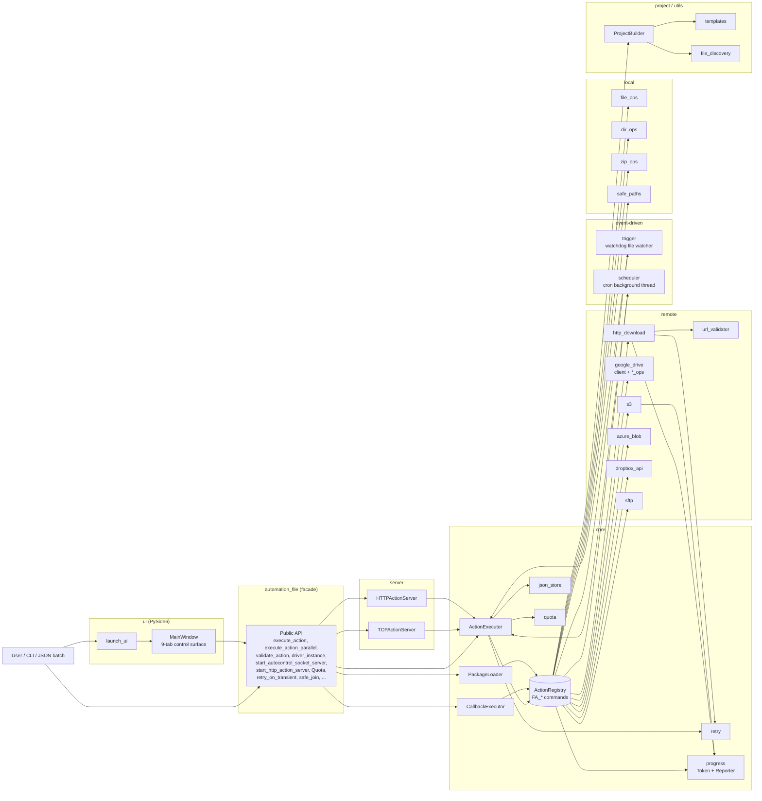

# FileAutomation

[English](README.md) | [繁體中文](README.zh-TW.md) | **简体中文**

一套模块化的自动化框架，涵盖本地文件 / 目录 / ZIP 操作、经 SSRF 验证的 HTTP
下载、远程存储（Google Drive、S3、Azure Blob、Dropbox、SFTP），以及通过内嵌
TCP / HTTP 服务器执行的 JSON 驱动动作。内附 PySide6 GUI，每个功能都有对应
页签。所有公开 API 均由顶层 `automation_file` facade 统一导出。

- 本地文件 / 目录 / ZIP 操作，内置路径穿越防护（`safe_join`）
- 经 SSRF 验证的 HTTP 下载，支持重试与大小 / 时间上限
- Google Drive CRUD（上传、下载、搜索、删除、分享、文件夹）
- 一等公民的 S3、Azure Blob、Dropbox、SFTP 后端 — 默认安装
- JSON 动作清单由共享的 `ActionExecutor` 执行 — 支持验证、干跑、并行
- Loopback 优先的 TCP **与** HTTP 服务器，接受 JSON 指令批量并可选 shared-secret 验证
- 可靠性原语：`retry_on_transient` 装饰器、`Quota` 大小 / 时间预算
- **文件监听触发** — 当路径变动时执行动作清单（`FA_watch_*`）
- **Cron 调度器** — 仅用标准库的 5 字段解析器执行周期性动作清单（`FA_schedule_*`）
- **传输进度 + 取消** — HTTP 与 S3 传输可选的 `progress_name` 钩子（`FA_progress_*`）
- **快速文件搜索** — OS 索引快速路径（`mdfind` / `locate` / `es.exe`）搭配流式 `scandir` 回退（`FA_fast_find`）
- PySide6 GUI（`python -m automation_file ui`）每个后端一个页签，含 JSON 动作执行器，另有 Triggers、Scheduler、实时 Progress 专属页签
- 功能丰富的 CLI，包含一次性子命令与旧式 JSON 批量标志
- 项目脚手架（`ProjectBuilder`）协助构建以 executor 为核心的自动化项目

## 架构



`build_default_registry()` 构建的 `ActionRegistry` 是所有 `FA_*` 命令的唯一
权威来源。`ActionExecutor`、`CallbackExecutor`、`PackageLoader`、
`TCPActionServer`、`HTTPActionServer` 都通过同一份共享 registry（以
`executor.registry` 对外公开）解析命令。

## 安装

```bash
pip install automation_file
```

单次安装即涵盖所有后端（Google Drive、S3、Azure Blob、Dropbox、SFTP）以及
PySide6 GUI — 日常使用不需要任何 extras。

```bash
pip install "automation_file[dev]"       # ruff, mypy, pre-commit, pytest-cov, build, twine
```

要求：
- Python 3.10+
- 内置依赖：`google-api-python-client`、`google-auth-oauthlib`、
  `requests`、`tqdm`、`boto3`、`azure-storage-blob`、`dropbox`、`paramiko`、
  `PySide6`、`watchdog`

## 使用方式

### 执行 JSON 动作清单
```python
from automation_file import execute_action

execute_action([
    ["FA_create_file", {"file_path": "test.txt"}],
    ["FA_copy_file", {"source": "test.txt", "target": "copy.txt"}],
])
```

### 验证、干跑、并行
```python
from automation_file import execute_action, execute_action_parallel, validate_action

# Fail-fast：只要有任何命令名称未知就在执行前中止。
execute_action(actions, validate_first=True)

# Dry-run：只记录会被调用的内容，不真的执行。
execute_action(actions, dry_run=True)

# Parallel：通过 thread pool 并行执行独立动作。
execute_action_parallel(actions, max_workers=4)

# 手动验证 — 返回解析后的名称列表。
names = validate_action(actions)
```

### 初始化 Google Drive 并上传
```python
from automation_file import driver_instance, drive_upload_to_drive

driver_instance.later_init("token.json", "credentials.json")
drive_upload_to_drive("example.txt")
```

### 经验证的 HTTP 下载（含重试）
```python
from automation_file import download_file

download_file("https://example.com/file.zip", "file.zip")
```

### 启动 loopback TCP 服务器（可选 shared-secret 验证）
```python
from automation_file import start_autocontrol_socket_server

server = start_autocontrol_socket_server(
    host="127.0.0.1", port=9943, shared_secret="optional-secret",
)
```

设定 `shared_secret` 时，客户端每个包都必须以 `AUTH <secret>\n` 为前缀。
若要绑定非 loopback 地址必须明确传入 `allow_non_loopback=True`。

### 启动 HTTP 动作服务器
```python
from automation_file import start_http_action_server

server = start_http_action_server(
    host="127.0.0.1", port=9944, shared_secret="optional-secret",
)

# curl -H 'Authorization: Bearer optional-secret' \
#      -d '[["FA_create_dir",{"dir_path":"x"}]]' \
#      http://127.0.0.1:9944/actions
```

### Retry 与 quota 原语
```python
from automation_file import retry_on_transient, Quota

@retry_on_transient(max_attempts=5, backoff_base=0.5)
def flaky_network_call(): ...

quota = Quota(max_bytes=50 * 1024 * 1024, max_seconds=30.0)
with quota.time_budget("bulk-upload"):
    bulk_upload_work()
```

### 路径穿越防护
```python
from automation_file import safe_join

target = safe_join("/data/jobs", user_supplied_path)
# 若解析后的路径逃出 /data/jobs 会抛出 PathTraversalException。
```

### Cloud / SFTP 后端
每个后端都会由 `build_default_registry()` 自动注册，因此 `FA_s3_*`、
`FA_azure_blob_*`、`FA_dropbox_*`、`FA_sftp_*` 动作开箱即用 — 不需要另外调用
`register_*_ops`。

```python
from automation_file import execute_action, s3_instance

s3_instance.later_init(region_name="us-east-1")

execute_action([
    ["FA_s3_upload_file", {"local_path": "report.csv", "bucket": "reports", "key": "report.csv"}],
])
```

所有后端（`s3`、`azure_blob`、`dropbox_api`、`sftp`）都提供相同的五组操作：
`upload_file`、`upload_dir`、`download_file`、`delete_*`、`list_*`。
SFTP 使用 `paramiko.RejectPolicy` — 未知主机会被拒绝，不会自动加入。

### 文件监听触发
每当被监听路径发生文件系统事件，就执行动作清单：

```python
from automation_file import watch_start, watch_stop

watch_start(
    name="inbox-sweeper",
    path="/data/inbox",
    action_list=[["FA_copy_all_file_to_dir", {"source_dir": "/data/inbox",
                                              "target_dir": "/data/processed"}]],
    events=["created", "modified"],
    recursive=False,
)
# 稍后：
watch_stop("inbox-sweeper")
```

`FA_watch_start` / `FA_watch_stop` / `FA_watch_stop_all` / `FA_watch_list`
让 JSON 动作清单能使用相同的生命周期。

### Cron 调度器
以纯标准库的 5 字段 cron 解析器执行周期性动作清单：

```python
from automation_file import schedule_add

schedule_add(
    name="nightly-snapshot",
    cron_expression="0 2 * * *",        # 每天本地时间 02:00
    action_list=[["FA_zip_dir", {"dir_we_want_to_zip": "/data",
                                 "zip_name": "/backup/data_nightly"}]],
)
```

支持 `*`、确切值、`a-b` 范围、逗号列表、`*/n` 步进语法，以及 `jan..dec` /
`sun..sat` 别名。JSON 动作：`FA_schedule_add`、`FA_schedule_remove`、
`FA_schedule_remove_all`、`FA_schedule_list`。

### 传输进度 + 取消
HTTP 与 S3 传输支持可选的 `progress_name` 关键字参数：

```python
from automation_file import download_file, progress_cancel

download_file("https://example.com/big.bin", "big.bin",
              progress_name="big-download")

# 从另一个线程或 GUI：
progress_cancel("big-download")
```

共享的 `progress_registry` 通过 `progress_list()` 以及 `FA_progress_list` /
`FA_progress_cancel` / `FA_progress_clear` JSON 动作提供实时快照。GUI 的
**Progress** 页签每半秒轮询一次 registry。

### 快速文件搜索
若 OS 索引器可用就直接查询（macOS 的 `mdfind`、Linux 的 `locate` /
`plocate`、Windows 的 Everything `es.exe`），否则回退到以流式 `os.scandir`
遍历。不需要额外依赖。

```python
from automation_file import fast_find, scandir_find, has_os_index

# 可用时使用 OS 索引器，否则回退到 scandir。
results = fast_find("/var/log", "*.log", limit=100)

# 强制使用可移植路径（跳过 OS 索引器）。
results = fast_find("/data", "report_*.csv", use_index=False)

# 流式 — 不需要遍历整棵树就能提前停止。
for path in scandir_find("/data", "*.csv"):
    if "2026" in path:
        break
```

`FA_fast_find` 将同一个函数提供给 JSON 动作清单：

```json
[["FA_fast_find", {"root": "/var/log", "pattern": "*.log", "limit": 50}]]
```

### GUI
```bash
python -m automation_file ui        # 或：python main_ui.py
```

```python
from automation_file import launch_ui
launch_ui()
```

页签：Home、Local、Transfer、Progress、JSON actions、Triggers、Scheduler、
Servers。底部常驻的 log 面板实时流式输出每一笔结果与错误。

### 以 executor 为核心构建项目脚手架
```python
from automation_file import create_project_dir

create_project_dir("my_workflow")
```

## CLI

```bash
# 子命令（一次性操作）
python -m automation_file ui
python -m automation_file zip ./src out.zip --dir
python -m automation_file unzip out.zip ./restored
python -m automation_file download https://example.com/file.bin file.bin
python -m automation_file create-file hello.txt --content "hi"
python -m automation_file server --host 127.0.0.1 --port 9943
python -m automation_file http-server --host 127.0.0.1 --port 9944
python -m automation_file drive-upload my.txt --token token.json --credentials creds.json

# 旧式标志（JSON 动作清单）
python -m automation_file --execute_file actions.json
python -m automation_file --execute_dir ./actions/
python -m automation_file --execute_str '[["FA_create_dir",{"dir_path":"x"}]]'
python -m automation_file --create_project ./my_project
```

## JSON 动作格式

每一项动作可以是单纯的命令名称、`[name, kwargs]` 组合，或 `[name, args]`
列表：

```json
[
  ["FA_create_file", {"file_path": "test.txt"}],
  ["FA_drive_upload_to_drive", {"file_path": "test.txt"}],
  ["FA_drive_search_all_file"]
]
```

## 文档

完整 API 文档位于 `docs/`，可用 Sphinx 生成：

```bash
pip install -r docs/requirements.txt
sphinx-build -b html docs/source docs/_build/html
```

架构笔记、代码规范与安全考量请参见 [`CLAUDE.md`](CLAUDE.md)。
