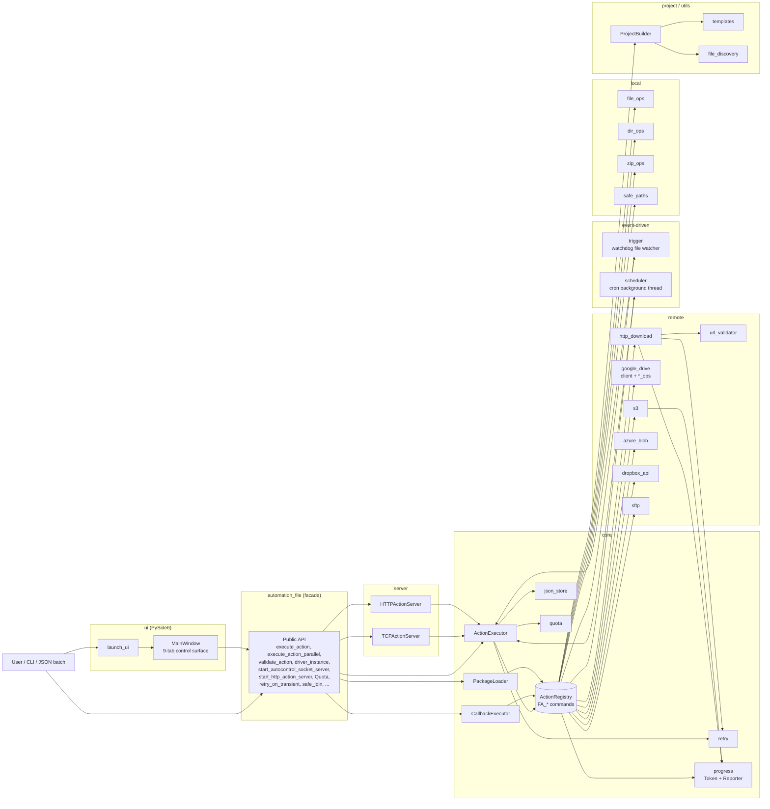

# FileAutomation

[English](README.md) | **繁體中文** | [简体中文](README.zh-CN.md)

一套模組化的自動化框架，涵蓋本機檔案 / 目錄 / ZIP 操作、經 SSRF 驗證的 HTTP
下載、遠端儲存（Google Drive、S3、Azure Blob、Dropbox、SFTP），以及透過內建
TCP / HTTP 伺服器執行的 JSON 驅動動作。內附 PySide6 GUI，每個功能都有對應
分頁。所有公開 API 皆由頂層 `automation_file` facade 統一匯出。

- 本機檔案 / 目錄 / ZIP 操作，內建路徑穿越防護（`safe_join`）
- 經 SSRF 驗證的 HTTP 下載，支援重試與大小 / 時間上限
- Google Drive CRUD（上傳、下載、搜尋、刪除、分享、資料夾）
- 一等公民的 S3、Azure Blob、Dropbox、SFTP 後端 — 預設安裝
- JSON 動作清單由共用的 `ActionExecutor` 執行 — 支援驗證、乾跑、平行
- Loopback 優先的 TCP **與** HTTP 伺服器，接受 JSON 指令批次並可選 shared-secret 驗證
- 可靠性原語：`retry_on_transient` 裝飾器、`Quota` 大小 / 時間預算
- **檔案監看觸發** — 當路徑變動時執行動作清單（`FA_watch_*`）
- **Cron 排程器** — 僅用標準函式庫的 5 欄位解析器執行週期性動作清單（`FA_schedule_*`）
- **傳輸進度 + 取消** — HTTP 與 S3 傳輸可選的 `progress_name` 掛鉤（`FA_progress_*`）
- **快速檔案搜尋** — OS 索引快速路徑（`mdfind` / `locate` / `es.exe`）搭配串流式 `scandir` 備援（`FA_fast_find`）
- PySide6 GUI（`python -m automation_file ui`）每個後端一個分頁，含 JSON 動作執行器，另有 Triggers、Scheduler、即時 Progress 專屬分頁
- 功能豐富的 CLI，包含一次性子指令與舊式 JSON 批次旗標
- 專案鷹架（`ProjectBuilder`）協助建立以 executor 為核心的自動化專案

## 架構



`build_default_registry()` 建立的 `ActionRegistry` 是所有 `FA_*` 指令的唯一
權威來源。`ActionExecutor`、`CallbackExecutor`、`PackageLoader`、
`TCPActionServer`、`HTTPActionServer` 都透過同一份共用 registry（以
`executor.registry` 對外公開）解析指令。

## 安裝

```bash
pip install automation_file
```

單一安裝即涵蓋所有後端（Google Drive、S3、Azure Blob、Dropbox、SFTP）以及
PySide6 GUI — 日常使用不需要任何 extras。

```bash
pip install "automation_file[dev]"       # ruff, mypy, pre-commit, pytest-cov, build, twine
```

需求：
- Python 3.10+
- 內建相依套件：`google-api-python-client`、`google-auth-oauthlib`、
  `requests`、`tqdm`、`boto3`、`azure-storage-blob`、`dropbox`、`paramiko`、
  `PySide6`、`watchdog`

## 使用方式

### 執行 JSON 動作清單
```python
from automation_file import execute_action

execute_action([
    ["FA_create_file", {"file_path": "test.txt"}],
    ["FA_copy_file", {"source": "test.txt", "target": "copy.txt"}],
])
```

### 驗證、乾跑、平行
```python
from automation_file import execute_action, execute_action_parallel, validate_action

# Fail-fast：只要有任何指令名稱未知就在執行前中止。
execute_action(actions, validate_first=True)

# Dry-run：只記錄會被呼叫的內容，不真的執行。
execute_action(actions, dry_run=True)

# Parallel：透過 thread pool 平行執行獨立動作。
execute_action_parallel(actions, max_workers=4)

# 手動驗證 — 回傳解析後的名稱清單。
names = validate_action(actions)
```

### 初始化 Google Drive 並上傳
```python
from automation_file import driver_instance, drive_upload_to_drive

driver_instance.later_init("token.json", "credentials.json")
drive_upload_to_drive("example.txt")
```

### 經驗證的 HTTP 下載（含重試）
```python
from automation_file import download_file

download_file("https://example.com/file.zip", "file.zip")
```

### 啟動 loopback TCP 伺服器（可選 shared-secret 驗證）
```python
from automation_file import start_autocontrol_socket_server

server = start_autocontrol_socket_server(
    host="127.0.0.1", port=9943, shared_secret="optional-secret",
)
```

設定 `shared_secret` 時，客戶端每個封包都必須以 `AUTH <secret>\n` 為前綴。
若要綁定非 loopback 位址必須明確傳入 `allow_non_loopback=True`。

### 啟動 HTTP 動作伺服器
```python
from automation_file import start_http_action_server

server = start_http_action_server(
    host="127.0.0.1", port=9944, shared_secret="optional-secret",
)

# curl -H 'Authorization: Bearer optional-secret' \
#      -d '[["FA_create_dir",{"dir_path":"x"}]]' \
#      http://127.0.0.1:9944/actions
```

### Retry 與 quota 原語
```python
from automation_file import retry_on_transient, Quota

@retry_on_transient(max_attempts=5, backoff_base=0.5)
def flaky_network_call(): ...

quota = Quota(max_bytes=50 * 1024 * 1024, max_seconds=30.0)
with quota.time_budget("bulk-upload"):
    bulk_upload_work()
```

### 路徑穿越防護
```python
from automation_file import safe_join

target = safe_join("/data/jobs", user_supplied_path)
# 若解析後的路徑跳脫 /data/jobs 會拋出 PathTraversalException。
```

### Cloud / SFTP 後端
每個後端都會由 `build_default_registry()` 自動註冊，因此 `FA_s3_*`、
`FA_azure_blob_*`、`FA_dropbox_*`、`FA_sftp_*` 動作開箱即用 — 不需要另外呼叫
`register_*_ops`。

```python
from automation_file import execute_action, s3_instance

s3_instance.later_init(region_name="us-east-1")

execute_action([
    ["FA_s3_upload_file", {"local_path": "report.csv", "bucket": "reports", "key": "report.csv"}],
])
```

所有後端（`s3`、`azure_blob`、`dropbox_api`、`sftp`）都對外提供相同的五組
操作：`upload_file`、`upload_dir`、`download_file`、`delete_*`、`list_*`。
SFTP 使用 `paramiko.RejectPolicy` — 未知主機會被拒絕，不會自動加入。

### 檔案監看觸發
每當被監看路徑發生檔案系統事件，就執行動作清單：

```python
from automation_file import watch_start, watch_stop

watch_start(
    name="inbox-sweeper",
    path="/data/inbox",
    action_list=[["FA_copy_all_file_to_dir", {"source_dir": "/data/inbox",
                                              "target_dir": "/data/processed"}]],
    events=["created", "modified"],
    recursive=False,
)
# 稍後：
watch_stop("inbox-sweeper")
```

`FA_watch_start` / `FA_watch_stop` / `FA_watch_stop_all` / `FA_watch_list`
讓 JSON 動作清單能使用相同的生命週期。

### Cron 排程器
以純標準函式庫的 5 欄位 cron 解析器執行週期性動作清單：

```python
from automation_file import schedule_add

schedule_add(
    name="nightly-snapshot",
    cron_expression="0 2 * * *",        # 每天本地時間 02:00
    action_list=[["FA_zip_dir", {"dir_we_want_to_zip": "/data",
                                 "zip_name": "/backup/data_nightly"}]],
)
```

支援 `*`、確切值、`a-b` 範圍、逗號清單、`*/n` 步進語法，以及 `jan..dec` /
`sun..sat` 別名。JSON 動作：`FA_schedule_add`、`FA_schedule_remove`、
`FA_schedule_remove_all`、`FA_schedule_list`。

### 傳輸進度 + 取消
HTTP 與 S3 傳輸支援可選的 `progress_name` 關鍵字參數：

```python
from automation_file import download_file, progress_cancel

download_file("https://example.com/big.bin", "big.bin",
              progress_name="big-download")

# 從另一個執行緒或 GUI：
progress_cancel("big-download")
```

共用的 `progress_registry` 透過 `progress_list()` 以及 `FA_progress_list` /
`FA_progress_cancel` / `FA_progress_clear` JSON 動作提供即時快照。GUI 的
**Progress** 分頁每半秒輪詢一次 registry。

### 快速檔案搜尋
若 OS 索引器可用就直接查詢（macOS 的 `mdfind`、Linux 的 `locate` /
`plocate`、Windows 的 Everything `es.exe`），否則退回以串流 `os.scandir`
走訪。不需要額外相依套件。

```python
from automation_file import fast_find, scandir_find, has_os_index

# 可用時使用 OS 索引器，否則退回 scandir。
results = fast_find("/var/log", "*.log", limit=100)

# 強制使用可攜路徑（跳過 OS 索引器）。
results = fast_find("/data", "report_*.csv", use_index=False)

# 串流 — 不需走訪整棵樹就能提早停止。
for path in scandir_find("/data", "*.csv"):
    if "2026" in path:
        break
```

`FA_fast_find` 將同一個函式提供給 JSON 動作清單：

```json
[["FA_fast_find", {"root": "/var/log", "pattern": "*.log", "limit": 50}]]
```

### GUI
```bash
python -m automation_file ui        # 或：python main_ui.py
```

```python
from automation_file import launch_ui
launch_ui()
```

分頁：Home、Local、Transfer、Progress、JSON actions、Triggers、Scheduler、
Servers。底部常駐的 log 面板即時串流每一筆結果與錯誤。

### 以 executor 為核心建立專案鷹架
```python
from automation_file import create_project_dir

create_project_dir("my_workflow")
```

## CLI

```bash
# 子指令（一次性操作）
python -m automation_file ui
python -m automation_file zip ./src out.zip --dir
python -m automation_file unzip out.zip ./restored
python -m automation_file download https://example.com/file.bin file.bin
python -m automation_file create-file hello.txt --content "hi"
python -m automation_file server --host 127.0.0.1 --port 9943
python -m automation_file http-server --host 127.0.0.1 --port 9944
python -m automation_file drive-upload my.txt --token token.json --credentials creds.json

# 舊式旗標（JSON 動作清單）
python -m automation_file --execute_file actions.json
python -m automation_file --execute_dir ./actions/
python -m automation_file --execute_str '[["FA_create_dir",{"dir_path":"x"}]]'
python -m automation_file --create_project ./my_project
```

## JSON 動作格式

每一項動作可以是單純的指令名稱、`[name, kwargs]` 組合，或 `[name, args]`
清單：

```json
[
  ["FA_create_file", {"file_path": "test.txt"}],
  ["FA_drive_upload_to_drive", {"file_path": "test.txt"}],
  ["FA_drive_search_all_file"]
]
```

## 文件

完整 API 文件位於 `docs/`，可用 Sphinx 產生：

```bash
pip install -r docs/requirements.txt
sphinx-build -b html docs/source docs/_build/html
```

架構筆記、程式碼慣例與安全考量請參見 [`CLAUDE.md`](CLAUDE.md)。
