# FileAutomation

[English](README.md) | **繁體中文** | [简体中文](README.zh-CN.md)

一套模組化的自動化框架，涵蓋本機檔案 / 目錄 / ZIP 操作、經 SSRF 驗證的 HTTP
下載、遠端儲存（Google Drive、S3、Azure Blob、Dropbox、SFTP），以及透過內建
TCP / HTTP 伺服器執行的 JSON 驅動動作。內附 PySide6 GUI，每個功能都有對應
分頁。所有公開 API 皆由頂層 `automation_file` facade 統一匯出。

- 本機檔案 / 目錄 / ZIP 操作，內建路徑穿越防護（`safe_join`）
- 經 SSRF 驗證的 HTTP 下載，支援重試與大小 / 時間上限
- Google Drive CRUD（上傳、下載、搜尋、刪除、分享、資料夾）
- 一等公民的 S3、Azure Blob、Dropbox、SFTP 後端 — 預設安裝
- JSON 動作清單由共用的 `ActionExecutor` 執行 — 支援驗證、乾跑、平行
- Loopback 優先的 TCP **與** HTTP 伺服器，接受 JSON 指令批次並可選 shared-secret 驗證
- 可靠性原語：`retry_on_transient` 裝飾器、`Quota` 大小 / 時間預算
- **檔案監看觸發** — 當路徑變動時執行動作清單（`FA_watch_*`）
- **Cron 排程器** — 僅用標準函式庫的 5 欄位解析器執行週期性動作清單（`FA_schedule_*`）
- **傳輸進度 + 取消** — HTTP 與 S3 傳輸可選的 `progress_name` 掛鉤（`FA_progress_*`）
- **快速檔案搜尋** — OS 索引快速路徑（`mdfind` / `locate` / `es.exe`）搭配串流式 `scandir` 備援（`FA_fast_find`）
- **檢查碼 + 完整性驗證** — 串流式 `file_checksum` / `verify_checksum`，支援任何 `hashlib` 演算法；`download_file(expected_sha256=...)` 於下載完成後立即驗證（`FA_file_checksum`、`FA_verify_checksum`）
- **可續傳 HTTP 下載** — `download_file(resume=True)` 寫入 `<target>.part` 並傳送 `Range: bytes=<n>-`，讓中斷的傳輸繼續而非從頭開始
- **重複檔案尋找器** — 三階段 size → 部分雜湊 → 完整雜湊管線；大小唯一的檔案完全不會被雜湊（`FA_find_duplicates`）
- **DAG 動作執行器** — 依相依順序拓撲排程，獨立分支平行展開，失敗時其後代預設標記跳過（`FA_execute_action_dag`）
- **Entry-point 外掛** — 第三方套件透過 `[project.entry-points."automation_file.actions"]` 註冊自訂 `FA_*` 動作；`build_default_registry()` 會自動載入
- **增量目錄同步** — rsync 風格鏡像，支援 size+mtime 或 checksum 變更偵測，選擇性刪除多餘檔案，支援乾跑（`FA_sync_dir`）
- **目錄 manifest** — 以 JSON 快照記錄樹下每個檔案的檢查碼，驗證時分開回報 missing / modified / extra（`FA_write_manifest`、`FA_verify_manifest`）
- **通知 sink** — webhook / Slack / SMTP / Telegram / Discord / Teams / PagerDuty，fanout 管理器做個別 sink 錯誤隔離與滑動視窗去重；trigger + scheduler 失敗時自動通知（`FA_notify_send`、`FA_notify_list`）
- **設定檔 + 秘密提供者** — 在 `automation_file.toml` 宣告通知 sink / 預設值；`${env:…}` 與 `${file:…}` 參考透過 Env / File / Chained 提供者抽象解析，讓秘密不留在檔案裡
- **設定熱重載** — `ConfigWatcher` 輪詢 `automation_file.toml`，變更時即時套用 sink / 預設值，無需重啟
- **Shell / grep / JSON 編輯 / tar / 備份輪替** — `FA_run_shell`（參數列表式 subprocess，含逾時）、`FA_grep`（串流文字搜尋）、`FA_json_get` / `FA_json_set` / `FA_json_delete`（原地 JSON 編輯）、`FA_create_tar` / `FA_extract_tar`、`FA_rotate_backups`
- **FTP / FTPS 後端** — 純 FTP 或透過 `FTP_TLS.auth()` 的顯式 FTPS；自動註冊為 `FA_ftp_*`
- **跨後端複製** — `FA_copy_between` 透過 `local://`、`s3://`、`drive://`、`azure://`、`dropbox://`、`sftp://`、`ftp://` URI 在任意兩個後端之間搬運資料
- **排程器重疊防護** — 正在執行的工作在下次觸發時會被跳過，除非明確傳入 `allow_overlap=True`
- **伺服器動作 ACL** — `allowed_actions=(...)` 限制 TCP / HTTP 伺服器可派送的指令
- **變數替換** — 動作參數中可選使用 `${env:VAR}` / `${date:%Y-%m-%d}` / `${uuid}` / `${cwd}`，透過 `execute_action(..., substitute=True)` 展開
- **條件式執行** — `FA_if_exists` / `FA_if_newer` / `FA_if_size_gt` 僅在路徑守護通過時執行巢狀動作清單
- **SQLite 稽核日誌** — `AuditLog(db_path)` 為每個動作記錄 actor / status / duration；以 `recent` / `count` / `purge` 查詢
- **檔案完整性監控** — `IntegrityMonitor` 依 manifest 輪詢整棵樹，偵測到 drift 時觸發 callback + 通知
- **HTTPActionClient SDK** — HTTP 動作伺服器的型別化 Python 客戶端，具 shared-secret 驗證、loopback 防護與 OPTIONS ping
- **AES-256-GCM 檔案加密** — `encrypt_file` / `decrypt_file` 搭配 `generate_key()` / `key_from_password()`（PBKDF2-HMAC-SHA256）；JSON 動作 `FA_encrypt_file` / `FA_decrypt_file`
- **Prometheus metrics 匯出器** — `start_metrics_server()` 提供 `automation_file_actions_total{action,status}` 計數器與 `automation_file_action_duration_seconds{action}` 直方圖
- **WebDAV 後端** — `WebDAVClient` 提供 `exists` / `upload` / `download` / `delete` / `mkcol` / `list_dir`，適用於任何 RFC 4918 伺服器；除非顯式傳入 `allow_private_hosts=True`，否則拒絕私有 / loopback 目標
- **SMB / CIFS 後端** — `SMBClient` 建構於 `smbprotocol` 的高階 `smbclient` API；採用 UNC 路徑，預設啟用加密連線
- **fsspec 橋接** — 透過 `get_fs` / `fsspec_upload` / `fsspec_download` / `fsspec_list_dir` 等函式，驅動任何 `fsspec` 支援的檔案系統（memory、local、s3、gcs、abfs、…）
- **HTTP 伺服器觀測端點** — `GET /healthz` / `GET /readyz` 探針、`GET /openapi.json` 規格、以及 `GET /progress`（以 WebSocket 推送即時傳輸快照）
- **HTMX Web UI** — `start_web_ui()` 啟動唯讀觀測儀表板（health、progress、registry），以 HTML 片段輪詢；僅用標準函式庫 HTTP，搭配一支帶 SRI 的 CDN 腳本
- **MCP（Model Context Protocol）伺服器** — `MCPServer` 透過 stdio 上的 JSON-RPC 2.0（行分隔 JSON）將登錄表橋接到任何 MCP 主機（Claude Desktop、MCP CLI）；每個 `FA_*` 動作都會自動生成輸入 schema 並成為 MCP 工具
- PySide6 GUI（`python -m automation_file ui`）每個後端一個分頁，含 JSON 動作執行器，另有 Triggers、Scheduler、即時 Progress 專屬分頁
- 功能豐富的 CLI，包含一次性子指令與舊式 JSON 批次旗標
- 專案鷹架（`ProjectBuilder`）協助建立以 executor 為核心的自動化專案

## 架構

```mermaid
flowchart TD
    CLI["<b>CLI / JSON 批次</b><br/>python -m automation_file"]
    GUIUser["<b>PySide6 GUI</b><br/>launch_ui"]
    ClientSDK["<b>HTTPActionClient SDK</b>"]
    MCPHost["<b>MCP 主機</b><br/>Claude Desktop · MCP CLIs"]
    Plugins["<b>進入點外掛</b><br/>automation_file.actions"]

    subgraph Facade["<b>automation_file &mdash; 門面 (__init__.py)</b>"]
        PublicAPI["<b>Public API</b><br/>execute_action · execute_action_parallel · execute_action_dag<br/>validate_action · driver_instance · s3_instance · azure_blob_instance<br/>dropbox_instance · sftp_instance · ftp_instance · onedrive_instance · box_instance<br/>start_autocontrol_socket_server · start_http_action_server<br/>start_metrics_server · start_web_ui · MCPServer<br/>notification_manager · scheduler · trigger_manager<br/>AutomationConfig · progress_registry · Quota · retry_on_transient"]
    end

    subgraph Core["<b>core 核心</b>"]
        Registry[("<b>ActionRegistry</b><br/>FA_* 指令")]
        Executor["<b>ActionExecutor</b><br/>序列 · 並行 · dry-run · validate-first"]
        DAG["<b>dag_executor</b><br/>拓樸排程 fan-out"]
        Callback["<b>CallbackExecutor</b>"]
        Loader["<b>PackageLoader</b><br/>+ 進入點外掛"]
        Queue["<b>ActionQueue</b>"]
        Json["<b>json_store</b>"]
        Sub["<b>substitution</b><br/>${env:} ${date:} ${uuid}"]
    end

    subgraph Reliability["<b>可靠性</b>"]
        Retry["<b>retry</b><br/>@retry_on_transient"]
        QuotaMod["<b>Quota</b><br/>位元組 + 時間配額"]
        Breaker["<b>CircuitBreaker</b>"]
        RL["<b>RateLimiter</b>"]
        Locks["<b>FileLock</b> · <b>SQLiteLock</b>"]
    end

    subgraph Observability["<b>可觀測性</b>"]
        Progress["<b>progress</b><br/>CancellationToken · Reporter"]
        Metrics["<b>metrics</b><br/>Prometheus counters + histograms"]
        Audit["<b>AuditLog</b><br/>SQLite 稽核紀錄"]
        Tracing["<b>tracing</b><br/>OpenTelemetry spans"]
        FIM["<b>IntegrityMonitor</b>"]
    end

    subgraph Security["<b>安全 &amp; 設定</b>"]
        Secrets["<b>Secret providers</b><br/>Env · File · Chained"]
        Config["<b>AutomationConfig</b><br/>TOML 載入器"]
        ConfW["<b>ConfigWatcher</b><br/>熱重載"]
        Crypto["<b>crypto</b><br/>AES-256-GCM"]
        Check["<b>checksum</b> / <b>manifest</b>"]
        SafeP["<b>safe_paths</b><br/>safe_join · is_within"]
        ACL["<b>ActionACL</b>"]
    end

    subgraph Events["<b>事件驅動</b>"]
        Trigger["<b>TriggerManager</b><br/>watchdog 檔案監聽"]
        Sched["<b>Scheduler</b><br/>5-field cron + overlap guard"]
    end

    subgraph Servers["<b>伺服器</b>"]
        TCP["<b>TCPActionServer</b><br/>loopback · AUTH secret"]
        HTTPS["<b>HTTPActionServer</b><br/>POST /actions · Bearer<br/>/healthz /readyz /progress /openapi.json"]
        MCP["<b>MCPServer</b><br/>JSON-RPC 2.0 (stdio)"]
        MetSrv["<b>MetricsServer</b><br/>/metrics"]
        WebUI["<b>WebUIServer</b><br/>HTMX dashboard"]
    end

    subgraph UI["<b>ui (PySide6)</b>"]
        MainWin["<b>MainWindow</b><br/>Home · Local · HTTP · Drive · S3 · Azure · Dropbox<br/>SFTP · OneDrive · Box · JSON · Triggers · Scheduler<br/>Progress · Transfer · Servers"]
        Worker["<b>ActionWorker</b><br/>QRunnable on QThreadPool"]
    end

    subgraph Local["<b>本地 ops</b>"]
        FileOps["<b>file_ops</b> · <b>dir_ops</b>"]
        Archives["<b>zip_ops</b> · <b>tar_ops</b> · <b>archive_ops</b>"]
        DataOps["<b>data_ops</b><br/>csv · jsonl · parquet · yaml"]
        TextOps["<b>text_ops</b> · <b>diff_ops</b><br/><b>json_edit</b> · <b>templates</b>"]
        Misc["<b>shell_ops</b> · <b>sync_ops</b> · <b>trash</b><br/><b>versioning</b> · <b>conditional</b> · <b>mime</b>"]
    end

    subgraph Remote["<b>遠端後端</b>"]
        UrlVal["<b>url_validator</b><br/>SSRF 防護"]
        Http["<b>http_download</b><br/>retry · resume · SHA-256"]
        Drive["<b>google_drive</b>"]
        S3M["<b>s3</b>"]
        Azure["<b>azure_blob</b>"]
        Dropbox["<b>dropbox_api</b>"]
        SFTP["<b>sftp</b> (RejectPolicy)"]
        FTP["<b>ftp / FTPS</b>"]
        OneD["<b>onedrive</b>"]
        Box["<b>box</b>"]
        WebDAV["<b>webdav</b>"]
        SMB["<b>smb / cifs</b>"]
        Fsspec["<b>fsspec_bridge</b>"]
        Cross["<b>cross_backend</b><br/>local:// s3:// drive:// azure://<br/>dropbox:// sftp:// ftp://"]
    end

    subgraph Notify["<b>通知</b>"]
        NM["<b>NotificationManager</b><br/>fanout · dedup · SSRF guard"]
        Sinks["<b>Sinks</b><br/>Webhook · Slack · Email<br/>Telegram · Discord · Teams · PagerDuty"]
    end

    subgraph Utils["<b>工具 / 專案</b>"]
        Fast["<b>fast_find</b><br/>mdfind / locate / es.exe"]
        Dedup["<b>find_duplicates</b>"]
        Grep["<b>grep_files</b>"]
        Rotate["<b>rotate_backups</b>"]
        Discovery["<b>file_discovery</b>"]
        Builder["<b>ProjectBuilder</b> + templates"]
    end

    CLI ==> PublicAPI
    GUIUser ==> MainWin
    ClientSDK ==> HTTPS
    MCPHost ==> MCP
    Plugins ==> Loader

    MainWin ==> Worker
    Worker ==> PublicAPI

    PublicAPI ==> Executor
    PublicAPI ==> DAG
    PublicAPI ==> Callback
    PublicAPI ==> Queue
    PublicAPI ==> Config
    PublicAPI ==> NM
    PublicAPI ==> Trigger
    PublicAPI ==> Sched

    TCP ==> Executor
    HTTPS ==> Executor
    MCP ==> Registry
    MetSrv ==> Metrics
    WebUI ==> Registry
    ACL ==> TCP
    ACL ==> HTTPS

    Executor ==> Registry
    Executor ==> Sub
    Executor ==> Retry
    Executor ==> QuotaMod
    Executor ==> Metrics
    Executor ==> Audit
    Executor ==> Tracing
    Executor ==> Json
    DAG ==> Executor
    Callback ==> Registry
    Loader ==> Registry

    Trigger ==> Executor
    Sched ==> Executor
    Trigger -. 失敗時 .-> NM
    Sched -. 失敗時 .-> NM
    FIM -. 偵測到異動 .-> NM
    ConfW ==> Config
    Config ==> Secrets
    Config ==> NM

    Registry ==> FileOps
    Registry ==> Archives
    Registry ==> DataOps
    Registry ==> TextOps
    Registry ==> Misc
    Registry ==> Http
    Registry ==> Drive
    Registry ==> S3M
    Registry ==> Azure
    Registry ==> Dropbox
    Registry ==> SFTP
    Registry ==> FTP
    Registry ==> OneD
    Registry ==> Box
    Registry ==> WebDAV
    Registry ==> SMB
    Registry ==> Fsspec
    Registry ==> Cross
    Registry ==> Crypto
    Registry ==> Check
    Registry ==> Fast
    Registry ==> Dedup
    Registry ==> Grep
    Registry ==> Rotate
    Registry ==> Discovery
    Registry ==> Builder
    Registry ==> Progress

    FileOps ==> SafeP
    Archives ==> SafeP
    Misc ==> SafeP

    Http ==> UrlVal
    Http ==> Retry
    Http ==> Progress
    Http ==> Check
    S3M ==> Progress
    WebDAV ==> UrlVal
    NM ==> UrlVal
    NM ==> Sinks

    Cross ==> Drive
    Cross ==> S3M
    Cross ==> Azure
    Cross ==> Dropbox
    Cross ==> SFTP
    Cross ==> FTP

    classDef entry fill:#FDEDEC,stroke:#641E16,stroke-width:3px,color:#000,font-weight:bold;
    classDef facade fill:#D6EAF8,stroke:#154360,stroke-width:4px,color:#000,font-weight:bold;
    classDef core fill:#FEF9E7,stroke:#1F3A93,stroke-width:3px,color:#000,font-weight:bold;
    classDef rel fill:#D1F2EB,stroke:#0B5345,stroke-width:3px,color:#000,font-weight:bold;
    classDef obs fill:#FDEBD0,stroke:#9C640C,stroke-width:3px,color:#000,font-weight:bold;
    classDef sec fill:#F5B7B1,stroke:#78281F,stroke-width:3px,color:#000,font-weight:bold;
    classDef event fill:#FCF3CF,stroke:#7D6608,stroke-width:3px,color:#000,font-weight:bold;
    classDef server fill:#FADBD8,stroke:#922B21,stroke-width:3px,color:#000,font-weight:bold;
    classDef ui fill:#AED6F1,stroke:#1B4F72,stroke-width:3px,color:#000,font-weight:bold;
    classDef localOps fill:#E8DAEF,stroke:#512E5F,stroke-width:3px,color:#000,font-weight:bold;
    classDef remote fill:#D5F5E3,stroke:#196F3D,stroke-width:3px,color:#000,font-weight:bold;
    classDef notify fill:#F9E79F,stroke:#7D6608,stroke-width:3px,color:#000,font-weight:bold;
    classDef utils fill:#EAEDED,stroke:#212F3C,stroke-width:3px,color:#000,font-weight:bold;

    class CLI,GUIUser,ClientSDK,MCPHost,Plugins entry;
    class PublicAPI facade;
    class Registry,Executor,DAG,Callback,Loader,Queue,Json,Sub core;
    class Retry,QuotaMod,Breaker,RL,Locks rel;
    class Progress,Metrics,Audit,Tracing,FIM obs;
    class Secrets,Config,ConfW,Crypto,Check,SafeP,ACL sec;
    class Trigger,Sched event;
    class TCP,HTTPS,MCP,MetSrv,WebUI server;
    class MainWin,Worker ui;
    class FileOps,Archives,DataOps,TextOps,Misc localOps;
    class UrlVal,Http,Drive,S3M,Azure,Dropbox,SFTP,FTP,OneD,Box,WebDAV,SMB,Fsspec,Cross remote;
    class NM,Sinks notify;
    class Fast,Dedup,Grep,Rotate,Discovery,Builder utils;

    linkStyle default stroke:#1F2A44,stroke-width:2.5px;
```



`build_default_registry()` 建立的 `ActionRegistry` 是所有 `FA_*` 指令的唯一
權威來源。`ActionExecutor`、`CallbackExecutor`、`PackageLoader`、
`TCPActionServer`、`HTTPActionServer` 都透過同一份共用 registry（以
`executor.registry` 對外公開）解析指令。

## 安裝

```bash
pip install automation_file
```

單一安裝即涵蓋所有後端（Google Drive、S3、Azure Blob、Dropbox、SFTP）以及
PySide6 GUI — 日常使用不需要任何 extras。

```bash
pip install "automation_file[dev]"       # ruff, mypy, pre-commit, pytest-cov, build, twine
```

需求：
- Python 3.10+
- 內建相依套件：`google-api-python-client`、`google-auth-oauthlib`、
  `requests`、`tqdm`、`boto3`、`azure-storage-blob`、`dropbox`、`paramiko`、
  `PySide6`、`watchdog`

## 使用方式

### 執行 JSON 動作清單
```python
from automation_file import execute_action

execute_action([
    ["FA_create_file", {"file_path": "test.txt"}],
    ["FA_copy_file", {"source": "test.txt", "target": "copy.txt"}],
])
```

### 驗證、乾跑、平行
```python
from automation_file import execute_action, execute_action_parallel, validate_action

# Fail-fast：只要有任何指令名稱未知就在執行前中止。
execute_action(actions, validate_first=True)

# Dry-run：只記錄會被呼叫的內容，不真的執行。
execute_action(actions, dry_run=True)

# Parallel：透過 thread pool 平行執行獨立動作。
execute_action_parallel(actions, max_workers=4)

# 手動驗證 — 回傳解析後的名稱清單。
names = validate_action(actions)
```

### 初始化 Google Drive 並上傳
```python
from automation_file import driver_instance, drive_upload_to_drive

driver_instance.later_init("token.json", "credentials.json")
drive_upload_to_drive("example.txt")
```

### 經驗證的 HTTP 下載（含重試）
```python
from automation_file import download_file

download_file("https://example.com/file.zip", "file.zip")
```

### 啟動 loopback TCP 伺服器（可選 shared-secret 驗證）
```python
from automation_file import start_autocontrol_socket_server

server = start_autocontrol_socket_server(
    host="127.0.0.1", port=9943, shared_secret="optional-secret",
)
```

設定 `shared_secret` 時，客戶端每個封包都必須以 `AUTH <secret>\n` 為前綴。
若要綁定非 loopback 位址必須明確傳入 `allow_non_loopback=True`。

### 啟動 HTTP 動作伺服器
```python
from automation_file import start_http_action_server

server = start_http_action_server(
    host="127.0.0.1", port=9944, shared_secret="optional-secret",
)

# curl -H 'Authorization: Bearer optional-secret' \
#      -d '[["FA_create_dir",{"dir_path":"x"}]]' \
#      http://127.0.0.1:9944/actions
```

### Retry 與 quota 原語
```python
from automation_file import retry_on_transient, Quota

@retry_on_transient(max_attempts=5, backoff_base=0.5)
def flaky_network_call(): ...

quota = Quota(max_bytes=50 * 1024 * 1024, max_seconds=30.0)
with quota.time_budget("bulk-upload"):
    bulk_upload_work()
```

### 路徑穿越防護
```python
from automation_file import safe_join

target = safe_join("/data/jobs", user_supplied_path)
# 若解析後的路徑跳脫 /data/jobs 會拋出 PathTraversalException。
```

### Cloud / SFTP 後端
每個後端都會由 `build_default_registry()` 自動註冊，因此 `FA_s3_*`、
`FA_azure_blob_*`、`FA_dropbox_*`、`FA_sftp_*` 動作開箱即用 — 不需要另外呼叫
`register_*_ops`。

```python
from automation_file import execute_action, s3_instance

s3_instance.later_init(region_name="us-east-1")

execute_action([
    ["FA_s3_upload_file", {"local_path": "report.csv", "bucket": "reports", "key": "report.csv"}],
])
```

所有後端（`s3`、`azure_blob`、`dropbox_api`、`sftp`）都對外提供相同的五組
操作：`upload_file`、`upload_dir`、`download_file`、`delete_*`、`list_*`。
SFTP 使用 `paramiko.RejectPolicy` — 未知主機會被拒絕，不會自動加入。

### 檔案監看觸發
每當被監看路徑發生檔案系統事件，就執行動作清單：

```python
from automation_file import watch_start, watch_stop

watch_start(
    name="inbox-sweeper",
    path="/data/inbox",
    action_list=[["FA_copy_all_file_to_dir", {"source_dir": "/data/inbox",
                                              "target_dir": "/data/processed"}]],
    events=["created", "modified"],
    recursive=False,
)
# 稍後：
watch_stop("inbox-sweeper")
```

`FA_watch_start` / `FA_watch_stop` / `FA_watch_stop_all` / `FA_watch_list`
讓 JSON 動作清單能使用相同的生命週期。

### Cron 排程器
以純標準函式庫的 5 欄位 cron 解析器執行週期性動作清單：

```python
from automation_file import schedule_add

schedule_add(
    name="nightly-snapshot",
    cron_expression="0 2 * * *",        # 每天本地時間 02:00
    action_list=[["FA_zip_dir", {"dir_we_want_to_zip": "/data",
                                 "zip_name": "/backup/data_nightly"}]],
)
```

支援 `*`、確切值、`a-b` 範圍、逗號清單、`*/n` 步進語法，以及 `jan..dec` /
`sun..sat` 別名。JSON 動作：`FA_schedule_add`、`FA_schedule_remove`、
`FA_schedule_remove_all`、`FA_schedule_list`。

### 傳輸進度 + 取消
HTTP 與 S3 傳輸支援可選的 `progress_name` 關鍵字參數：

```python
from automation_file import download_file, progress_cancel

download_file("https://example.com/big.bin", "big.bin",
              progress_name="big-download")

# 從另一個執行緒或 GUI：
progress_cancel("big-download")
```

共用的 `progress_registry` 透過 `progress_list()` 以及 `FA_progress_list` /
`FA_progress_cancel` / `FA_progress_clear` JSON 動作提供即時快照。GUI 的
**Progress** 分頁每半秒輪詢一次 registry。

### 快速檔案搜尋
若 OS 索引器可用就直接查詢（macOS 的 `mdfind`、Linux 的 `locate` /
`plocate`、Windows 的 Everything `es.exe`），否則退回以串流 `os.scandir`
走訪。不需要額外相依套件。

```python
from automation_file import fast_find, scandir_find, has_os_index

# 可用時使用 OS 索引器，否則退回 scandir。
results = fast_find("/var/log", "*.log", limit=100)

# 強制使用可攜路徑（跳過 OS 索引器）。
results = fast_find("/data", "report_*.csv", use_index=False)

# 串流 — 不需走訪整棵樹就能提早停止。
for path in scandir_find("/data", "*.csv"):
    if "2026" in path:
        break
```

`FA_fast_find` 將同一個函式提供給 JSON 動作清單：

```json
[["FA_fast_find", {"root": "/var/log", "pattern": "*.log", "limit": 50}]]
```

### 檢查碼 + 完整性驗證
串流式處理任何 `hashlib` 演算法；`verify_checksum` 以 `hmac.compare_digest`
（常數時間）比對摘要：

```python
from automation_file import file_checksum, verify_checksum

digest = file_checksum("bundle.tar.gz")                # 預設為 sha256
verify_checksum("bundle.tar.gz", digest)               # -> True
verify_checksum("bundle.tar.gz", "deadbeef...", algorithm="blake2b")
```

同時以 `FA_file_checksum` / `FA_verify_checksum` 提供 JSON 動作。

### 可續傳 HTTP 下載
`download_file(resume=True)` 會寫入 `<target>.part` 並於下次嘗試傳送
`Range: bytes=<n>-`。搭配 `expected_sha256=` 可在下載完成後立刻驗證完整性：

```python
from automation_file import download_file

download_file(
    "https://example.com/big.bin",
    "big.bin",
    resume=True,
    expected_sha256="3b0c44298fc1...",
)
```

### 重複檔案尋找器
三階段管線：依大小分桶 → 64 KiB 部分雜湊 → 完整雜湊。大小唯一的檔案完全不會
被雜湊：

```python
from automation_file import find_duplicates

groups = find_duplicates("/data", min_size=1024)
# list[list[str]] — 每個內層 list 是一組相同內容的檔案，以大小遞減排序。
```

`FA_find_duplicates` 以相同呼叫提供給 JSON。

### 增量目錄同步
`sync_dir` 以只複製新增或變更檔案的方式將 `src` 鏡像至 `dst`。變更偵測預設
為 `(size, mtime)`；當 mtime 不可信時可傳入 `compare="checksum"`。`dst`
下多餘的檔案預設保留 — 傳入 `delete=True` 才會清除（`dry_run=True` 可先
預覽）：

```python
from automation_file import sync_dir

summary = sync_dir("/data/src", "/data/dst", delete=True)
# summary: {"copied": [...], "skipped": [...], "deleted": [...],
#           "errors": [...], "dry_run": False}
```

Symlink 會以 symlink 形式重建而非被跟隨，因此指向樹外的連結不會拖垮鏡像。
JSON 動作：`FA_sync_dir`。

### 目錄 manifest
將樹下每個檔案的檢查碼寫入 JSON manifest，之後再驗證樹是否變動：

```python
from automation_file import write_manifest, verify_manifest

write_manifest("/release/payload", "/release/MANIFEST.json")

# 稍後…
result = verify_manifest("/release/payload", "/release/MANIFEST.json")
if not result["ok"]:
    raise SystemExit(f"manifest mismatch: {result}")
```

`result` 以 `matched`、`missing`、`modified`、`extra` 分別回報清單。
多餘檔案（`extra`）不會讓驗證失敗（對齊 `sync_dir` 預設不刪除的行為），
`missing` 與 `modified` 則會。JSON 動作：`FA_write_manifest`、
`FA_verify_manifest`。

### 通知
透過 webhook、Slack 或 SMTP 推送一次性訊息，或在 trigger / scheduler
失敗時自動通知：

```python
from automation_file import (
    SlackSink, WebhookSink, EmailSink,
    notification_manager, notify_send,
)

notification_manager.register(SlackSink("https://hooks.slack.com/services/T/B/X"))
notify_send("deploy complete", body="rev abc123", level="info")
```

每個 sink 都遵循相同的 `send(subject, body, level)` 合約。Fanout 的
`NotificationManager` 會進行個別 sink 錯誤隔離（一個壞掉的 sink 不會影響
其他 sink）、滑動視窗去重（避免卡住的 trigger 洗版），以及對每個
webhook / Slack URL 做 SSRF 驗證。Scheduler 與 trigger 派送器在失敗時
會以 `level="error"` 自動通知 — 只要註冊 sink 就能取得生產環境告警。
JSON 動作：`FA_notify_send`、`FA_notify_list`。

### 設定檔與秘密提供者
在 `automation_file.toml` 一次宣告 sink 與預設值。秘密參考在載入時由
環境變數或檔案根目錄（Docker / K8s 風格）解析：

```toml
# automation_file.toml

[secrets]
file_root = "/run/secrets"

[defaults]
dedup_seconds = 120

[[notify.sinks]]
type = "slack"
name = "team-alerts"
webhook_url = "${env:SLACK_WEBHOOK}"

[[notify.sinks]]
type = "email"
name = "ops-email"
host = "smtp.example.com"
port = 587
sender = "alerts@example.com"
recipients = ["ops@example.com"]
username = "${env:SMTP_USER}"
password = "${file:smtp_password}"
```

```python
from automation_file import AutomationConfig, notification_manager

config = AutomationConfig.load("automation_file.toml")
config.apply_to(notification_manager)
```

未解析的 `${…}` 參考會拋出 `SecretNotFoundException`，而非默默變成空字串。
可組合 `ChainedSecretProvider` / `EnvSecretProvider` /
`FileSecretProvider` 建立自訂提供者鏈，並以
`AutomationConfig.load(path, provider=…)` 傳入。

### 動作清單變數替換
以 `substitute=True` 啟用後，`${…}` 參考會在派送時展開：

```python
from automation_file import execute_action

execute_action(
    [["FA_create_file", {"file_path": "reports/${date:%Y-%m-%d}/${uuid}.txt"}]],
    substitute=True,
)
```

支援 `${env:VAR}`、`${date:FMT}`（strftime）、`${uuid}`、`${cwd}`。未知名稱
會拋出 `SubstitutionException`，不會默默變成空字串。

### 條件式執行
只在路徑守護通過時執行巢狀動作清單：

```json
[
  ["FA_if_exists", {"path": "/data/in/job.json",
                    "then": [["FA_copy_file", {"source": "/data/in/job.json",
                                               "target": "/data/processed/job.json"}]]}],
  ["FA_if_newer",  {"source": "/src", "target": "/dst",
                    "then": [["FA_sync_dir", {"src": "/src", "dst": "/dst"}]]}],
  ["FA_if_size_gt", {"path": "/logs/app.log", "size": 10485760,
                     "then": [["FA_run_shell", {"command": ["logrotate", "/logs/app.log"]}]]}]
]
```

### SQLite 稽核日誌
`AuditLog` 以短連線 + 模組層級 lock 為每個動作寫入一筆紀錄：

```python
from automation_file import AuditLog

audit = AuditLog("audit.sqlite3")
audit.record(action="FA_copy_file", actor="ops",
             status="ok", duration_ms=12, detail={"src": "a", "dst": "b"})

for row in audit.recent(limit=50):
    print(row["timestamp"], row["action"], row["status"])
```

### 檔案完整性監控
依 manifest 輪詢整棵樹，偵測到 drift 時觸發 callback + 通知：

```python
from automation_file import IntegrityMonitor, notification_manager, write_manifest

write_manifest("/srv/site", "/srv/MANIFEST.json")

mon = IntegrityMonitor(
    root="/srv/site",
    manifest_path="/srv/MANIFEST.json",
    interval=60.0,
    manager=notification_manager,
    on_drift=lambda summary: print("drift:", summary),
)
mon.start()
```

載入 manifest 時的錯誤也會被視為 drift，讓竄改與設定問題走同一條處理
路徑。

### AES-256-GCM 檔案加密
具驗證的加密與自述式封包格式。可由密碼衍生金鑰或直接產生金鑰：

```python
from automation_file import encrypt_file, decrypt_file, key_from_password

key = key_from_password("correct horse battery staple", salt=b"app-salt-v1")
encrypt_file("secret.pdf", "secret.pdf.enc", key, associated_data=b"v1")
decrypt_file("secret.pdf.enc", "secret.pdf", key, associated_data=b"v1")
```

竄改由 GCM 驗證 tag 偵測，以 `CryptoException("authentication failed")`
回報。JSON 動作：`FA_encrypt_file`、`FA_decrypt_file`。

### HTTPActionClient Python SDK
HTTP 動作伺服器的型別化客戶端；預設強制 loopback，並自動附帶 shared
secret：

```python
from automation_file import HTTPActionClient

with HTTPActionClient("http://127.0.0.1:9944", shared_secret="s3cr3t") as client:
    client.ping()                                       # OPTIONS /actions
    result = client.execute([["FA_create_dir", {"dir_path": "x"}]])
```

驗證失敗會轉成 `HTTPActionClientException(kind="unauthorized")`;
404 則表示伺服器存在但未對外提供 `/actions`。

### Prometheus metrics 匯出器
`ActionExecutor` 為每個動作記錄一筆計數器與一筆直方圖樣本。在 loopback
`/metrics` 端點提供：

```python
from automation_file import start_metrics_server

server = start_metrics_server(host="127.0.0.1", port=9945)
# curl http://127.0.0.1:9945/metrics
```

匯出 `automation_file_actions_total{action,status}` 以及
`automation_file_action_duration_seconds{action}`。若要綁定非 loopback
位址必須明確傳入 `allow_non_loopback=True`。

### WebDAV、SMB/CIFS、fsspec
在一等公民的 S3 / Azure / Dropbox / SFTP 之外，另有額外的遠端後端：

```python
from automation_file import WebDAVClient, SMBClient, fsspec_upload

# RFC 4918 WebDAV —— loopback / 私有目標需要顯式開關。
dav = WebDAVClient("https://files.example.com/remote.php/dav",
                   username="alice", password="s3cr3t")
dav.upload("/local/report.csv", "team/reports/report.csv")

# 透過 smbprotocol 的高階 smbclient API 操作 SMB / CIFS。
with SMBClient("fileserver", "share", "alice", "s3cr3t") as smb:
    smb.upload("/local/report.csv", "reports/report.csv")

# 任何 fsspec 能定址的目標 —— memory、gcs、abfs、local、…
fsspec_upload("/local/report.csv", "memory://reports/report.csv")
```

### HTTP 伺服器觀測端點
`start_http_action_server()` 額外提供 liveness / readiness 探針、OpenAPI 3.0
規格，以及即時進度快照的 WebSocket 串流：

```bash
curl http://127.0.0.1:9944/healthz          # {"status": "ok"}
curl http://127.0.0.1:9944/readyz           # 登錄表非空時 200，否則 503
curl http://127.0.0.1:9944/openapi.json     # OpenAPI 3.0 規格
# 以 WebSocket 連線 ws://127.0.0.1:9944/progress 取得即時進度訊框。
```

### HTMX Web UI
建構於標準函式庫 HTTP + HTMX（以帶 SRI 的固定 CDN URL 載入）之上的唯讀觀測
儀表板。預設僅允許 loopback，可選 shared-secret：

```python
from automation_file import start_web_ui

server = start_web_ui(host="127.0.0.1", port=9955, shared_secret="s3cr3t")
# 瀏覽 http://127.0.0.1:9955/ —— health、progress、registry 片段每數秒
# 自動輪詢；寫入操作仍保留在動作伺服器。
```

### MCP（Model Context Protocol）伺服器
透過 stdio 上的 JSON-RPC 2.0 將登錄的每個 `FA_*` 動作暴露給 MCP 主機
（Claude Desktop、MCP CLI）：

```python
from automation_file import MCPServer

MCPServer().serve_stdio()          # 從 stdin 讀取 JSON-RPC，寫入 stdout
```

`pip install` 後，`[project.scripts]` 會提供 `automation_file_mcp` console
script，MCP 主機不需要寫任何 Python glue 也能啟動橋接器。三種等價的啟動方式：

```bash
automation_file_mcp                                      # 已安裝的 console script
python -m automation_file mcp                            # CLI 子指令
python examples/mcp/run_mcp.py                           # 獨立啟動腳本
```

三者皆支援 `--name`、`--version`、`--allowed-actions`（逗號分隔白名單——
強烈建議使用，因為預設登錄表包含 `FA_run_shell` 等高權限動作）。可直接複製的
Claude Desktop 範例設定請見 [`examples/mcp/`](examples/mcp)。

工具描述在執行時由動作簽章自動生成——參數名稱與型別會轉換為 JSON schema，
主機無需任何手動設定即可渲染欄位。

### DAG 動作執行器
依相依關係執行動作；獨立分支會透過執行緒池平行展開。每個節點形式為
`{"id": ..., "action": [...], "depends_on": [...]}`：

```python
from automation_file import execute_action_dag

execute_action_dag([
    {"id": "fetch",  "action": ["FA_download_file",
                                ["https://example.com/src.tar.gz", "src.tar.gz"]]},
    {"id": "verify", "action": ["FA_verify_checksum",
                                ["src.tar.gz", "3b0c44298fc1..."]],
                     "depends_on": ["fetch"]},
    {"id": "unpack", "action": ["FA_unzip_file", ["src.tar.gz", "src"]],
                     "depends_on": ["verify"]},
])
```

若 `verify` 拋出例外，預設情況下 `unpack` 會被標記為 `skipped`。傳入
`fail_fast=False` 可讓後代節點仍然執行。JSON 動作：`FA_execute_action_dag`。

### Entry-point 外掛
第三方套件以 `pyproject.toml` 宣告動作：

```toml
[project.entry-points."automation_file.actions"]
my_plugin = "my_plugin:register"
```

其中 `register` 是一個零參數的可呼叫物件，回傳 `dict[str, Callable]`。只要
套件被安裝於同一個虛擬環境，這些指令就會出現在每次新建的 registry：

```python
# my_plugin/__init__.py
def greet(name: str) -> str:
    return f"hello {name}"

def register() -> dict:
    return {"FA_greet": greet}
```

```python
# 執行 `pip install my_plugin` 之後
from automation_file import execute_action
execute_action([["FA_greet", {"name": "world"}]])
```

外掛失敗（匯入錯誤、factory 例外、回傳型別不正確、registry 拒絕）都會被記錄
並吞掉 — 一個壞掉的外掛不會影響整個函式庫。

### GUI
```bash
python -m automation_file ui        # 或：python main_ui.py
```

```python
from automation_file import launch_ui
launch_ui()
```

分頁：Home、Local、Transfer、Progress、JSON actions、Triggers、Scheduler、
Servers。底部常駐的 log 面板即時串流每一筆結果與錯誤。

### 以 executor 為核心建立專案鷹架
```python
from automation_file import create_project_dir

create_project_dir("my_workflow")
```

## CLI

```bash
# 子指令（一次性操作）
python -m automation_file ui
python -m automation_file zip ./src out.zip --dir
python -m automation_file unzip out.zip ./restored
python -m automation_file download https://example.com/file.bin file.bin
python -m automation_file create-file hello.txt --content "hi"
python -m automation_file server --host 127.0.0.1 --port 9943
python -m automation_file http-server --host 127.0.0.1 --port 9944
python -m automation_file drive-upload my.txt --token token.json --credentials creds.json
python -m automation_file mcp --allowed-actions FA_file_checksum,FA_fast_find
automation_file_mcp --allowed-actions FA_file_checksum,FA_fast_find  # 已安裝的 console script

# 舊式旗標（JSON 動作清單）
python -m automation_file --execute_file actions.json
python -m automation_file --execute_dir ./actions/
python -m automation_file --execute_str '[["FA_create_dir",{"dir_path":"x"}]]'
python -m automation_file --create_project ./my_project
```

## JSON 動作格式

每一項動作可以是單純的指令名稱、`[name, kwargs]` 組合，或 `[name, args]`
清單：

```json
[
  ["FA_create_file", {"file_path": "test.txt"}],
  ["FA_drive_upload_to_drive", {"file_path": "test.txt"}],
  ["FA_drive_search_all_file"]
]
```

## 文件

完整 API 文件位於 `docs/`，可用 Sphinx 產生：

```bash
pip install -r docs/requirements.txt
sphinx-build -b html docs/source docs/_build/html
```

架構筆記、程式碼慣例與安全考量請參見 [`CLAUDE.md`](CLAUDE.md)。
