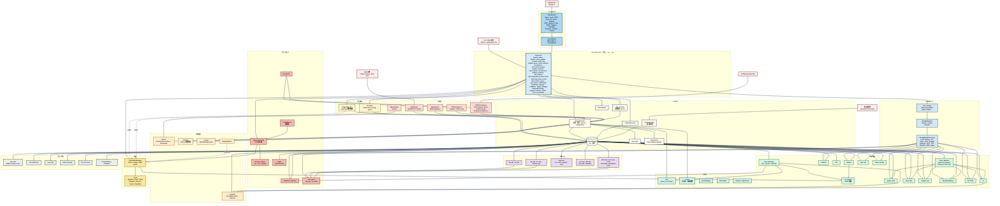

# FileAutomation

[English](README.md) | **繁體中文** | [简体中文](README.zh-CN.md)

FileAutomation 是通用的檔案層與資料管線執行環境：以同一套 API 存取本機與遠端儲存，並提供
檔案完整性監控、具備重試與續跑能力的管線、排程、事件驅動的通知、稽核軌跡，以及透過 JSON
動作、內建 TCP / HTTP 伺服器與 MCP 進行的自動化。物件 API（`File`、`Storage`、`Pipeline`、
`IntegrityMonitor`）與 `FA_*` JSON 動作是同一組操作的兩種面貌，所有公開名稱皆由頂層
`automation_file` facade 統一匯出。另附桌面 GUI 與唯讀的 Web UI。

```python
from automation_file import File, IntegrityMonitor, Pipeline, Storage

File("s3://reports/2026/q1.csv").copy_to("sftp://nas.example/archive/q1.csv")
IntegrityMonitor("s3://reports/2026", baseline="reports.baseline.json").verify()
```

- 本機檔案 / 目錄 / ZIP 操作，內建路徑穿越防護（`safe_join`）
- 經 SSRF 驗證的 HTTP 下載，支援重試與大小 / 時間上限
- Google Drive CRUD（上傳、下載、搜尋、刪除、分享、資料夾）
- S3、Azure Blob、Dropbox、SFTP 以及另外七種遠端後端，各自以對應的 extra 安裝（`pip install "automation_file[s3]"`，或以 `[all]` 一次安裝全部）
- JSON 動作清單由共用的 `ActionExecutor` 執行 — 支援驗證、乾跑、平行
- Loopback 優先的 TCP **與** HTTP 伺服器，接受 JSON 指令批次並可選 shared-secret 驗證
- 可靠性原語：`retry_on_transient` 裝飾器、`Quota` 大小 / 時間預算
- **檔案監看觸發** — 當路徑變動時執行動作清單（`FA_watch_*`）
- **排程器** — 在觸發條件成立時執行動作清單或管線：帶時區的 cron、手動呼叫、檔案事件、匯流排上的事件，或另一條管線結束；每次執行都會記錄狀態，預設拒絕重疊執行，工作可設定逾時並可取消（`FA_schedule_*`）
- **傳輸進度 + 取消** — HTTP 與 S3 傳輸可選的 `progress_name` 掛鉤（`FA_progress_*`）
- **快速檔案搜尋** — OS 索引快速路徑（`mdfind` / `locate` / `es.exe`）搭配串流式 `scandir` 備援（`FA_fast_find`）
- **檢查碼 + 完整性驗證** — 串流式 `file_checksum` / `verify_checksum`，支援任何 `hashlib` 演算法；`download_file(expected_sha256=...)` 於下載完成後立即驗證（`FA_file_checksum`、`FA_verify_checksum`）
- **可續傳 HTTP 下載** — `download_file(resume=True)` 寫入 `<target>.part` 並傳送 `Range: bytes=<n>-`，讓中斷的傳輸繼續而非從頭開始
- **重複檔案尋找器** — 三階段 size → 部分雜湊 → 完整雜湊管線；大小唯一的檔案完全不會被雜湊（`FA_find_duplicates`）
- **DAG 動作執行器** — 依相依順序拓撲排程，獨立分支平行展開，失敗時其後代預設標記跳過（`FA_execute_action_dag`）
- **Entry-point 外掛** — 第三方套件透過 `[project.entry-points."automation_file.actions"]` 註冊自訂 `FA_*` 動作；`build_default_registry()` 會自動載入
- **增量目錄同步** — rsync 風格鏡像，支援 size+mtime 或 checksum 變更偵測，選擇性刪除多餘檔案，支援乾跑（`FA_sync_dir`）
- **目錄 manifest** — 以 JSON 快照記錄樹下每個檔案的檢查碼，驗證時分開回報 missing / modified / extra（`FA_write_manifest`、`FA_verify_manifest`）
- **通知 sink** — webhook / Slack / SMTP / Telegram / Discord / Teams / PagerDuty，fanout 管理器做個別 sink 錯誤隔離與滑動視窗去重；trigger + scheduler 失敗時自動通知（`FA_notify_send`、`FA_notify_list`）
- **設定檔 + 秘密提供者** — 在 `automation_file.toml` 宣告通知 sink / 預設值；`${env:…}` 與 `${file:…}` 參考透過 Env / File / Chained 提供者抽象解析，讓秘密不留在檔案裡
- **設定熱重載** — `ConfigWatcher` 輪詢 `automation_file.toml`，變更時即時套用 sink / 預設值，無需重啟
- **Shell / grep / JSON 編輯 / tar / 備份輪替** — `FA_run_shell`（參數列表式 subprocess，含逾時）、`FA_grep`（串流文字搜尋）、`FA_json_get` / `FA_json_set` / `FA_json_delete`（原地 JSON 編輯）、`FA_create_tar` / `FA_extract_tar`、`FA_rotate_backups`
- **FTP / FTPS 後端** — 純 FTP 或透過 `FTP_TLS.auth()` 的顯式 FTPS；自動註冊為 `FA_ftp_*`
- **跨後端複製** — `FA_copy_between` 建立在儲存層之上，在任意兩個儲存位置之間複製檔案（`local://`、`s3://`、`azure://`、`gdrive://`、`dropbox://`、`sftp://`、`ftp://`、掛載點，或以 `http(s)://` 作為來源）；舊的 `s3:bucket/key` 與 `sftp:/path` 寫法仍然可用
- **排程器重疊防護** — 正在執行的工作在下次觸發時會被跳過，除非明確傳入 `allow_overlap=True`
- **伺服器動作 ACL** — `allowed_actions=(...)` 限制 TCP / HTTP 伺服器可派送的指令
- **變數替換** — 動作參數中可選使用 `${env:VAR}` / `${date:%Y-%m-%d}` / `${uuid}` / `${cwd}`，透過 `execute_action(..., substitute=True)` 展開
- **條件式執行** — `FA_if_exists` / `FA_if_newer` / `FA_if_size_gt` 僅在路徑守護通過時執行巢狀動作清單
- **SQLite 稽核日誌** — `AuditLog(db_path)` 為每個動作記錄 actor / status / duration；以 `recent` / `count` / `purge` 查詢
- **檔案完整性監控** — `IntegrityMonitor` 為任何儲存後端中的目錄樹保存帶版本的基準，偵測新增、修改、刪除、重新命名以及中繼資料或權限的變更，把偏移發布為事件，並且只在政策要求時才隔離或還原
- **HTTPActionClient SDK** — HTTP 動作伺服器的型別化 Python 客戶端，具 shared-secret 驗證、loopback 防護與 OPTIONS ping
- **AES-256-GCM 檔案加密** — `encrypt_file` / `decrypt_file` 搭配 `generate_key()` / `key_from_password()`（PBKDF2-HMAC-SHA256）；JSON 動作 `FA_encrypt_file` / `FA_decrypt_file`
- **Prometheus metrics 匯出器** — `start_metrics_server()` 提供 `automation_file_actions_total{action,status}` 計數器與 `automation_file_action_duration_seconds{action}` 直方圖
- **WebDAV 後端** — `WebDAVClient` 提供 `exists` / `upload` / `download` / `delete` / `mkcol` / `list_dir`，適用於任何 RFC 4918 伺服器；除非顯式傳入 `allow_private_hosts=True`，否則拒絕私有 / loopback 目標
- **SMB / CIFS 後端** — `SMBClient` 建構於 `smbprotocol` 的高階 `smbclient` API；採用 UNC 路徑，預設啟用加密連線
- **fsspec 橋接** — 透過 `get_fs` / `fsspec_upload` / `fsspec_download` / `fsspec_list_dir` 等函式，驅動任何 `fsspec` 支援的檔案系統（memory、local、s3、gcs、abfs、…）
- **HTTP 伺服器觀測端點** — `GET /healthz` / `GET /readyz` 探針、`GET /openapi.json` 規格、以及 `GET /progress`（以 WebSocket 推送即時傳輸快照）
- **HTMX Web UI** — `start_web_ui()` 啟動唯讀觀測儀表板（health、progress、registry），以 HTML 片段輪詢；僅用標準函式庫 HTTP，搭配一支帶 SRI 的 CDN 腳本
- **MCP（Model Context Protocol）伺服器** — `MCPServer` 透過 stdio 上的 JSON-RPC 2.0（行分隔 JSON）將登錄表橋接到任何 MCP 主機（Claude Desktop、MCP CLI）；每個 `FA_*` 動作都會自動生成輸入 schema 並成為 MCP 工具
- **通用儲存層** — `File` / `Storage` 以同一套 URI 語法（`local:///…`、`s3://…`、`azure://…`、`gdrive://…`、`sftp://…`、…）、同一份 `StorageBackend` 契約與同一組例外階層存取本機與遠端儲存；內建十二種後端（本機、記憶體、S3、Azure Blob、Google Drive、Dropbox、OneDrive、SFTP、FTP / FTPS、WebDAV、SMB、fsspec），並附 88 個案例的契約測試套件可檢查任何後端
- **事件匯流排** — 單一 `Event` 模型與十種核心事件（`pipeline.*`、`task.*`、`integrity.violation`、`storage.error`、`scheduler.error`、`system.error`），具備嚴重程度、關聯 ID 與 actor；可在 `event_bus` 上依類別、type 或前綴訂閱
- **通知路由器** — 以路由決定哪些事件（依類型、來源與最低嚴重程度）送到哪些 sink，每條路由各自去重與限流；可在程式、`automation_file.toml` 或以 `FA_notify_route_*` 宣告
- **稽核軌跡** — `configure_audit(path)` 為每個事件與每次儲存操作記錄一筆（actor、來源、pipeline、task、動作、資源、後端、狀態、耗時、關聯 ID），可用 `audit_search` / `FA_audit_search` 查詢
- **管線（Pipeline）** — `Pipeline` 依相依順序執行任務（可呼叫物件或 `FA_*` 動作），互不相依者平行執行，並支援重試、逾時、取消、條件、冪等鍵、檢查點與續跑、試跑以及執行歷史；定義可用 Python、YAML 或 JSON 撰寫
- **語意化 MCP 工具** — 提供給 AI 宿主的十四個名稱穩定的工具（`file_read`、`file_copy`、`storage_list`、`pipeline_run`、`integrity_status`、`audit_search` 等），僅限於你指定的根位置，在你允許寫入之前皆為唯讀，所有會變更內容的工具都支援試跑；`FA_*` 橋接仍然保留
- PySide6 GUI（`python -m automation_file ui`）每個後端一個分頁，含 JSON 動作執行器，另有 Triggers、Scheduler、即時 Progress 專屬分頁
- 功能豐富的 CLI，包含一次性子指令與舊式 JSON 批次旗標
- 專案鷹架（`ProjectBuilder`）協助建立以 executor 為核心的自動化專案

## 架構


```mermaid
flowchart TD
    CLI["<b>CLI / JSON 批次</b><br/>python -m automation_file"]
    GUIUser["<b>PySide6 GUI</b><br/>launch_ui"]
    ClientSDK["<b>HTTPActionClient SDK</b>"]
    MCPHost["<b>MCP 主機</b><br/>Claude Desktop · MCP CLIs"]
    Plugins["<b>進入點外掛</b><br/>automation_file.actions"]

    subgraph Facade["<b>automation_file &mdash; 門面 (__init__.py)</b>"]
        PublicAPI["<b>Public API</b><br/>execute_action · execute_action_parallel · execute_action_dag<br/>validate_action · driver_instance · s3_instance · azure_blob_instance<br/>dropbox_instance · sftp_instance · ftp_instance · onedrive_instance · box_instance<br/>start_autocontrol_socket_server · start_http_action_server<br/>start_metrics_server · start_web_ui · MCPServer<br/>notification_manager · scheduler · trigger_manager<br/>AutomationConfig · progress_registry · Quota · retry_on_transient"]
    end

    subgraph Core["<b>core 核心</b>"]
        Registry[("<b>ActionRegistry</b><br/>FA_* 指令")]
        Executor["<b>ActionExecutor</b><br/>序列 · 並行 · dry-run · validate-first"]
        DAG["<b>dag_executor</b><br/>拓樸排程 fan-out"]
        Callback["<b>CallbackExecutor</b>"]
        Loader["<b>PackageLoader</b><br/>+ 進入點外掛"]
        Queue["<b>ActionQueue</b>"]
        Json["<b>json_store</b>"]
        Sub["<b>substitution</b><br/>${env:} ${date:} ${uuid}"]
    end

    subgraph Reliability["<b>可靠性</b>"]
        Retry["<b>retry</b><br/>@retry_on_transient"]
        QuotaMod["<b>Quota</b><br/>位元組 + 時間配額"]
        Breaker["<b>CircuitBreaker</b>"]
        RL["<b>RateLimiter</b>"]
        Locks["<b>FileLock</b> · <b>SQLiteLock</b>"]
    end

    subgraph Observability["<b>可觀測性</b>"]
        Progress["<b>progress</b><br/>CancellationToken · Reporter"]
        Metrics["<b>metrics</b><br/>Prometheus counters + histograms"]
        Audit["<b>AuditLog</b><br/>SQLite 稽核紀錄"]
        Tracing["<b>tracing</b><br/>OpenTelemetry spans"]
        FIM["<b>IntegrityMonitor</b>"]
    end

    subgraph Security["<b>安全 &amp; 設定</b>"]
        Secrets["<b>Secret providers</b><br/>Env · File · Chained"]
        Config["<b>AutomationConfig</b><br/>TOML 載入器"]
        ConfW["<b>ConfigWatcher</b><br/>熱重載"]
        Crypto["<b>crypto</b><br/>AES-256-GCM"]
        Check["<b>checksum</b> / <b>manifest</b>"]
        SafeP["<b>safe_paths</b><br/>safe_join · is_within"]
        ACL["<b>ActionACL</b>"]
    end

    subgraph Events["<b>事件驅動</b>"]
        Trigger["<b>TriggerManager</b><br/>watchdog 檔案監聽"]
        Sched["<b>Scheduler</b><br/>5-field cron + overlap guard"]
    end

    subgraph Servers["<b>伺服器</b>"]
        TCP["<b>TCPActionServer</b><br/>loopback · AUTH secret"]
        HTTPS["<b>HTTPActionServer</b><br/>POST /actions · Bearer<br/>/healthz /readyz /progress /openapi.json"]
        MCP["<b>MCPServer</b><br/>JSON-RPC 2.0 (stdio)"]
        MetSrv["<b>MetricsServer</b><br/>/metrics"]
        WebUI["<b>WebUIServer</b><br/>HTMX dashboard"]
    end

    subgraph UI["<b>ui (PySide6)</b>"]
        MainWin["<b>MainWindow</b><br/>Home · Local · HTTP · Drive · S3 · Azure · Dropbox<br/>SFTP · OneDrive · Box · JSON · Triggers · Scheduler<br/>Progress · Transfer · Servers"]
        Worker["<b>ActionWorker</b><br/>QRunnable on QThreadPool"]
    end

    subgraph Local["<b>本地 ops</b>"]
        FileOps["<b>file_ops</b> · <b>dir_ops</b>"]
        Archives["<b>zip_ops</b> · <b>tar_ops</b> · <b>archive_ops</b>"]
        DataOps["<b>data_ops</b><br/>csv · jsonl · parquet · yaml"]
        TextOps["<b>text_ops</b> · <b>diff_ops</b><br/><b>json_edit</b> · <b>templates</b>"]
        Misc["<b>shell_ops</b> · <b>sync_ops</b> · <b>trash</b><br/><b>versioning</b> · <b>conditional</b> · <b>mime</b>"]
    end

    subgraph Remote["<b>遠端後端</b>"]
        UrlVal["<b>url_validator</b><br/>SSRF 防護"]
        Http["<b>http_download</b><br/>retry · resume · SHA-256"]
        Drive["<b>google_drive</b>"]
        S3M["<b>s3</b>"]
        Azure["<b>azure_blob</b>"]
        Dropbox["<b>dropbox_api</b>"]
        SFTP["<b>sftp</b> (RejectPolicy)"]
        FTP["<b>ftp / FTPS</b>"]
        OneD["<b>onedrive</b>"]
        Box["<b>box</b>"]
        WebDAV["<b>webdav</b>"]
        SMB["<b>smb / cifs</b>"]
        Fsspec["<b>fsspec_bridge</b>"]
        Cross["<b>cross_backend</b><br/>local:// s3:// azure://<br/>dropbox:// sftp:// ftp://"]
    end

    subgraph StorageLayer["<b>通用儲存層</b>"]
        FileAPI["<b>File</b> · <b>Storage</b><br/>local:// s3:// azure:// gdrive:// sftp:// …"]
        Resolver["<b>StorageResolver</b><br/>mounts · scheme factories"]
        Backends["<b>StorageBackend</b> contract<br/>Local · Memory · S3 · Azure · Drive · Dropbox<br/>OneDrive · SFTP · FTP · WebDAV · SMB · fsspec"]
    end

    subgraph Notify["<b>通知</b>"]
        NM["<b>NotificationManager</b><br/>fanout · dedup · SSRF guard"]
        Sinks["<b>Sinks</b><br/>Webhook · Slack · Email<br/>Telegram · Discord · Teams · PagerDuty"]
    end

    subgraph Utils["<b>工具 / 專案</b>"]
        Fast["<b>fast_find</b><br/>mdfind / locate / es.exe"]
        Dedup["<b>find_duplicates</b>"]
        Grep["<b>grep_files</b>"]
        Rotate["<b>rotate_backups</b>"]
        Discovery["<b>file_discovery</b>"]
        Builder["<b>ProjectBuilder</b> + templates"]
    end

    CLI ==> PublicAPI
    GUIUser ==> MainWin
    ClientSDK ==> HTTPS
    MCPHost ==> MCP
    Plugins ==> Loader

    MainWin ==> Worker
    Worker ==> PublicAPI

    PublicAPI ==> Executor
    PublicAPI ==> DAG
    PublicAPI ==> Callback
    PublicAPI ==> Queue
    PublicAPI ==> Config
    PublicAPI ==> NM
    PublicAPI ==> Trigger
    PublicAPI ==> Sched
    PublicAPI ==> FileAPI
    FileAPI ==> Resolver
    Resolver ==> Backends
    Backends ==> SafeP
    Backends ==> Check
    Backends ==> S3M
    Backends ==> Azure
    Backends ==> Drive
    Backends ==> Dropbox
    Backends ==> OneD
    Backends ==> SFTP
    Backends ==> FTP
    Backends ==> WebDAV
    Backends ==> SMB
    Backends ==> Fsspec

    TCP ==> Executor
    HTTPS ==> Executor
    MCP ==> Registry
    MetSrv ==> Metrics
    WebUI ==> Registry
    ACL ==> TCP
    ACL ==> HTTPS

    Executor ==> Registry
    Executor ==> Sub
    Executor ==> Retry
    Executor ==> QuotaMod
    Executor ==> Metrics
    Executor ==> Audit
    Executor ==> Tracing
    Executor ==> Json
    DAG ==> Executor
    Callback ==> Registry
    Loader ==> Registry

    Trigger ==> Executor
    Sched ==> Executor
    Trigger -. 失敗時 .-> NM
    Sched -. 失敗時 .-> NM
    FIM -. 偵測到異動 .-> NM
    ConfW ==> Config
    Config ==> Secrets
    Config ==> NM

    Registry ==> FileOps
    Registry ==> Archives
    Registry ==> DataOps
    Registry ==> TextOps
    Registry ==> Misc
    Registry ==> Http
    Registry ==> Drive
    Registry ==> S3M
    Registry ==> Azure
    Registry ==> Dropbox
    Registry ==> SFTP
    Registry ==> FTP
    Registry ==> OneD
    Registry ==> Box
    Registry ==> WebDAV
    Registry ==> SMB
    Registry ==> Fsspec
    Registry ==> Cross
    Registry ==> Crypto
    Registry ==> Check
    Registry ==> Fast
    Registry ==> Dedup
    Registry ==> Grep
    Registry ==> Rotate
    Registry ==> Discovery
    Registry ==> Builder
    Registry ==> Progress

    FileOps ==> SafeP
    Archives ==> SafeP
    Misc ==> SafeP

    Http ==> UrlVal
    Http ==> Retry
    Http ==> Progress
    Http ==> Check
    S3M ==> Progress
    WebDAV ==> UrlVal
    NM ==> UrlVal
    NM ==> Sinks

    Cross ==> Drive
    Cross ==> S3M
    Cross ==> Azure
    Cross ==> Dropbox
    Cross ==> SFTP
    Cross ==> FTP

    classDef entry fill:#FDEDEC,stroke:#641E16,stroke-width:3px,color:#000,font-weight:bold;
    classDef facade fill:#D6EAF8,stroke:#154360,stroke-width:4px,color:#000,font-weight:bold;
    classDef core fill:#FEF9E7,stroke:#1F3A93,stroke-width:3px,color:#000,font-weight:bold;
    classDef rel fill:#D1F2EB,stroke:#0B5345,stroke-width:3px,color:#000,font-weight:bold;
    classDef obs fill:#FDEBD0,stroke:#9C640C,stroke-width:3px,color:#000,font-weight:bold;
    classDef sec fill:#F5B7B1,stroke:#78281F,stroke-width:3px,color:#000,font-weight:bold;
    classDef event fill:#FCF3CF,stroke:#7D6608,stroke-width:3px,color:#000,font-weight:bold;
    classDef server fill:#FADBD8,stroke:#922B21,stroke-width:3px,color:#000,font-weight:bold;
    classDef ui fill:#AED6F1,stroke:#1B4F72,stroke-width:3px,color:#000,font-weight:bold;
    classDef localOps fill:#E8DAEF,stroke:#512E5F,stroke-width:3px,color:#000,font-weight:bold;
    classDef remote fill:#D5F5E3,stroke:#196F3D,stroke-width:3px,color:#000,font-weight:bold;
    classDef notify fill:#F9E79F,stroke:#7D6608,stroke-width:3px,color:#000,font-weight:bold;
    classDef utils fill:#EAEDED,stroke:#212F3C,stroke-width:3px,color:#000,font-weight:bold;
    classDef storage fill:#D4E6F1,stroke:#1A5276,stroke-width:3px,color:#000,font-weight:bold;

    class CLI,GUIUser,ClientSDK,MCPHost,Plugins entry;
    class PublicAPI facade;
    class Registry,Executor,DAG,Callback,Loader,Queue,Json,Sub core;
    class Retry,QuotaMod,Breaker,RL,Locks rel;
    class Progress,Metrics,Audit,Tracing,FIM obs;
    class Secrets,Config,ConfW,Crypto,Check,SafeP,ACL sec;
    class Trigger,Sched event;
    class TCP,HTTPS,MCP,MetSrv,WebUI server;
    class MainWin,Worker ui;
    class FileOps,Archives,DataOps,TextOps,Misc localOps;
    class UrlVal,Http,Drive,S3M,Azure,Dropbox,SFTP,FTP,OneD,Box,WebDAV,SMB,Fsspec,Cross remote;
    class NM,Sinks notify;
    class Fast,Dedup,Grep,Rotate,Discovery,Builder utils;
    class FileAPI,Resolver,Backends storage;

    linkStyle default stroke:#1F2A44,stroke-width:2.5px;
```

`build_default_registry()` 建立的 `ActionRegistry` 是所有 `FA_*` 指令的唯一
權威來源。`ActionExecutor`、`CallbackExecutor`、`PackageLoader`、
`TCPActionServer`、`HTTPActionServer` 都透過同一份共用 registry（以
`executor.registry` 對外公開）解析指令。

## 安裝

```bash
pip install automation_file                 # 基礎安裝：不含雲端 SDK，也不含 GUI 工具組
pip install "automation_file[s3,sftp]"      # 加上你會用到的後端
pip install "automation_file[all]"          # 所有後端與 GUI
```

基礎安裝即可執行 JSON 動作、本機檔案操作、HTTP 下載、儲存層的本機與記憶體後端、pipeline、
事件、觸發器、排程器與各種伺服器。各後端的 SDK 與 GUI 工具組都放在 extra 中，只有在用到該
功能時才會匯入。呼叫缺少 extra 的功能時，會拋出 `OptionalDependencyException`，訊息中附有
要執行的安裝指令。

| Extra | 安裝的套件 | 提供的功能 |
|---|---|---|
| `s3` | `boto3` | S3（`FA_s3_*`、`s3://`） |
| `azure` | `azure-storage-blob` | Azure Blob（`FA_azure_blob_*`、`azure://`） |
| `gdrive` | `google-api-python-client`、`google-auth-httplib2`、`google-auth-oauthlib` | Google Drive（`FA_drive_*`） |
| `dropbox` | `dropbox` | Dropbox（`FA_dropbox_*`） |
| `sftp` | `paramiko` | SFTP（`FA_sftp_*`） |
| `ftp` | — | FTP / FTPS（`FA_ftp_*`）；只需要標準函式庫 |
| `webdav` | — | WebDAV（`WebDAVClient`）；基礎相依套件已足夠 |
| `smb` | `smbprotocol` | SMB / CIFS（`SMBClient`） |
| `fsspec` | `fsspec` | fsspec 橋接 |
| `onedrive` | `msal` | OneDrive（`FA_onedrive_*`） |
| `box` | `boxsdk` | Box（`FA_box_*`） |
| `parquet` | `pyarrow` | Parquet 資料操作（`FA_parquet_*`、`FA_csv_to_parquet`） |
| `gui` | `PySide6` | 桌面 GUI（`python -m automation_file ui`） |
| `all` | 以上全部 | 所有後端與 GUI，與拆分之前相同 |

```bash
pip install "automation_file[all,dev]"   # 另含 ruff、mypy、pre-commit、pytest-cov、build、twine
```

從先前內含所有套件的版本升級時：安裝 `automation_file[all]` 即可保留原有的全部功能。

需求：
- Python 3.10+
- 基礎相依套件：`requests`、`tqdm`、`watchdog`、`cryptography`、`prometheus_client`、`defusedxml`、
  `PyYAML`、`opentelemetry-api`、`opentelemetry-sdk`、`je_action_core`（與 APITestka、
  LoadDensity、MailThunder 共用的 action 執行器）

## 使用方式

### 執行 JSON 動作清單
```python
from automation_file import execute_action

execute_action([
    ["FA_create_file", {"file_path": "test.txt"}],
    ["FA_copy_file", {"source": "test.txt", "target": "copy.txt"}],
])
```

### 驗證、乾跑、平行
```python
from automation_file import execute_action, execute_action_parallel, validate_action

# Fail-fast：只要有任何指令名稱未知就在執行前中止。
execute_action(actions, validate_first=True)

# Dry-run：只記錄會被呼叫的內容，不真的執行。
execute_action(actions, dry_run=True)

# Parallel：透過 thread pool 平行執行獨立動作。
execute_action_parallel(actions, max_workers=4)

# 手動驗證 — 回傳解析後的名稱清單。
names = validate_action(actions)
```

### 初始化 Google Drive 並上傳
```python
from automation_file import driver_instance, drive_upload_to_drive

driver_instance.later_init("token.json", "credentials.json")
drive_upload_to_drive("example.txt")
```

### 經驗證的 HTTP 下載（含重試）
```python
from automation_file import download_file

download_file("https://example.com/file.zip", "file.zip")
```

### 啟動 loopback TCP 伺服器（可選 shared-secret 驗證）
```python
from automation_file import start_autocontrol_socket_server

server = start_autocontrol_socket_server(
    host="127.0.0.1", port=9943, shared_secret="optional-secret",
)
```

設定 `shared_secret` 時，客戶端每個封包都必須以 `AUTH <secret>\n` 為前綴。
若要綁定非 loopback 位址必須明確傳入 `allow_non_loopback=True`。

### 啟動 HTTP 動作伺服器
```python
from automation_file import start_http_action_server

server = start_http_action_server(
    host="127.0.0.1", port=9944, shared_secret="optional-secret",
)

# curl -H 'Authorization: Bearer optional-secret' \
#      -d '[["FA_create_dir",{"dir_path":"x"}]]' \
#      http://127.0.0.1:9944/actions
```

### Retry 與 quota 原語
```python
from automation_file import retry_on_transient, Quota

@retry_on_transient(max_attempts=5, backoff_base=0.5)
def flaky_network_call(): ...

quota = Quota(max_bytes=50 * 1024 * 1024, max_seconds=30.0)
with quota.time_budget("bulk-upload"):
    bulk_upload_work()
```

### 路徑穿越防護
```python
from automation_file import safe_join

target = safe_join("/data/jobs", user_supplied_path)
# 若解析後的路徑跳脫 /data/jobs 會拋出 PathTraversalException。
```

### Cloud / SFTP 後端
每個後端都會由 `build_default_registry()` 自動註冊，因此 `FA_s3_*`、
`FA_azure_blob_*`、`FA_dropbox_*`、`FA_sftp_*` 動作開箱即用 — 不需要另外呼叫
`register_*_ops`。

```python
from automation_file import execute_action, s3_instance

s3_instance.later_init(region_name="us-east-1")

execute_action([
    ["FA_s3_upload_file", {"local_path": "report.csv", "bucket": "reports", "key": "report.csv"}],
])
```

所有後端（`s3`、`azure_blob`、`dropbox_api`、`sftp`）都對外提供相同的五組
操作：`upload_file`、`upload_dir`、`download_file`、`delete_*`、`list_*`。
SFTP 使用 `paramiko.RejectPolicy` — 未知主機會被拒絕，不會自動加入。

### 通用儲存層（File / Storage）
每一種儲存都使用同一套 URI 語法、同一組操作與同一組例外。`File` 代表單一檔案，
`Storage` 代表目錄，`StorageBackend` 則是後端要實作的契約。`FA_*` 動作與各後端原有的
函式完全不變，可與本層並用。

```python
from automation_file import File, LocalStorage, Storage

report = File("local:///data/reports/q1.csv")      # 也可以直接寫一般路徑
report.write("region,total\nEMEA,42\n")
report.size, report.modified_at, report.content_type
report.checksum()                                   # Checksum("sha256", "…")
report.copy_to("memory://scratch/archive/q1.csv")   # 任何後端到任何後端
report.move_to("local:///data/done/q1.csv")

reports = Storage("local:///data/reports")
for info in reports.list_dir(recursive=True):
    print(info.path, info.size)

# 限制不受信任的路徑：sandbox://jobs/ 之下的任何東西都離不開 /srv/jobs。
Storage.mount("sandbox://jobs", LocalStorage("/srv/jobs"))
File("sandbox://jobs/42/out.csv").write(b"done")
```

- **URI** — `<scheme>://<authority>/<path>`：`local:///data/a.csv`、`s3://bucket/a.csv`、
  `sftp://server/data/a.csv`。路徑按字面解讀（不做百分比解碼），`..` 區段會被拒絕，
  authority 中的憑證也會被拒絕。不含 `://` 的文字視為本機路徑。
- **操作** — `exists`、`stat`、`list_dir`、`mkdir`、`upload`、`download`、`delete`、
  `checksum`、`read_bytes`、`write_bytes`、`copy_from`、`move_from`，在每個後端上都相同。
  下載與本機寫入皆為原子操作，刪除內有項目的目錄需要 `recursive=True`，儲存的根目錄
  永遠不會被刪除。
- **串流與目錄樹** — `File.open_read()` / `open_write()` / `iter_chunks()` 用於大到放不進記憶體的
  內容；`Storage.copy_to(target)` 把整個目錄樹複製到任何後端，
  `Storage.sync_to(target, delete=False, checksum=False, dry_run=False)` 只複製有變動的部分。
- **例外** — `StorageException` 及其子類別：`StorageNotFoundException`、
  `StorageAlreadyExistsException`、`StoragePathTypeException`、`StorageNotEmptyException`、
  `StoragePermissionException`、`StorageTransientException`、`StorageUnavailableException`、
  `StorageUnsupportedException`、`StorageURIException`。
- **後端** — 內建十二種。可直接以 URI 存取、並使用你原本就會初始化的共用用戶端的有：`local://`、
  `memory://`、`s3://bucket/key`、`azure://container/blob`、`gdrive://<root>/path`、`dropbox:///path`、
  `onedrive:///path`、`sftp://host/path`、`ftp://host/path` 與 `ftps://host/path`。需要自己的用戶端或
  檔案系統、因此以掛載方式使用的有：`WebDAVStorage`、`SMBStorage` 與 `FsspecStorage`
  （`Storage.mount("webdav://files.example.com", WebDAVStorage(client))`）。每個遠端後端都需要對應的
  extra（`pip install "automation_file[sftp]"`）。`sftp://` 或 `ftp://` URI 必須寫出工作階段實際連線
  的主機，打錯字就不會寫到另一台伺服器。Box 沒有轉接器，仍使用它的 `FA_box_*` 動作。你可以繼承
  `StorageBackend`（物件儲存繼承 `ObjectStorage`，登入工作階段繼承 `SessionStorage`）撰寫自己的後端，
  並用 `tests/storage_contract.py` 中 88 個案例的契約測試套件檢查。

- **動作** — `FA_storage_exists`, `FA_storage_stat`, `FA_storage_list`, `FA_storage_mkdir`,
  `FA_storage_upload`, `FA_storage_download`, `FA_storage_delete`, `FA_storage_checksum`,
  `FA_storage_verify`, `FA_storage_copy`, `FA_storage_move`, `FA_storage_read_text`,
  `FA_storage_write_text`, `FA_storage_copy_tree`, `FA_storage_sync`, `FA_storage_schemes`。它們以字串
  形式接收 URI，並回傳可序列化為 JSON 的值，因此本層可用於動作檔、CLI、TCP 與 HTTP 伺服器，
  也能作為 MCP 工具。在伺服器上請像其他檔案動作一樣以 `ActionACL` 加以限制。

```json
[
  ["FA_storage_copy", {"source": "s3://reports/q1.csv", "target": "local:///backup/q1.csv"}],
  ["FA_storage_verify", {"uri": "local:///backup/q1.csv", "expected": "sha256:9f86d081884c7d65…"}],
  ["FA_storage_list", {"uri": "s3://reports", "recursive": true}]
]
```

此 API 為新功能，在 1.0 之前仍可能調整。完整說明請見文件的「通用儲存層」章節。

### 事件
每個元件都透過同一套事件模型回報，而不是自行呼叫通知接收端或稽核紀錄。

```python
from automation_file import Severity, actor_scope, correlation_scope, event_bus

event_bus.subscribe(print, types=["pipeline.*", "integrity.violation"])
event_bus.subscribe(alert, min_severity=Severity.ERROR)

with actor_scope("scheduler"), correlation_scope() as run_id:
    ...   # 這裡面的每個事件與儲存操作都帶有 run_id 與 actor
event_bus.recent(limit=20, correlation_id=run_id)
```

- **核心事件** — `PipelineStarted`、`PipelineCompleted`、`PipelineFailed`、`TaskStarted`、
  `TaskCompleted`、`TaskFailed`、`IntegrityViolation`、`StorageError`、`SchedulerError`、
  `SystemErrorEvent`。每個事件都有 `type`（`pipeline.failed`）、`severity`、`source`、`subject`、
  結構化的 `payload`、`correlation_id` 與 `actor`，並可用 `to_dict()` 轉成 JSON。
- **匯流排** — `event_bus.subscribe(handler, types=..., min_severity=...)` 可依類別、type 名稱或
  前綴訂閱；處理函式拋出例外時只會被記錄並略過；`event_bus.recent()` 回傳最近的事件。
- **儲存操作** — 上傳、下載、讀取、刪除、複製與搬移都會回報給
  `automation_file.storage.observe` 的監聽者，後端失敗時會產生 `StorageError` 事件。

### 通知路由器
通知改由事件驅動：模組發布事件，再由路由決定哪些 sink 會收到。

```python
from automation_file import Route, Severity, notification_router

notification_router.add_route(Route(
    "pipeline-failures",
    sinks=("team-alerts",),                  # 留空 = 所有已註冊的 sink
    types=("pipeline.*", "task.failed"),     # 事件類別、type 名稱或前綴
    min_severity=Severity.ERROR,
    dedup_seconds=600, rate_limit=10, rate_period=60,
))
notification_router.start()                  # 在事件匯流排上訂閱
```

- **路由** — 依事件 type、來源與最低嚴重程度，送往指定名稱的 sink。可以在程式中宣告、
  在 `automation_file.toml` 以 `[[notify.routes]]` 表格宣告（與 sink 一起熱重載），或使用
  `FA_notify_route_add` / `FA_notify_route_remove` / `FA_notify_route_list`。
- **去重與速率限制** — 以每條路由、每個 sink 為單位：type、來源與主旨都相同的事件在
  `dedup_seconds` 內重複出現時會被丟棄，每個 `rate_period` 內最多送出 `rate_limit` 則訊息。
- **結構化訊息** — 主旨與內文由事件組成：嚴重程度、來源、關聯 ID、actor 以及
  `event.to_dict()` 的 JSON。`critical` 會以 sink 的 `error` 等級發送。
- **失敗隔離** — 單一 sink 失敗絕對不會影響其他 sink。失敗會以來源為 `notify` 的
  `system.error` 事件發布，而路由器絕對不會路由這類事件，因此故障的 sink 不會形成迴圈。
- **`notify_on_failure`** — 一律會發布事件。路由器運作時由路由投遞；否則照舊直接發送通知，
  因此不會有人收到兩次，也不會有人收不到。

### 稽核軌跡（schema v2）
稽核軌跡記錄誰在什麼時候做了什麼、對象是哪個資源、使用哪個後端以及結果如何：每個事件與
每次儲存操作各一筆紀錄。

```python
from automation_file import audit_search, configure_audit, correlation_scope

configure_audit("audit.sqlite")              # SQLite 儲存庫；開始記錄

with correlation_scope() as run_id:
    ...                                      # 事件與儲存操作都會被記錄
audit_search(correlation_id=run_id)          # 整次執行，最新的在前
audit_search(status="error", resource_prefix="s3://reports/", limit=20)
```

- **紀錄** — `id`、`timestamp`（UTC）、`actor`、`source`、`pipeline`、`task`、`action`、
  `resource`、`backend`、`status`、`duration_ms`、`error`、`metadata`、`correlation_id`。
- **搜尋** — 可依 `since` / `until`、`actor`、`source`、`pipeline`、`task`、`action`、
  `resource_prefix`、`backend`、`status`、`correlation_id` 與自由文字 `text` 篩選；最新的
  在前，並支援 `limit` / `offset`。
- **儲存庫** — `SQLiteAuditStore`（參數化 SQL、結構描述版本資料表、WAL）與測試用的
  `MemoryAuditStore`；`AuditStore` 是 PostgreSQL 或遠端儲存庫要實作的介面。
  `SQLiteAuditStore.import_v1()` 可複製 v1 `AuditLog` 的資料列。
- **絕不礙事** — 無法寫入的紀錄只會被記錄到日誌並捨棄，絕對不會拋進被稽核的程式。失敗的
  儲存操作只記錄一次，不會重複。
- **動作與指標** — `FA_audit_configure` / `FA_audit_search` / `FA_audit_count` /
  `FA_audit_purge`；`install_operational_metrics()` 會加入事件、通知與儲存操作的
  Prometheus 計數器。

### 管線（Pipeline）

`automation_file.pipeline` 依相依順序執行任務，互不相依的任務平行執行，並記錄每一個
步驟。任務可以是 Python 可呼叫物件或 `FA_*` 動作；管線可以用 Python 建立，也可以從
YAML / JSON 定義載入。一次執行只透過事件匯流排上的 `pipeline.*` 與 `task.*` 事件回報。

```python
from automation_file import Pipeline, RetryPolicy, SQLiteRunStore

def check(ctx):
    if ctx.results["download"]["size"] == 0:
        raise ValueError("the report is empty")

pipeline = Pipeline("daily-report", max_workers=4)
pipeline.task(
    "download",
    ["FA_storage_copy", {"source": "s3://input/${params.date}.csv",
                         "target": "local:///tmp/report.csv"}],
    retry=RetryPolicy(max_attempts=3, backoff_base=1.0, backoff_cap=30.0),
    timeout=300.0,
)
pipeline.task("check", check, depends_on=["download"])
pipeline.task(
    "publish",
    ["FA_storage_copy", {"source": "local:///tmp/report.csv",
                         "target": "azure://reports/${params.date}.csv"}],
    depends_on=["check"],
    idempotency_key="publish-${params.date}",        # 同一個日期最多一次
)
pipeline.task(
    "withdraw",                                      # publish 失敗時清理
    ["FA_storage_delete", {"uri": "azure://reports/${params.date}.csv",
                           "missing_ok": True}],
    depends_on=["publish"],
    when="on_failure",
)

store = SQLiteRunStore("pipelines.db")
run = pipeline.run(params={"date": "2026-10-08"}, store=store)
if run.status != "succeeded":
    run = pipeline.resume(run.run_id, store=store)   # 保留已成功的部分
```

- **重試、逾時、取消。** `RetryPolicy` 以有上限的指數退避重試暫時性錯誤；超過
  `timeout` 的任務會被標記為 `timeout`，執行則繼續進行；`pipeline.start()` 在背景
  執行，`run.cancel()` 可以停止它。
- **條件與冪等。** `when` 可以是 `on_success`、`on_failure`、`always` 或可呼叫物件；
  `idempotency_key` 會略過已經以相同的鍵成功過的任務，並沿用它的結果。
- **檢查點、續跑、歷史。** 任務的每一次狀態轉換都會寫入 `RunStore`
  （`MemoryRunStore`、`SQLiteRunStore`）；`resume(run_id)` 只執行尚未成功的部分，
  `store.list_runs()` 就是執行歷史。
- **定義檔。** `Pipeline.from_file("daily-report.yaml")`、`from_dict` / `to_dict`、
  會回報每一項問題路徑的 `validate_definition()`，以及 `PIPELINE_SCHEMA`
  （JSON Schema）。`run(dry_run=True)` 只規劃而不執行。
- **動作。** `FA_pipeline_run`、`FA_pipeline_validate`、`FA_pipeline_status`、
  `FA_pipeline_history` 與 `FA_pipeline_resume`，可用於 JSON 動作清單、CLI、動作
  伺服器與 MCP。

### 檔案監看觸發
每當被監看路徑發生檔案系統事件，就執行動作清單：

```python
from automation_file import watch_start, watch_stop

watch_start(
    name="inbox-sweeper",
    path="/data/inbox",
    action_list=[["FA_copy_all_file_to_dir", {"source_dir": "/data/inbox",
                                              "target_dir": "/data/processed"}]],
    events=["created", "modified"],
    recursive=False,
)
# 稍後：
watch_stop("inbox-sweeper")
```

`FA_watch_start` / `FA_watch_stop` / `FA_watch_stop_all` / `FA_watch_list`
讓 JSON 動作清單能使用相同的生命週期。

### 排程器（Scheduler）

`automation_file.scheduler` 會在某件事觸發時執行一份動作清單或一條管線：帶時區的 cron
運算式、檔案事件、事件匯流排上的事件、另一條管線的執行結束，或是一次呼叫。每一次觸發
都會留下一筆執行紀錄。

```python
from automation_file.scheduler import PipelineTrigger, scheduler

scheduler.add(
    "nightly-snapshot",
    "0 2 * * *",                                 # 每天 02:00 ...
    [["FA_zip_dir", {"dir_we_want_to_zip": "/data",
                     "zip_name": "/backup/data_nightly"}]],
    timezone="Asia/Taipei",                      # ... 台北時間；不給就是本地時間
    timeout=1800,
)

# 宣告了 `schedule: {cron: "0 2 * * *", timezone: Asia/Taipei}` 的管線
scheduler.add_pipeline("pipelines/daily-report.yaml",
                       params={"date": "${date:%Y-%m-%d}"}, timeout=3600)
# ... 以及每當 daily-report 成功就執行的管線
scheduler.add_pipeline("pipelines/publish-summary.yaml",
                       triggers=PipelineTrigger("daily-report"))

run = scheduler.run_now("nightly-snapshot")      # 手動觸發
run.wait(600)
scheduler.history(state="failed", limit=10)      # 最近失敗的執行
```

- **觸發器。** `CronTrigger`（5 個欄位，可選的 IANA 時區）、`FileTrigger`（被監看的
  路徑）、`EventTrigger`（事件匯流排上的 type、前綴或來源；發布事件的 webhook 也是
  這樣觸發工作的）、`PipelineTrigger`（在另一條管線之後：`on_success`、
  `on_failure`、`always`），以及用來手動觸發工作的 `run_now`。一個工作可以有好幾個
  觸發器。
- **執行紀錄。** 每一次觸發都是一個 `JobRun`，狀態是七種之一：`scheduled`、
  `started`、`completed`、`failed`、`skipped`、`timeout`、`cancelled`，並帶有 UTC
  時間、觸發器、錯誤與關聯 ID。`scheduler.history(job, state, limit)` 回傳最近的
  紀錄，最新的在前。
- **重疊、逾時、取消。** 遇到仍在進行中的執行時，觸發會記錄為 `skipped`，除非工作
  設定了 `allow_overlap=True`。超過 `timeout` 的執行會記錄為 `timeout` 並被要求
  停止；`scheduler.cancel(name)` 則是應要求這麼做。管線透過它的取消權杖停止，動作
  清單則在下一個動作之前停止。
- **時區。** 時區名稱來自 `zoneinfo`（Windows 上請 `pip install tzdata`；`UTC` 不
  需要任何東西）。在日光節約時間切換的日子，不存在的本地時間不會觸發，出現兩次的
  本地時間只觸發一次。
- **失敗就是事件。** 失敗或逾時的執行會發布成 `scheduler.error`；請用通知路由器把
  它送到 sink。
- **動作。** `FA_schedule_add`、`FA_schedule_job`、`FA_schedule_pipeline`、
  `FA_schedule_run`、`FA_schedule_cancel`、`FA_schedule_history`、
  `FA_schedule_list`、`FA_schedule_remove` 與 `FA_schedule_remove_all`，可用於 JSON
  動作清單、CLI、動作伺服器與 MCP。

### 傳輸進度 + 取消
HTTP 與 S3 傳輸支援可選的 `progress_name` 關鍵字參數：

```python
from automation_file import download_file, progress_cancel

download_file("https://example.com/big.bin", "big.bin",
              progress_name="big-download")

# 從另一個執行緒或 GUI：
progress_cancel("big-download")
```

共用的 `progress_registry` 透過 `progress_list()` 以及 `FA_progress_list` /
`FA_progress_cancel` / `FA_progress_clear` JSON 動作提供即時快照。GUI 的
**Progress** 分頁每半秒輪詢一次 registry。

### 快速檔案搜尋
若 OS 索引器可用就直接查詢（macOS 的 `mdfind`、Linux 的 `locate` /
`plocate`、Windows 的 Everything `es.exe`），否則退回以串流 `os.scandir`
走訪。不需要額外相依套件。

```python
from automation_file import fast_find, scandir_find, has_os_index

# 可用時使用 OS 索引器，否則退回 scandir。
results = fast_find("/var/log", "*.log", limit=100)

# 強制使用可攜路徑（跳過 OS 索引器）。
results = fast_find("/data", "report_*.csv", use_index=False)

# 串流 — 不需走訪整棵樹就能提早停止。
for path in scandir_find("/data", "*.csv"):
    if "2026" in path:
        break
```

`FA_fast_find` 將同一個函式提供給 JSON 動作清單：

```json
[["FA_fast_find", {"root": "/var/log", "pattern": "*.log", "limit": 50}]]
```

### 檢查碼 + 完整性驗證
串流式處理任何 `hashlib` 演算法；`verify_checksum` 以 `hmac.compare_digest`
（常數時間）比對摘要：

```python
from automation_file import file_checksum, verify_checksum

digest = file_checksum("bundle.tar.gz")                # 預設為 sha256
verify_checksum("bundle.tar.gz", digest)               # -> True
verify_checksum("bundle.tar.gz", "deadbeef...", algorithm="blake2b")
```

同時以 `FA_file_checksum` / `FA_verify_checksum` 提供 JSON 動作。

### 可續傳 HTTP 下載
`download_file(resume=True)` 會寫入 `<target>.part` 並於下次嘗試傳送
`Range: bytes=<n>-`。搭配 `expected_sha256=` 可在下載完成後立刻驗證完整性：

```python
from automation_file import download_file

download_file(
    "https://example.com/big.bin",
    "big.bin",
    resume=True,
    expected_sha256="3b0c44298fc1...",
)
```

### 重複檔案尋找器
三階段管線：依大小分桶 → 64 KiB 部分雜湊 → 完整雜湊。大小唯一的檔案完全不會
被雜湊：

```python
from automation_file import find_duplicates

groups = find_duplicates("/data", min_size=1024)
# list[list[str]] — 每個內層 list 是一組相同內容的檔案，以大小遞減排序。
```

`FA_find_duplicates` 以相同呼叫提供給 JSON。

### 增量目錄同步
`sync_dir` 以只複製新增或變更檔案的方式將 `src` 鏡像至 `dst`。變更偵測預設
為 `(size, mtime)`；當 mtime 不可信時可傳入 `compare="checksum"`。`dst`
下多餘的檔案預設保留 — 傳入 `delete=True` 才會清除（`dry_run=True` 可先
預覽）：

```python
from automation_file import sync_dir

summary = sync_dir("/data/src", "/data/dst", delete=True)
# summary: {"copied": [...], "skipped": [...], "deleted": [...],
#           "errors": [...], "dry_run": False}
```

Symlink 會以 symlink 形式重建而非被跟隨，因此指向樹外的連結不會拖垮鏡像。
JSON 動作：`FA_sync_dir`。

### 目錄 manifest
將樹下每個檔案的檢查碼寫入 JSON manifest，之後再驗證樹是否變動：

```python
from automation_file import write_manifest, verify_manifest

write_manifest("/release/payload", "/release/MANIFEST.json")

# 稍後…
result = verify_manifest("/release/payload", "/release/MANIFEST.json")
if not result["ok"]:
    raise SystemExit(f"manifest mismatch: {result}")
```

`result` 以 `matched`、`missing`、`modified`、`extra` 分別回報清單。
多餘檔案（`extra`）不會讓驗證失敗（對齊 `sync_dir` 預設不刪除的行為），
`missing` 與 `modified` 則會。JSON 動作：`FA_write_manifest`、
`FA_verify_manifest`。

### 通知
透過 webhook、Slack 或 SMTP 推送一次性訊息，或在 trigger / scheduler
失敗時自動通知：

```python
from automation_file import (
    SlackSink, WebhookSink, EmailSink,
    notification_manager, notify_send,
)

notification_manager.register(SlackSink("https://hooks.slack.com/services/T/B/X"))
notify_send("deploy complete", body="rev abc123", level="info")
```

每個 sink 都遵循相同的 `send(subject, body, level)` 合約。Fanout 的
`NotificationManager` 會進行個別 sink 錯誤隔離（一個壞掉的 sink 不會影響
其他 sink）、滑動視窗去重（避免卡住的 trigger 洗版），以及對每個
webhook / Slack URL 做 SSRF 驗證。Scheduler 與 trigger 派送器在失敗時
會以 `level="error"` 自動通知 — 只要註冊 sink 就能取得生產環境告警。
JSON 動作：`FA_notify_send`、`FA_notify_list`。

### 設定檔與秘密提供者
在 `automation_file.toml` 一次宣告 sink 與預設值。秘密參考在載入時由
環境變數或檔案根目錄（Docker / K8s 風格）解析：

```toml
# automation_file.toml

[secrets]
file_root = "/run/secrets"

[defaults]
dedup_seconds = 120

[[notify.sinks]]
type = "slack"
name = "team-alerts"
webhook_url = "${env:SLACK_WEBHOOK}"

[[notify.sinks]]
type = "email"
name = "ops-email"
host = "smtp.example.com"
port = 587
sender = "alerts@example.com"
recipients = ["ops@example.com"]
username = "${env:SMTP_USER}"
password = "${file:smtp_password}"
```

```python
from automation_file import AutomationConfig, notification_manager, notification_router

config = AutomationConfig.load("automation_file.toml")
config.apply_to(notification_manager, notification_router)   # sinks, and [[notify.routes]]
```

未解析的 `${…}` 參考會拋出 `SecretNotFoundException`，而非默默變成空字串。
可組合 `ChainedSecretProvider` / `EnvSecretProvider` /
`FileSecretProvider` 建立自訂提供者鏈，並以
`AutomationConfig.load(path, provider=…)` 傳入。

### 動作清單變數替換
以 `substitute=True` 啟用後，`${…}` 參考會在派送時展開：

```python
from automation_file import execute_action

execute_action(
    [["FA_create_file", {"file_path": "reports/${date:%Y-%m-%d}/${uuid}.txt"}]],
    substitute=True,
)
```

支援 `${env:VAR}`、`${date:FMT}`（strftime）、`${uuid}`、`${cwd}`。未知名稱
會拋出 `SubstitutionException`，不會默默變成空字串。

### 條件式執行
只在路徑守護通過時執行巢狀動作清單：

```json
[
  ["FA_if_exists", {"path": "/data/in/job.json",
                    "then": [["FA_copy_file", {"source": "/data/in/job.json",
                                               "target": "/data/processed/job.json"}]]}],
  ["FA_if_newer",  {"source": "/src", "target": "/dst",
                    "then": [["FA_sync_dir", {"src": "/src", "dst": "/dst"}]]}],
  ["FA_if_size_gt", {"path": "/logs/app.log", "size": 10485760,
                     "then": [["FA_run_shell", {"command": ["logrotate", "/logs/app.log"]}]]}]
]
```

### SQLite 稽核日誌
`AuditLog` 以短連線 + 模組層級 lock 為每個動作寫入一筆紀錄：

```python
from automation_file import AuditLog

audit = AuditLog("audit.sqlite3")
audit.record(action="FA_copy_file", actor="ops",
             status="ok", duration_ms=12, detail={"src": "a", "dst": "b"})

for row in audit.recent(limit=50):
    print(row["timestamp"], row["action"], row["status"])
```

### 檔案完整性監控
`IntegrityMonitor` 檢查任何儲存後端中的目錄樹是否仍然是當初核可的樣子：它儲存基準、拿目錄樹與
基準比對，並把每一次偏移以事件的形式發布。

```python
from automation_file import IntegrityMonitor

monitor = IntegrityMonitor("s3://reports/2026",
                           baseline="local:///var/lib/fa/reports-2026.json")
monitor.create_baseline()        # 核可目前的內容
report = monitor.verify()        # 雜湊每個檔案；verify(deep=False) 是快速驗證
if not report.ok:
    print(report.counts)         # {'created': 0, 'modified': 1, 'deleted': 0, ...}
    monitor.accept(report)       # 檢視之後：核可這份報告所看到的狀態
monitor.start()                  # 持續模式：每隔 `interval` 秒驗證一次
handle = monitor.watch()         # 或在變更發生時即時反應；handle.stop() 結束監看
```

- **四種模式** — `snapshot()`、`verify()`、`watch()`（本機目標使用檔案系統事件，其他後端使用
  輪詢）以及持續模式的 `start()` / `stop()`。
- **六種變更** — `created`、`modified`、`deleted`、`renamed`、`metadata_changed` 與
  `permission_changed`，彙整在帶有各種類數量與 `to_dict()` 的 `DriftReport` 中。
- **基準可放在任何地方** — 位於任意儲存 URI、帶有版本的 JSON manifest，以原子方式寫入；仍可讀取
  `write_manifest` 的格式。預設使用 SHA-256，可改用 `sha512` 與 `blake2b`，`md5` 與 `sha1` 只有在
  `allow_weak=True` 時才能使用。
- **事件與需明確開啟的補救** — 每一次發現偏移的驗證發布一個 `IntegrityViolation`（有東西被修改
  或刪除時為 `error`，新增與中繼資料變更為 `warning`）。除非以 `RemediationPolicy` 要求隔離，
  或要求從鏡像還原（會以校驗碼驗證），否則監控器只會讀取。
- **動作** — `FA_integrity_snapshot`、`FA_integrity_baseline`、`FA_integrity_verify`、
  `FA_integrity_accept`、`FA_integrity_watch_start`、`FA_integrity_watch_stop`、
  `FA_integrity_status`。

為第一代監控器寫的程式照常運作：`IntegrityMonitor(root=..., manifest_path=..., interval=...,
manager=..., on_drift=...)` 會讀取 `write_manifest` 寫出的 manifest，`check_once()` 回傳同樣的摘要，
通知也仍然透過 `manager` 送出，沒有傳入時則使用整個行程共用的 `notification_manager`。通知路由器
啟用期間改由路由送達 `IntegrityViolation` 事件，不再另外直接通知，同一次偏移不會被通知兩次；
`notify=False` 會完全關閉這項直接通知。

### AES-256-GCM 檔案加密
具驗證的加密與自述式封包格式。可由密碼衍生金鑰或直接產生金鑰：

```python
from automation_file import encrypt_file, decrypt_file, key_from_password

key = key_from_password("correct horse battery staple", salt=b"app-salt-v1")
encrypt_file("secret.pdf", "secret.pdf.enc", key, associated_data=b"v1")
decrypt_file("secret.pdf.enc", "secret.pdf", key, associated_data=b"v1")
```

竄改由 GCM 驗證 tag 偵測，以 `CryptoException("authentication failed")`
回報。JSON 動作：`FA_encrypt_file`、`FA_decrypt_file`。

### HTTPActionClient Python SDK
HTTP 動作伺服器的型別化客戶端；預設強制 loopback，並自動附帶 shared
secret：

```python
from automation_file import HTTPActionClient

with HTTPActionClient("http://127.0.0.1:9944", shared_secret="s3cr3t") as client:
    client.ping()                                       # OPTIONS /actions
    result = client.execute([["FA_create_dir", {"dir_path": "x"}]])
```

驗證失敗會轉成 `HTTPActionClientException(kind="unauthorized")`;
404 則表示伺服器存在但未對外提供 `/actions`。

### Prometheus metrics 匯出器
`ActionExecutor` 為每個動作記錄一筆計數器與一筆直方圖樣本。在 loopback
`/metrics` 端點提供：

```python
from automation_file import start_metrics_server

server = start_metrics_server(host="127.0.0.1", port=9945)
# curl http://127.0.0.1:9945/metrics
```

匯出 `automation_file_actions_total{action,status}` 以及
`automation_file_action_duration_seconds{action}`。若要綁定非 loopback
位址必須明確傳入 `allow_non_loopback=True`。

### WebDAV、SMB/CIFS、fsspec
在一等公民的 S3 / Azure / Dropbox / SFTP 之外，另有額外的遠端後端：

```python
from automation_file import WebDAVClient, SMBClient, fsspec_upload

# RFC 4918 WebDAV —— loopback / 私有目標需要顯式開關。
dav = WebDAVClient("https://files.example.com/remote.php/dav",
                   username="alice", password="s3cr3t")
dav.upload("/local/report.csv", "team/reports/report.csv")

# 透過 smbprotocol 的高階 smbclient API 操作 SMB / CIFS。
with SMBClient("fileserver", "share", "alice", "s3cr3t") as smb:
    smb.upload("/local/report.csv", "reports/report.csv")

# 任何 fsspec 能定址的目標 —— memory、gcs、abfs、local、…
fsspec_upload("/local/report.csv", "memory://reports/report.csv")
```

### HTTP 伺服器觀測端點
`start_http_action_server()` 額外提供 liveness / readiness 探針、OpenAPI 3.0
規格，以及即時進度快照的 WebSocket 串流：

```bash
curl http://127.0.0.1:9944/healthz          # {"status": "ok"}
curl http://127.0.0.1:9944/readyz           # 登錄表非空時 200，否則 503
curl http://127.0.0.1:9944/openapi.json     # OpenAPI 3.0 規格
# 以 WebSocket 連線 ws://127.0.0.1:9944/progress 取得即時進度訊框。
```

### HTMX Web UI
建構於標準函式庫 HTTP + HTMX（以帶 SRI 的固定 CDN URL 載入）之上的唯讀觀測
儀表板。預設僅允許 loopback，可選 shared-secret：

```python
from automation_file import start_web_ui

server = start_web_ui(host="127.0.0.1", port=9955, shared_secret="s3cr3t")
# 瀏覽 http://127.0.0.1:9955/ —— health、progress、registry 片段每數秒
# 自動輪詢；寫入操作仍保留在動作伺服器。
```

### MCP（Model Context Protocol）伺服器

`MCPServer` 透過 stdio 上的 JSON-RPC 2.0 提供 MCP，讓 Claude Desktop 或 Claude Code
這類 AI 用戶端可以透過本函式庫處理檔案。它提供十四個受權限政策約束的 **語意工具**，
並且為了相容，保留把每個已註冊的 `FA_*` 動作暴露為工具的 **橋接**。

```bash
# 對單一目錄的唯讀存取，只提供語意工具
python -m automation_file mcp --root /srv/reports --no-bridge

# 兩個位置、允許寫入、管線定義存放在磁碟上
python -m automation_file mcp --root s3://reports-export/daily --root /srv/outbox \
    --allow-write --pipeline-dir /var/lib/automation_file/pipelines --no-bridge
```

```python
from automation_file import MCPServer
from automation_file.server.mcp_policy import MCPPolicy
from automation_file.server.mcp_tools import SemanticToolkit

policy = MCPPolicy(roots=["s3://reports-export/daily", "sftp://sftp.example.com/inbound"],
                   allow_write=True, allow_delete=True)
MCPServer(policy=policy, bridge=False).serve_stdio()      # 阻塞到 stdin 關閉為止

# 不經 JSON-RPC 使用同一組工具，適合測試與內嵌
toolkit = SemanticToolkit(MCPPolicy(roots=["/srv/reports"], allow_write=True))
outcome = toolkit.call(
    "file_copy",
    {"source": "/srv/reports/in/a.csv", "target": "/srv/reports/out/a.csv", "dry_run": True},
)
outcome.is_error, outcome.payload["overwrites"], outcome.correlation_id
```

- **十四個名稱穩定的工具。** `file_read`、`file_write`、`file_copy`、`file_move`、
  `file_search`、`file_checksum`、`file_verify`、`storage_list`、`storage_copy`、
  `pipeline_create`、`pipeline_run`、`pipeline_status`、`integrity_status` 與
  `audit_search`。它們接受儲存 URI，輸入 schema 為手寫，並以一份 JSON 文件回應。
- **安全的預設值。** 在 `--root` 指定位置之前不允許任何位置；在 `--allow-write` 之前
  伺服器是唯讀的；取代檔案與刪除（搬移會刪除來源）分別需要 `--allow-overwrite` 與
  `--allow-delete`。讀取、列表、搜尋與寫入的內容都有上限（`--max-read-bytes`、
  `--max-results`、`--max-search-bytes`、`--max-write-bytes`）。
- **守得住的根位置。** 本機根位置由限制在其內的 `LocalStorage` 提供服務，所以離開它的
  符號連結或絕對路徑會被 `safe_join` 拒絕。其他後端以 scheme、authority 與完整的路徑
  區段比對：`s3://bucket/team` 不會允許 `s3://bucket/team-b`。
- **試跑。** 每個會更動東西的工具都接受 `dry_run`，並回傳它將會做的事：來源、目標、
  大小、是否會取代什麼。
- **受政策約束的管線。** 透過 MCP 建立或執行的管線只能呼叫權限所涵蓋的
  `FA_storage_*` 動作，而且是受防護的版本，會在每個任務執行時檢查根位置。
  `--pipeline-actions` 可以明確列出其他動作；`FA_run_shell` 除非被列出，否則永遠
  無法使用。
- **可追溯。** 每次呼叫都帶有關聯 ID 與 `mcp` actor，並發布為 `mcp.tool.completed` 或
  `mcp.tool.failed`，所以 `audit_search` 能回傳某次呼叫做了什麼，通知路由也能在拒絕與
  失敗時發出警示。
- **`FA_*` 橋接。** 和以前一樣預設開啟，可用 `--allowed-actions` 縮小範圍。政策不約束
  它：面對 AI 用戶端請使用 `--no-bridge`。

`pip install` 會提供 `automation_file_mcp` 主控台指令，它接受與
`python -m automation_file mcp` 相同的旗標。權限模型、範例流程（S3 到 SFTP、驗證、
稽核、失敗時警示）與安全指引請見 [MCP 手冊](docs/source/Zh-TW/usage/mcp.rst)，宿主的
設定範例請見 [`examples/mcp/`](examples/mcp)。

建議的功能條目：

- **MCP（Model Context Protocol）伺服器** — `MCPServer` 透過 stdio 上以換行分隔的 JSON-RPC 2.0，提供十四個受權限政策約束的語意工具（`file_read`、`file_copy`、`pipeline_run`、`audit_search` ……；允許的根位置、預設唯讀、試跑），以及把每個 `FA_*` 動作暴露為工具的橋接

### DAG 動作執行器
依相依關係執行動作；獨立分支會透過執行緒池平行展開。每個節點形式為
`{"id": ..., "action": [...], "depends_on": [...]}`：

```python
from automation_file import execute_action_dag

execute_action_dag([
    {"id": "fetch",  "action": ["FA_download_file",
                                ["https://example.com/src.tar.gz", "src.tar.gz"]]},
    {"id": "verify", "action": ["FA_verify_checksum",
                                ["src.tar.gz", "3b0c44298fc1..."]],
                     "depends_on": ["fetch"]},
    {"id": "unpack", "action": ["FA_unzip_file", ["src.tar.gz", "src"]],
                     "depends_on": ["verify"]},
])
```

若 `verify` 拋出例外，預設情況下 `unpack` 會被標記為 `skipped`。傳入
`fail_fast=False` 可讓後代節點仍然執行。JSON 動作：`FA_execute_action_dag`。

### Entry-point 外掛
第三方套件以 `pyproject.toml` 宣告動作：

```toml
[project.entry-points."automation_file.actions"]
my_plugin = "my_plugin:register"
```

其中 `register` 是一個零參數的可呼叫物件，回傳 `dict[str, Callable]`。只要
套件被安裝於同一個虛擬環境，這些指令就會出現在每次新建的 registry：

```python
# my_plugin/__init__.py
def greet(name: str) -> str:
    return f"hello {name}"

def register() -> dict:
    return {"FA_greet": greet}
```

```python
# 執行 `pip install my_plugin` 之後
from automation_file import execute_action
execute_action([["FA_greet", {"name": "world"}]])
```

外掛失敗（匯入錯誤、factory 例外、回傳型別不正確、registry 拒絕）都會被記錄
並吞掉 — 一個壞掉的外掛不會影響整個函式庫。

### GUI
```bash
python -m automation_file ui        # 或：python main_ui.py
```

```python
from automation_file import launch_ui
launch_ui()
```

分頁：Home、Local、Transfer、Progress、JSON actions、Triggers、Scheduler、
Servers。底部常駐的 log 面板即時串流每一筆結果與錯誤。

### 以 executor 為核心建立專案鷹架
```python
from automation_file import create_project_dir

create_project_dir("my_workflow")
```

## CLI

```bash
# 子指令（一次性操作）
python -m automation_file ui
python -m automation_file zip ./src out.zip --dir
python -m automation_file unzip out.zip ./restored
python -m automation_file download https://example.com/file.bin file.bin
python -m automation_file create-file hello.txt --content "hi"
python -m automation_file server --host 127.0.0.1 --port 9943
python -m automation_file http-server --host 127.0.0.1 --port 9944
python -m automation_file drive-upload my.txt --token token.json --credentials creds.json
python -m automation_file mcp --allowed-actions FA_file_checksum,FA_fast_find
automation_file_mcp --allowed-actions FA_file_checksum,FA_fast_find  # 已安裝的 console script

# 儲存層：ls、stat、cat、cp、mv、rm、mkdir、sync、checksum、verify、schemes（輸出 JSON）
python -m automation_file storage ls s3://reports/2026 --recursive
python -m automation_file storage cp report.csv s3://reports/2026/report.csv
python -m automation_file storage sync ./site s3://www --delete --dry-run
python -m automation_file storage checksum s3://reports/2026/q1.csv

# 完整性、管線與稽核軌跡（輸出 JSON；出現偏移或執行失敗時結束碼為 1）
python -m automation_file integrity baseline s3://reports/2026 reports.baseline.json
python -m automation_file integrity verify s3://reports/2026 reports.baseline.json
python -m automation_file pipeline run daily.yaml --param date=2026-10-08 --store runs.db
python -m automation_file pipeline history --store runs.db
python -m automation_file pipeline --audit audit.sqlite run daily.yaml --store runs.db
python -m automation_file audit search --db audit.sqlite --status error --limit 20

# 舊式旗標（JSON 動作清單）
python -m automation_file --execute_file actions.json
python -m automation_file --execute_dir ./actions/
python -m automation_file --execute_str '[["FA_create_dir",{"dir_path":"x"}]]'
python -m automation_file --create_project ./my_project
```

## JSON 動作格式

每一項動作可以是單純的指令名稱、`[name, kwargs]` 組合，或 `[name, args]`
清單：

```json
[
  ["FA_create_file", {"file_path": "test.txt"}],
  ["FA_drive_upload_to_drive", {"file_path": "test.txt"}],
  ["FA_drive_search_all_file"]
]
```

## 部署

排程器、完整性監控、通知路由器、稽核軌跡與各個伺服器，都是啟動它們的那個行程中的執行緒，因此
正式環境的部署就是一支交給服務管理員執行的腳本：載入設定、把稽核軌跡與管線執行紀錄指向 SQLite
檔案、初始化後端、啟動該執行的部分，並讓每個伺服器都只綁定 loopback 介面、設有共享密鑰與動作
允許清單。手冊的「部署到正式環境」一章（`docs/source/Zh-TW/usage/deployment.rst`）提供了這支
腳本、systemd unit、該備份什麼、該監看什麼，以及如何升級。

## 測試

```bash
pip install -e ".[all,test]"
python -m pytest tests/                 # 單元測試；缺少 extra 的後端會被略過

# 對容器中的真實服務執行儲存契約測試（需要 Docker）
eval "$(bash tests/integration/start_service.sh s3)"   # 或 azure、sftp、ftp、webdav、smb
python -m pytest tests/integration/test_s3_minio.py
```

除非設定了對應的 `FA_IT_*` 變數，否則整合測試會被略過；詳見手冊的「整合測試」一章。

## 相容性

版本採用語意化版本。公開介面包含 `automation_file.__all__` 與已寫入文件的各套件 `__all__` 中的
所有名稱、`FA_*` 動作、命令列、儲存 URI 語法、資料格式（每一種都帶有 schema 版本）以及事件類型。
在 1.0 之前，儲存層、事件匯流排、管線、完整性監控、稽核軌跡、通知路由器與語意化 MCP 工具屬於
暫定功能：仍可能在次版本中變動，版本說明會交代如何因應。被棄用的名稱至少會保留兩個次版本、
發出附帶替代方案的警告，並且只會在主版本中移除。完整的政策請見手冊的「公開 API 與相容性」
（`docs/source/Zh-TW/usage/api_policy.rst`）。

## 文件

完整 API 文件位於 `docs/`，可用 Sphinx 產生：

```bash
pip install -r docs/requirements.txt
sphinx-build -b html docs/source docs/_build/html
```

架構筆記、程式碼慣例與安全考量請參見 [`CLAUDE.md`](CLAUDE.md)。
